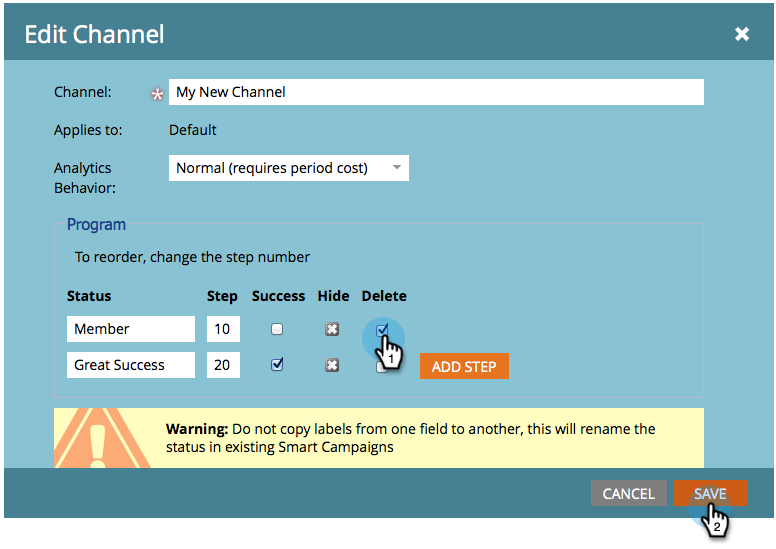

# August 2014 - Versionshinweise {#release-notes-august}

Die folgenden Funktionen sind in der Version vom August 2014 enthalten. Überprüfen Sie Ihre Marketo-Edition auf Funktionsverfügbarkeit. Nach der Veröffentlichung finden Sie Links zur ausführlichen Dokumentation der Funktionen.

## Marketingkalenderlizenzen {#marketing-calendar-licenses}

Ab dem 5. September 2014 können nur 5 Benutzer freien Zugriff auf den Marketingkalender haben. Stellen Sie sicher, dass Sie den Benutzern Ihrer Wahl zuvor eine Lizenz für den Marketingkalender ](/help/marketo/product-docs/core-marketo-concepts/marketing-calendar/understanding-the-calendar/issue-revoke-a-marketing-calendar-license.md) ausgeben/widerrufen, damit sie ununterbrochen darauf zugreifen können.[

## Berechtigungen für neue Benutzer {#new-user-permissions}

Die folgenden neuen Benutzerberechtigungen wurden hinzugefügt:

| Berechtigung | Beschreibung |
|---|---|
| Auf Revenue Explorer zugreifen | Wenn Sie RCA erworben haben, haben Sie jetzt die Kontrolle darüber, wer darauf zugreifen kann. |
| Liste importieren | Benutzer daran hindern, Listen in die Lead-Datenbank zu importieren. |
| Listenimport | Schränken Sie den Listenimport über ein Programm im Rahmen von Marketingaktivitäten ein. |
| Auslöser-Kampagne aktivieren | Kontrolle darüber, wer Trigger-Kampagnen aktivieren kann und wer nicht. |
| Stapel-Kampagne planen | Kontrolle darüber, wer die Ausführung von Batch-Kampagnen planen kann und wer nicht. |

## Benutzer und Rollen aus Admin exportieren {#export-users-and-roles-from-admin}

Sie können jetzt [eine Liste von Anwendern und Rollen exportieren](/help/marketo/product-docs/administration/users-and-roles/export-a-list-of-users-and-roles.md) aus Marketo. Sie können auch einen Zeitstempel &quot;Letzte Anmeldung&quot;einfügen, der in den Export eingefügt werden soll.

## Kanäle und Tags löschen {#delete-channels-and-tags}

Sie können jetzt nicht verwendete Kanäle und Status löschen. Wie immer können Sie nur ein Element ausblenden, das derzeit verwendet wird.

## Automatisierter DKIM {#automated-dkim}

Für eine verbesserte Zustellbarkeit werden alle ausgehenden E-Mails von DKIM (DomainKeys Identified Mail) signiert. Standardmäßig verwenden E-Mails die freigegebene DKIM-Signatur von Marketo. Sie können diese Signatur anpassen.

>[!NOTE]
>
>DKIM wird langsam eingeführt, Sie werden es vielleicht einige Wochen nicht sehen.

## Echtzeit-Updates für Personalization {#real-time-personalization-updates}

Wir haben der Kampagnenseite Titel hinzugefügt, damit Sie Ihren Herzinhalt mit Tags versehen können.

## Mobile Targeting {#mobile-targeting}

Sie haben auf die Community gefragt und wir haben geliefert! Sie können jetzt einen bestimmten Aktionsaufruf für Benutzer von Mobilgeräten und Tablets einschließen, ausschließen oder einrichten.

## Verbesserte 1:1-Segmentierung und -Targeting {#enhanced-segmentation-and-targeting}

Sie können jetzt erweiterte Filteroperatoren verwenden, um bekannte Besucher anzusprechen.

## Kampagnenfreigabe {#campaign-sharing}

Sie können jetzt schnell und einfach einen Vorschau-Link für eine RTP-Kampagne freigeben.

## Bericht zur Inhaltsempfehlungs-Engine {#content-recommendation-engine-report}

Wir haben einen neuen Bericht zur Inhaltsempfehlungs-Engine hinzugefügt, damit Sie eine schöne Zusammenfassung erhalten.

## Erweiterte Benutzerverwaltung {#enhanced-user-administration}

Administratoren können Benutzer nun aufgrund mehrerer fehlgeschlagener Anmeldeversuche sperren. Sie können diese Benutzer bei Bedarf auch entsperren.

## Tracking Control {#tracking-control}

Sie können jetzt bestimmte IPs aus der Verfolgung und Berichterstellung in Echtzeit-Personalization ausschließen.

