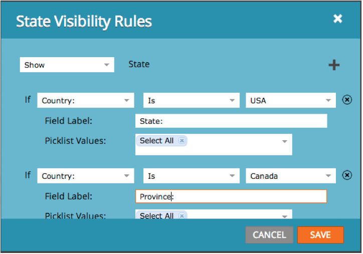
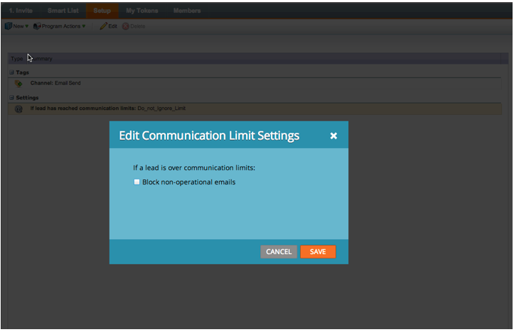
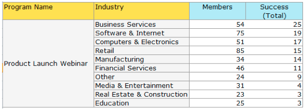

# Versionshinweise – Januar 2014 {#release-notes-january}

Die folgenden Funktionen sind in der Version vom Januar 2014 enthalten. Bitte überprüfen Sie Ihre [Marketo Edition](https://www.marketo.com/pricing/) auf Funktionsverfügbarkeit.

## Formulare 2.0 {#forms}

Heads Up: Die Dokumentation für Forms 2.0 ist in Kürze verfügbar!

Übernehmen Sie die Kontrolle über den Prozess der Formularerstellung und gönnen Sie Ihren Webentwicklern eine Pause. Forms 2.0 wurde entwickelt, um es Marketing-Experten zu ermöglichen, sowohl visuell als auch funktionell robuste Formulare zu erstellen, ohne Programmierkenntnisse zu benötigen.

**Verleihen Sie Ihrer Forms das visuelle Makeover, das sie verdienen:**

Designdesigns, Schaltflächenanpassung und flexible Layouts ermöglichen es Ihnen, moderne Formulare zu entwerfen, die genau in das Erscheinungsbild Ihrer Site passen.

**Bedingte Sichtbarkeit und Folgeseitenlogik:**

Möchten Sie, dass „Bundesland“ nur angezeigt wird, wenn ein Benutzer USA als „Land“ auswählt? Wie wäre es, wenn Kunden verschiedene Whitepaper präsentiert werden, die darauf basieren, wie sie Fragen in Ihrem Formular beantworten? Erstellen Sie eine bedingte Logik direkt im Editor in Ihre Formulare. Keine [!DNL javascript] erforderlich!

**Einfaches Einbetten von Forms auf eigenen Landingpages:**

Die Zeiten, in denen HTML-Code aus Formularen auf Marketo-Landingpages entfernt und in einem [!DNL iFrame] abgelegt wurde, sind vorbei. Nehmen Sie einfach den Einbettungs-Code und platzieren Sie ihn auf der Landingpage an der Stelle, an der das Formular gerendert werden soll. Zwei Modi - normal und Lightbox - bieten Ihnen noch mehr Flexibilität bei Marketo-Formularen auf Ihrer Site.

## Kommunikationsbeschränkungen für das E-Mail-Programm {#communication-limits-for-email-program}

[Legen Sie Kommunikationsbeschränkungen für ein E-Mail](/help/marketo/product-docs/email-marketing/email-programs/email-program-actions/enable-disable-communication-limits-in-an-email-program.md)Programm fest, um sicherzustellen, dass Sie mit Ihrer Datenbank nicht übermäßig kommunizieren. Wenn eine Person das festgelegte Limit überschreitet, erhält sie die E-Mail nicht.

## Zusätzliche Felder in Programmmitgliedschafts-Analyse {#additional-fields-in-program-membership-analysis}

Jetzt können Sie Ihre Metriken zur Programmmitgliedschaftsanalyse hinzufügen und nach Lead- und Unternehmensattributen gruppieren. Sie können beispielsweise das Feld Branche hinzufügen, um die Aufteilung Ihrer Programmmitglieder und Erfolge anzuzeigen.

