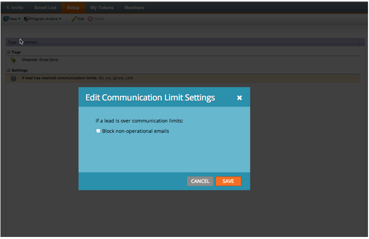

# Januar 2014 - Versionshinweise {#release-notes-january}

Die folgenden Funktionen sind in der Version vom Januar 2014 enthalten. Bitte überprüfen Sie Ihre [Marketo Edition](https://www.marketo.com/pricing/) für Funktionsverfügbarkeit.

## Formulare 2.0 {#forms}

Köpfe hoch: Die Dokumentation für Forms 2.0 ist in Kürze verfügbar!

Übernehmen Sie die Kontrolle über den Formularerstellungsprozess und geben Sie Ihren Webentwicklern eine Pause. Forms 2.0 wurde entwickelt, um Marketingexperten die Möglichkeit zu geben, visuell und funktional robuste Formulare zu erstellen, ohne Programmierkenntnisse zu benötigen.

**Vergeben Sie Ihrer Forms den visuellen Makeover, den sie verdienen:**

Designentwürfe, Schaltflächenanpassungen und flexible Layouts ermöglichen es Ihnen, moderne Formulare zu entwerfen, die genau an das Erscheinungsbild Ihrer Website angepasst sind.

**Bedingte Sichtbarkeit und Folgenachricht:**

Möchten Sie, dass &quot;State&quot;nur angezeigt wird, wenn ein Benutzer USA als &quot;Country&quot;auswählt? Wie wäre es, Kunden verschiedene Whitepapers zu präsentieren, basierend darauf, wie sie auf Fragen in Ihrem Formular antworten? Erstellen Sie eine Bedingungslogik in Ihren Formularen direkt vom Editor aus. Kein JavaScript erforderlich!

**Einbetten von Forms einfach in Ihre eigenen Landingpages:**

Vorbei sind die Tage, in denen HTML-Code aus Formularen auf Marketo-Landingpages entfernt und in einem iFrame abgelegt wird. Erfassen Sie einfach den Einbettungscode und platzieren Sie ihn auf der Einstiegsseite an der Stelle, an der das Formular wiedergegeben werden soll. Zwei Modi - Normal und Lightbox - bieten Ihnen noch mehr Flexibilität bei Marketo-Formularen auf Ihrer Site.

## Kommunikationsbeschränkungen für das E-Mail-Programm {#communication-limits-for-email-program}

[Festlegen von Kommunikationsbeschränkungen für ein E-Mail-Programm](/help/marketo/product-docs/email-marketing/email-programs/email-program-actions/enable-disable-communication-limits-in-an-email-program.md) um sicherzustellen, dass Sie nicht zu häufig mit Ihrer Datenbank kommunizieren. Wenn eine Person den festgelegten Grenzwert überschreitet, erhält sie die E-Mail nicht.

## Zusätzliche Felder in Programmmitgliedschafts-Analyse {#additional-fields-in-program-membership-analysis}

Jetzt können Sie Ihre [Analyse der Programmmitgliedschaft](/help/marketo/product-docs/reporting/revenue-cycle-analytics/program-analytics/build-a-program-membership-analysis-report-that-lists-leads.md) Metriken nach Lead- und Unternehmensattributen. Beispielsweise können Sie das Feld Branche hinzufügen, um die Aufteilung Ihrer Programmmitglieder und Erfolge anzuzeigen.

