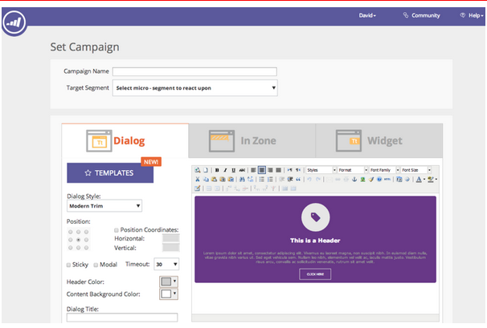

# Versionshinweise: Juli 2014 {#release-notes-july}

Die folgenden Funktionen sind in der Version vom Juli 2014 enthalten. Bitte überprüfen Sie Ihre Marketo Edition auf Funktionsverfügbarkeit. Kehren Sie nach der Veröffentlichung wieder zurück, um Links zu detaillierten Funktionsdokumentationen zu erhalten.

## Marketing-Kalender {#marketing-calendar}

Zeigen Sie alle Ihre Termine, E-Mails und dergleichen programmübergreifend an. [Dieses neue Produkt](/help/marketo/product-docs/core-marketo-concepts/marketing-calendar/understanding-the-calendar/navigating-the-marketing-calendar.md) wird Kunden mit 10 oder weniger [!DNL Marketo Lead Management] oder Dialog-Benutzern kostenlos zur Verfügung stehen.

Die Dokumentation zum Marketing-Kalender wird zum Zeitpunkt der Veröffentlichung verfügbar sein.

## Neues Aussehen, neue Navigation {#new-look-and-feel}

[!DNL Marketo Lead Management] wird mit einem neuen Look-and-Feel aktualisiert, das modern und elegant ist und eine aktualisierte Navigation enthält.

## Datumsoperatoren {#date-operators}

[Erweiterte Filter](/help/marketo/product-docs/core-marketo-concepts/smart-lists-and-static-lists/creating-a-smart-list/smart-list-filter-operators-glossary.md) für &quot;[!UICONTROL in der Vergangenheit]&quot;, &quot;[!UICONTROL in der ]&quot; und &quot;[!UICONTROL in der Zukunft danach]&quot;. Suchen Sie beispielsweise nach Leads, die in den nächsten 3 Monaten ein Geburtsdatum haben, oder nach einem Vertrag, der nach 6 Monaten abläuft.

## Ansicht des Programmplans {#program-schedule-view}

Zusätzlich zum Marketing-Kalender können Sie Ihre Ereignisse und Standardprogramme mit einer neuen Zeitplanansicht direkt im Programm verwalten.

* Alle Termine gleichzeitig neu planen
* Neue Vorläufige Termine - Bleiben Sie dran!
* Benutzerdefinierte Eintragstypen - Aufgaben, Pressemitteilung, alles, was Sie wollen

## Listenvorgänge in der REST-API {#list-operations-in-the-rest-api}

Wir haben die folgenden Aufrufe im Zusammenhang mit Listenvorgängen in ReST hinzugefügt. Die vollständige Dokumentation finden Sie ](https://experienceleague.adobe.com/en/docs/marketo-developer/marketo/rest/rest-api) [https://experienceleague.adobe.com/en/docs/marketo-developer/marketo/rest/rest-api.

* Liste nach ID abrufen
* Abrufen mehrerer Listen
* In Liste importieren
* Import zum Listenstatus abrufen

## Schneller Listenimport {#fast-list-import}

Über **50-mal schneller** zoomen Ihre Dateien in Marketo! Die alten Importoptionen „Normal“ und „Für neue Leads optimiert“ wurden durch „Standard (schneller Import)“ ersetzt.

Die Option „Neue Leads und Aktualisierungen überspringen“ bleibt unverändert.

## Neues verbessertes Munchkin! {#new-improved-munchkin}

Der Rollout wird ab Mitte Juli geplant und in den nächsten Monaten fortgesetzt.

* Entfernt die [!DNL jQuery] für vollständige und zukünftige Kompatibilität
* Kompatibler mit anderen JavaScript auf Ihrer Site
* Vollständig getestet an vielen Standorten im vergangenen Jahr!

## RTP: Echtzeit-Personalization-Kampagnenvorlagen {#rtp-real-time-personalization-campaign-templates}

Die Seite RTP-Set-[ (enthält jetzt vorgefertigte Vorlagen](/help/marketo/product-docs/web-personalization/using-templates/using-templates-to-create-web-campaigns.md). Wählen Sie aus einer Vielzahl von Stilen, einschließlich Webinaren, Fallstudien und eBooks.

## RTP: JavaScript API-Verbesserungen {#rtp-javascript-api-enhancements}

Neuer RTP-API-Aufruf, um Echtzeit-Besucherdaten wie Organisation, Branche, Standort und Segment-Code abzugleichen. Darüber hinaus wird beim Bewegen des Mauszeigers über einen Segmentnamen auf der Seite Segmente eine QuickInfo mit dem Segment-Code angezeigt. Die vollständige Dokumentation finden [ auf unserer ](https://experienceleague.adobe.com/en/docs/marketo-developer/marketo/javascriptapi/rich-media-recommendation)-Website.

## RTP: HTML5-Unterstützung im Campaign Content Editor {#rtp-html-support-in-campaign-content-editor}

Der Content WYSIWYG-Editor auf der Seite Kampagnen festlegen ist jetzt mit HTML5 vollständig kompatibel. Klicken Sie im Editor auf das Symbol &quot;HTML&quot;, um HTML5-Code einzufügen.
