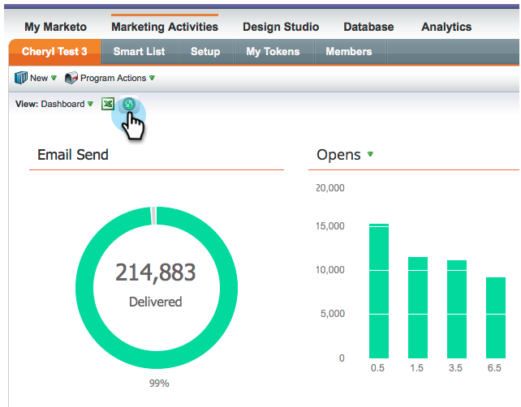
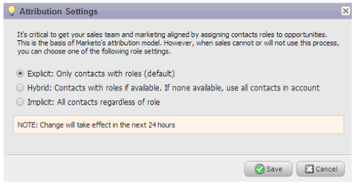

# Versionshinweise: März 2014 {#release-notes-march}

Die folgenden Funktionen sind in der Version vom März 2014 enthalten. Bitte überprüfen Sie Ihre Marketo Edition auf Funktionsverfügbarkeit. Vergewissern Sie sich, dass Sie nach der Veröffentlichung zu jeder Funktion zurückkehren, um Links zu Knowledge-Base-Artikeln zu erhalten.

## Schaltfläche „E-Mail-Programm-Dashboard aktualisieren“ {#email-program-dashboard-refresh-button}

Verwenden Sie die [Aktualisieren](/help/marketo/product-docs/email-marketing/email-programs/email-program-data/use-the-email-program-dashboard.md)-Schaltfläche, um aktuelle E-Mail-Metriken zu Ihrer E-Mail zu erhalten oder Ihren AB-Test zu senden!

## Rückgängig machen/Wiederholen im E-Mail-Editor und im Snippet-Editor {#undo-redo-in-the-email-editor-and-snippet-editor}

[Rückgängig machen oder ](/help/marketo/product-docs/email-marketing/general/email-editor-2/edit-elements-in-an-email.md): Bis zu 50 Aktionen für die aktuelle Sitzung.

## Programmstatusspalten im Programmleistungsbericht {#program-status-columns-in-program-performance-report}

Bei Verwendung des [Programmleistungsberichts](/help/marketo/product-docs/core-marketo-concepts/programs/program-performance-report/add-program-status-columns-to-a-program-report.md) können Sie jetzt sehen, wie viele Personen sich in welchen Programmstatus befinden.

## Enthaltene und betriebliche Programme für Analytics {#inclusive-and-operational-programs-for-analytics}

Sie können jetzt [Programme ohne Periodenkosten einbeziehen](/help/marketo/product-docs/reporting/revenue-cycle-analytics/program-analytics/make-a-program-without-a-period-cost-available-in-revenue-explorer-and-analyzers.md) in Revenue Explorer und Analyzer verwenden, indem Sie die Analytics-Verhaltensoption auf „Inklusiv“ setzen, wenn Sie Programmkanäle bearbeiten. Sie können operationelle Programme auch von der gesamten Berichterstattung ausschließen, indem Sie „Operativ“ wählen.

## Hybride und implizite Optionen für die Lead-Konversion {#hybrid-and-implicit-options-for-lead-conversion}

Sie können die Art und Weise ändern, wie Marketo Kontakte und Opportunities für die Lead-Konversionsmetriken in der Lead-Analyse verknüpft. Sie können [ Attributionseinstellung ](/help/marketo/product-docs/administration/settings/change-attribution-settings-for-analytics.md) eine von drei Optionen ändern. Wenn Sie diese Einstellung ändern, werden keine Marketo- oder CRM-Daten geändert. Sie ändern lediglich die Ausführung Ihrer Berichte und können jederzeit rückgängig gemacht werden.

Die Einstellung Explizit behandelt nur Kontakte mit Rollen in einer Opportunity als konvertierte Leads (Standardverhalten). Implizit werden alle mit dem Konto in der Opportunity verbundenen Kontakte unabhängig von der Rolle als konvertiert behandelt. Hybrid behandelt Kontakte mit Rollen als konvertiert, falls verfügbar. Wenn nicht, behandeln wir alle Kontakte im Konto als konvertiert.

Zur Erinnerung: Diese Einstellung ändert auch die Programmzuordnungsmetriken.

## Zusätzliche Benutzersprache {#additional-user-language}

Wählen Sie Ihre [Marketo-Anwendungssprache](/help/marketo/product-docs/administration/settings/select-your-language-locale-and-time-zone.md). Sehen Sie sich die Marketo-Lead-Management-Oberfläche in Ihrer bevorzugten Sprache an - jetzt wird Japanisch unterstützt.

## Marketo Developer-Blog {#marketo-developer-blog}

Der [Marketo Developer Blog](https://developers.marketo.com/blog/) ist für Web-Entwickler und Software-Ingenieure gedacht, die die sich schnell verändernden Anforderungen moderner Marketing-Experten unterstützen. Sie können Ankündigungen zu neuen Integrationsoptionen, API-Versionsaktualisierungen und einer neuen Reihe von Anleitungsartikeln abonnieren, die Codebeispiele und Best Practices zur Integration mit der Marketo-Plattform enthalten.

Der [erste Artikel](https://developers.marketo.com/blog/retrieving-customer-and-prospect-information-from-marketo-using-the-api/) in dieser Reihe führt Sie durch die effiziente Suche nach Informationen über die Personen (Kunden/Kontakte/Leads), die in Marketo mithilfe der -API gespeichert sind.
