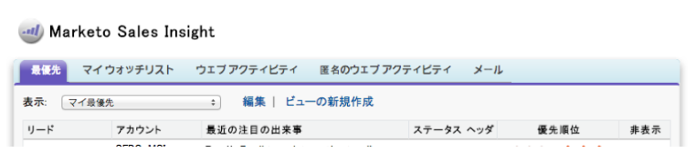

# Versionshinweise – Mai 2014 {#release-notes-may}

Die folgenden Funktionen sind in der Version vom Mai 2014 enthalten. Bitte überprüfen Sie Ihre Marketo Edition auf Funktionsverfügbarkeit. Kehren Sie nach der Veröffentlichung immer wieder zu Links zu detaillierten Knowledge Base-Artikeln für jede Funktion zurück!

## Arbeitsbereich löschen {#delete-workspace}

Jetzt können Sie [nicht verwendeten Arbeitsbereich löschen](/help/marketo/product-docs/administration/workspaces-and-person-partitions/delete-a-workspace.md). Verschieben Sie alle Assets in einen anderen Arbeitsbereich, bevor Sie versuchen, den Arbeitsbereich zu löschen.

## Erstbesetzung planen {#schedule-first-cast}

In Interaktionsprogrammen können Sie das Datum für die (erste [) Ausführung &#x200B;](/help/marketo/product-docs/email-marketing/drip-nurturing/engagement-program-streams/set-stream-cadence.md). Geben Sie beispielsweise die Kadenz an, die alle 2 Wochen erfolgen soll, und wählen Sie das Datum der ersten Besetzung aus.

## Erweiterte Engagement Programs {#enhanced-engagement-programs}

Jetzt erhält jeder mehrere Programme, Streams und Kommunikationsbeschränkungen.

## Linktracking in Textnachrichten {#link-tracking-in-text-emails}

[Fügen Sie doppelte eckige Klammern &#x200B;](/help/marketo/product-docs/email-marketing/general/functions-in-the-editor/add-tracked-links-to-a-text-email.md) URLs in der Textversion Ihrer E-Mails hinzu, um anzugeben, wann Links in umgeleitete Marketo-Tracking-Links konvertiert werden sollen

>[!NOTE]
>
>**Beispiel**
>
>`[[https://www.marketo.com]]`

Standardmäßig werden in der Textversion von E-Mails keine Links verfolgt. Fügen Sie diese neue Syntax hinzu, um anzugeben, wann ein Link in einen Tracking-Link konvertiert werden soll. Das Verhalten von HTML-Links bleibt unverändert.  So fügen Sie Ihren E-Mails getrackte Links hinzu:

* **HTML-Version:** Fügen Sie einfach Ihren Link ein. Er wird standardmäßig verfolgt.
* **Textversion:** Geben Sie die URL ein, die von doppelten eckigen Klammern umgeben ist.

So fügen Sie Ihren E-Mails nicht getrackte Links hinzu:

* **HTML-Version:** Fügen Sie den Link ein und fügen Sie die Klasse „mktNoTrack“ zum Link hinzu.
* **Textversion:** Geben Sie einfach die URL ein. Die Verfolgung wird standardmäßig aufgehoben.

## Link-Markup in Beispiel-E-Mails {#link-markup-in-sample-emails}

Erfahren Sie, wie sich Ihre Links in E-Mails im Voraus verhalten werden. Beispiel-E-Mails zeigen jetzt Links genau so an, wie sie Ihren Leads erscheinen würden. Zeigen Sie in einer Vorschau an, welche Links in Tracking-Links konvertiert wurden, damit Sie sich ein besseres Bild davon machen können, wie die Nachricht den Empfängern tatsächlich angezeigt wird.

## [!UICONTROL Kampagne abbrechen] {#abort-campaign}

Keine Panik! Wenn Sie einen Fehler finden, verwenden Sie die neue Schaltfläche [Abbruchkampagne](/help/marketo/product-docs/core-marketo-concepts/smart-campaigns/using-smart-campaigns/abort-a-smart-campaign.md) , um Kampagnen sofort zu stoppen. Sie erhalten eine Benachrichtigung, in der angegeben wird, wie viele Leads in jedem Flussschritt zum Zeitpunkt des Stoppens der Kampagne ausstanden.

## [!UICONTROL Sales Insight] auf Japanisch, Portugiesisch und Spanisch {#sales-insight-in-japanese-portuguese-and-spanish}

Laden Sie die neueste Version von [!UICONTROL Sales Insight] von AppExchange herunter, damit Ihre japanisch, portugiesisch und spanischsprachigen Vertriebsmitarbeiter [!UICONTROL Sales Insight] Inhalte in ihrer bevorzugten Sprache anzeigen können.

## Programmstatus und Erfolgszeitrahmen in der Analyse der Programmmitgliedschaft {#program-status-and-success-timeframe-in-program-membership-analysis}

Ermitteln Sie, wie viele [Mitglieder sich in jedem Programmstatus befinden](/help/marketo/product-docs/reporting/revenue-cycle-analytics/program-analytics/build-a-program-membership-analysis-report-that-lists-leads.md) und wann sie in jeden Status gewechselt haben, einschließlich des Datums, an dem sie den Programmerfolg erzielt haben.

## A/B-Test-E-Mails in [!UICONTROL E-Mail-Analyse] {#a-b-test-emails-in-email-analysis}

Erstellen Sie für jede Ihrer A/B[Test-E-Mail](/help/marketo/product-docs/reporting/revenue-cycle-analytics/email-analysis/build-an-email-analysis-report-that-shows-program-information.md)Varianten einen Bericht in [!UICONTROL E-Mail-Analyse].

## Änderungen am Analytics-Paket {#analytics-packaging-changes}

Modeler und Success Path Analyzer sind jetzt in MA Standard Edition enthalten.

## Informationen zur mobilen Plattform {#mobile-platform-info}

[Segment und Trigger &#x200B;](/help/marketo/product-docs/reporting/basic-reporting/report-activity/build-a-people-performance-report-with-mobile-platform-columns.md) von Leads, die E-Mails von ihren Mobilgeräten aus öffnen und klicken.
