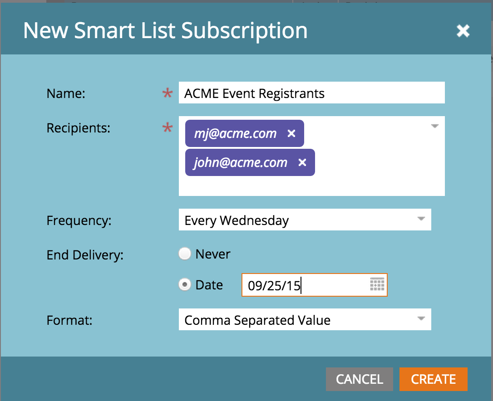

# Versionshinweise: Herbst 2015 {#release-notes-fall}

Die folgenden Funktionen sind in der Version vom Herbst 15 enthalten. Bitte überprüfen Sie Ihre Marketo Edition auf Funktionsverfügbarkeit.

## Abonnieren einer Smart-Liste {#subscribe-to-a-smart-list}

[Abonnieren einer Smart-Liste](/help/marketo/product-docs/reporting/basic-reporting/report-subscriptions/subscribe-to-a-smart-list.md)

Mit der Option „Smart-Liste abonnieren“ können Marketing-Experten eine Smart-Liste exportieren und per E-Mail an die Stakeholder senden, die Marketo nicht verwenden, z. B. Verkaufs- oder Telemarketing-Teams.

Der Export kann täglich, wöchentlich oder monatlich geplant werden, kann ein Endlieferdatum haben und so angepasst werden, dass eine begrenzte Anzahl von Spalten gemeinsam genutzt werden kann.



Es können mehrere Abonnements in einer Smart-Liste erstellt werden. Es gibt eine Beschränkung von 100 Abonnements mit 100.000 Leads pro Abonnement, über Workspaces hinweg und pro Marketo-Instanz.


## Benutzerdefinierte Marketo-Objekte {#marketo-custom-objects}

[Benutzerdefinierte Marketo-Objekte](/help/marketo/product-docs/administration/marketo-custom-objects/understanding-marketo-custom-objects.md)

Einfaches Erstellen benutzerdefinierter Objekte über die Admin-Benutzeroberfläche. Wir unterstützen derzeit die Möglichkeit, ein benutzerdefiniertes 1:N-Objekt in Marketo zu erstellen und es mit einem Lead oder einem Unternehmen zu verbinden.

>[!NOTE]
>
>Benutzerdefinierte Marketo-Objekte sind für Spark nicht verfügbar.


## Marketo Insights für [!DNL Google Chrome] {#marketo-insights-for-google-chrome}

[Marketo Insights für [!DNL Google Chrome]](/help/marketo/product-docs/marketo-sales-insight/msi-chrome-plugin/using-marketo-insights-for-google-chrome.md)

Wir freuen uns, die Veröffentlichung eines Updates für unsere [!DNL Google Mail] [!DNL Sales Insight]-Erweiterung bekannt geben zu können! Sehen Sie es sich in der [[!DNL Chrome Store]](https://chrome.google.com/webstore/detail/marketo-insights-for-goog/jjkfbhajlmoeegbjgjipliamplidmbjb) an.

Dieses Update enthält viele neue Funktionen:

* Vor der Kontaktaufnahme können Vertriebsmitarbeiter relevante Informationen über ihre potenziellen Kunden direkt in [!DNL Google Mail] sehen, einschließlich Stellenbezeichnungen, Twitter-Profile, Unternehmensinformationen, Fotos und mehr.
* Vertriebsmitarbeiter können in Echtzeit sehen, mit welchen Inhalten Interessenten kanalübergreifend interagieren, wie z. B. geöffnete oder angeklickte E-Mails, Online- oder persönliche Veranstaltungen, besuchte Webseiten, heruntergeladene eBooks und vieles mehr.
* E-Mails, die über [!DNL Google Mail] gesendet werden, werden in Marketo protokolliert und in Echtzeit verfolgt. Auf diese Weise können Vertriebsmitarbeiter sehen, wann potenzielle Kunden ihre E-Mails ansehen, damit sie genau zur richtigen Zeit nachfassen können. Marketo [!DNL Sales Insight] for [!DNL Google Mail] erleichtert es Vertriebsmitarbeitern außerdem, von Marketing-Experten erstellte Vorlagen zu nutzen, um aussagekräftige Einladungen, Angebote und andere Inhaltstypen zu versenden.


## Marketo Mobile-Interaktion - Token, Beispiel senden und Vorschau {#marketo-mobile-engagement-tokens-send-sample-preview}

* [Token](/help/marketo/product-docs/mobile-marketing/push-notifications/configure-mobile-push-notification.md)
* [Beispiel senden](/help/marketo/product-docs/mobile-marketing/push-notifications/send-a-push-notification-sample.md)
* [Vorschau](/help/marketo/product-docs/mobile-marketing/push-notifications/preview-a-push-notification.md)

Push-Benachrichtigungen einfach mit [Token](/help/marketo/product-docs/mobile-marketing/push-notifications/configure-mobile-push-notification.md) personalisieren.


Sie können auch [Vorschau](/help/marketo/product-docs/mobile-marketing/push-notifications/preview-a-push-notification.md) oder eine [-Push-Benachrichtigung senden](/help/marketo/product-docs/mobile-marketing/push-notifications/send-a-push-notification-sample.md) bevor Sie sie für Kunden bereitstellen.


## Intelligente Kampagnen in wenigen Augenblicken {#smart-campaigns-in-moments}

[Intelligente Kampagnen in wenigen Augenblicken](/help/marketo/product-docs/core-marketo-concepts/mobile-apps/marketo-moments/understanding-moments/understanding-smart-campaign-cards.md)

Statistiken zu E-Mails, die über Smart Campaign gesendet werden, sind jetzt in Moments verfügbar. Zu den weiteren Funktionen dieses Upgrades gehören:

* Nach rechts wischen. Haben Sie zu viele Karten in Ihrem Stream? Sie können sie jetzt wegwischen!
* Senden eines Beispiels direkt über den Vorschaubildschirm
* Smart List Details added to Email Program cards
* Unterstützung für den Status Abgebrochen für E-Mail-Programme hinzugefügt


## RTP - Content Analytics und Recommendations {#rtp-content-analytics-and-recommendations}

[Content Analytics](/help/marketo/product-docs/web-personalization/understanding-web-personalization/understanding-content-analytics.md) und Recommendations

RTP Content Analytics zeigt die Performance Ihrer Web-Content-Assets durch regelmäßige Web-Besuche sowie durch Besuche, die von der Content Recommendation-Engine von RTP generiert werden.

* Finden Sie heraus, welche Inhalte die beste Leistung erbringen und die meisten Leads einbringen
* Steigern Sie Ihre Nutzung von Inhalten, indem Sie Inhalte in der prädiktiven Content-Engine von RTP aktivieren, um den richtigen Besuchern automatisch die besten Inhalte zu empfehlen
* Schlüsseln Sie die einzelnen Content-Assets auf, um detailliertere Metriken, Diagramme und die Leistung anzuzeigen

Die Assets-Seite von RTP ist jetzt in Content Analytics und Content Recommendations unterteilt.

* **Content Analytics:** Zeigt die Ansichten und direkten Leads aller erkannten und definierten Web-Inhalte an und hilft Ihnen bei der Analyse Ihrer Inhalte mit der besten Leistung
* **Inhaltsempfehlungen**: Zeigt Impressionen und Klicks aus dem empfohlenen Inhalt von RTP und der zugehörigen Lead-Attribution an. Sie können Inhaltsempfehlungen auch auf dieser Seite für die Empfehlungen [Leiste](/help/marketo/product-docs/predictive-content/enabling-predictive-content/enable-the-content-recommendation-bar.md) und [Rich-Media](/help/marketo/product-docs/predictive-content/enabling-predictive-content/enable-predictive-content-for-web-rich-media.md) bearbeiten und aktivieren.

* Alle direkten Lead-Daten auf diesen beiden Seiten wurden seit Jahresbeginn (1. Januar 2015) rückwirkend aktualisiert.

## RTP - Klonen einer RTP-Kampagne {#rtp-clone-an-rtp-campaign}

[RTP - Klonen einer RTP-Kampagne](/help/marketo/product-docs/web-personalization/working-with-web-campaigns/clone-a-web-campaign.md)

Durch das Klonen einer RTP-Kampagne können Sie schneller und effizienter personalisiertere Web-Kampagnen erstellen. Verwenden Sie die Klon-Funktion auf der Kampagnenseite von RTP, um die Kampagneneinstellungen zu kopieren und den Inhalt für die Optimierung der Aufspaltungstests zu ändern, oder klonen Sie eine Kampagne mit demselben Inhalt und richten Sie sie auf ein anderes Segment aus. Erstellen Sie Kampagnen in Sekunden!


## Verbesserungen am Rich-Text-Editor {#rich-text-editor-improvements}

Der Rich-Text-Editor wird derzeit in mehreren Punkten verbessert. Nach der Veröffentlichung des aktualisierten Editors im Juli erhielten wir großes Feedback und konnten diese Änderungen in dieses Upgrade einarbeiten. In den nächsten Monaten wird es noch viel mehr geben. Im Folgenden finden Sie eine Liste der Neuerungen im 4. Quartal:

* VML wird jetzt in Ihrem HTML-Code unterstützt:

```
<v:background xmlns:v="urn:schemas-microsoft-com:vml" fill="t">
<v:fill type="tile" src="<a href="https://i.imgur.com/YJOX1PC.png" rel="nofollow">https://i.imgur.com/YJOX1PC.png</a>" color="#7bceeb"/>
</v:background>
```

* Alles kann jetzt in einen gültigen HTML-Kommentar eingefügt werden (bestimmte Syntaxen, wie unten dargestellt, wurden zuvor entfernt):

`<!--[if gte mso 9]> <![endif]-->`

* Leere Tabellenzellen nicht mit `&nbsp;` auffüllen

* Schaltfläche „Maximieren/Minimieren“ zum HTML-Quell-Editor hinzugefügt
* Bereits vorhandene Tabelleneigenschaften werden jetzt im Dialogfeld Tabelleneigenschaften identifiziert und angezeigt
* Standardmäßig werden nun beide Schaltflächenzeilen angezeigt.
* Der Editor akzeptiert jetzt alle Elemente (selbst veraltete oder nicht standardmäßige Elemente):

`<myCustomElement>Hello World!</myCustomElement>`

* Der Editor akzeptiert jetzt alle Attribute (selbst veraltete oder nicht standardmäßige Attribute):

```
<myCustomElement myCustomAttribute="foo">Hello World!</myCustomElement>
<td background="someImage.png"> 
```

## [!DNL Microsoft Dynamics] - Synchronisierung validieren {#microsoft-dynamics-validate-sync}

[[!DNL Microsoft Dynamics] - Synchronisierung validieren](/help/marketo/product-docs/crm-sync/microsoft-dynamics-sync/sync-setup/validate-microsoft-dynamics-sync.md)

Dieses neue Admin-Tool führt eine Reihe von Prüfungen durch, um festzustellen, ob Ihre Synchronisierungskonfigurationen korrekt eingerichtet wurden.


## Felder zur Synchronisierung benutzerdefinierter CRM-Objekte hinzufügen {#add-fields-to-crm-custom-object-sync}

Einfaches Hinzufügen neuer Felder zu benutzerdefinierten Objekten, die mit [!DNL Salesforce] und [!DNL Dynamics] synchronisiert werden. Sie können jetzt neue Felder zu Ihrer benutzerdefinierten Objektsynchronisierung hinzufügen, ohne Ihr gesamtes benutzerdefiniertes Objekt zu deaktivieren und zu aktivieren.

## Änderungen an Sicherheitsfunktionen {#changes-to-security-features}

* Passwortversuche sind auf 5 begrenzt. Nach dem fünften Versuch wird der Benutzer gesperrt.
* Die maximale Wartezeit für inaktive Sitzungen kann jetzt für das Abonnement konfiguriert werden.


## IE 11-Unterstützung (und veraltete Unterstützung für IE 9) {#ie-support-and-deprecating-support-for-ie}

Wir unterstützen jetzt offiziell den [!DNL Microsoft Internet Explorer] 11-Browser und entfernen die Unterstützung für den [!DNL Microsoft Internet Explorer] 9-Browser.

## Unterstützung der Lightning-Benutzeroberfläche für MSI {#lightning-ui-support-for-msi}

Das neueste MSI-Paket in App Exchange funktioniert sowohl mit Lightning- als auch mit Legacy-Versionen der [!DNL Salesforce]-Benutzeroberfläche.

## Neues [!DNL Dynamics]-Plug-in {#new-dynamics-plug-in}

Dieses neue Plug-in führt verschiedene Aktionen asynchron aus, um die Leistung zu steigern.

## Suchen nach URL der Landingpage in Design Studio {#search-by-url-of-landing-page-in-design-studio}

Im Design Studio-Landingpage-Raster können Sie jetzt nach Seiten-URL suchen, um Ihre Landingpages zu finden. Dies ist auch exportierbar.
