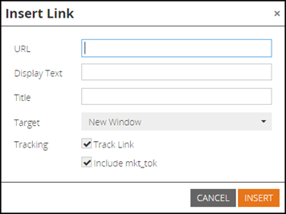
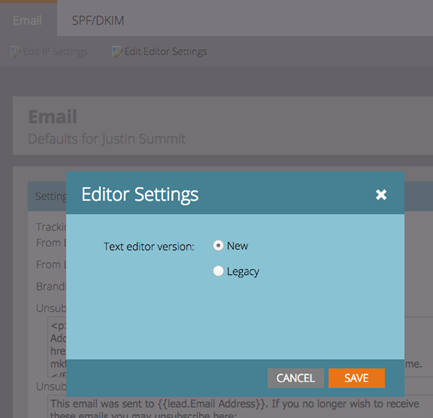

# Juli 2015 - Versionshinweise {#release-notes-july}

## Marketo Moments {#marketo-moments}

Mittag essen, aber eine E-Mail neu planen müssen? Die Marketo Moments-App, die über App Store oder Google Play verfügbar ist, bietet Ihnen die Möglichkeit zu sehen, wie Ihre E-Mail- und Ereigniskampagnen in Echtzeit funktionieren und was in Zukunft von Ihrem iPhone-, iPad- oder Android-Telefon aus geschieht.

## Rich-Text-Editor-Update {#rich-text-editor-update}

Der Texteditor wurde mit modernem Erscheinungsbild aktualisiert, einschließlich optimierter Textformatierung, Bildbearbeitung, Link-Einfügung und HTML-Bearbeitung. Der HTML-Editor verfügt jetzt über eine minimale Validierung, was eine weniger restriktive Codebearbeitung ermöglicht.
`<iframe width="420" height="315" src="https://www.youtube.com/embed/LmmBN6IQrII" frameborder="0" allowfullscreen></iframe>` Diese Aktualisierung wird innerhalb weniger Tage nach der Juli-Version automatisch durchgeführt. Danach können Sie zwischen den neuen und alten Versionen des Editors von **Admin > E-Mail > Editor-Einstellungen bearbeiten**.

Link- und Bilddialogfelder wurden aktualisiert.

Wechsel zur Texteditorversion.

## Single-Sign-On für die E-Mail-Zustellbarkeit {#email-deliverability-single-sign-on}

Wenn Sie auf die Kachel E-Mail-Zustellbarkeit klicken, müssen Sie Ihre Anmeldedaten nicht mehr angeben.

## Kampagnenpriorisierung {#campaign-prioritization}

Haben Sie mehrere personalisierte RTP-Kampagnen eingerichtet und festgestellt, dass sich einige von ihnen mit anderen überschneiden können? Legen Sie eine Priorität fest, für welche Kampagnen RTP andere anzeigen soll.

## Firmen-API {#company-api}

**Zugriff auf Unternehmensobjekte über die REST-API**: Die REST-API bietet jetzt Zugriff auf das Marketo-Unternehmensobjekt (auch Konto genannt). Das bedeutet, dass Sie in Marketo erstellte Unternehmensobjekte lesen, aktualisieren und löschen und mit diesen Unternehmen Leads über die aktualisierte Lead-API verknüpfen können.

Lernen [more]https://developer.adobe.com/marketo-apis/api/mapi/#tag/Companies) in unserem Referenzhandbuch für die Firmen-API.

## Email Deliverability aufrufen {#access-email-deliverability}

**Email Deliverability Tool aufrufen**: Diese neue Berechtigung ermöglicht es Administratoren, Benutzern Zugriff auf das Email Deliverability-Tool zu gewähren.
