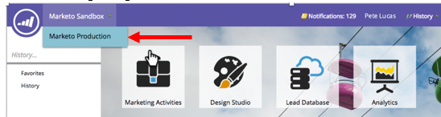

# Versionshinweise – Herbst 2016 {#release-notes-fall}

Die folgenden Funktionen sind in der Version vom Herbst 16 enthalten. Überprüfen Sie Ihre Marketo Edition auf die Verfügbarkeit der Funktionen. Bitte klicken Sie auf die Titel-Links, um detaillierte Artikel für jede Funktion anzuzeigen.

## [!UICONTROL Prädiktiver Inhalt] in E-Mails {#predictive-content-in-email}

Mit unserem Programm [!UICONTROL Predictive Content] können Sie Ihre Inhalte über maschinelles Lernen und Prognosealgorithmen im Web und in E-Mail-Kanälen verfolgen, verwalten und empfehlen.

>[!NOTE]
>
>Alle Kunden mit dem Predictive-Modul werden bis zum 10. Januar aktiviert.

Sie können Ihrer E-Mail jetzt prädiktive Inhalte hinzufügen. Wenn die E-Mail geöffnet wird, erhält der Empfänger automatisch relevante, empfohlene Inhalte, die dazu beitragen, die Interaktion mit Inhalten und die Konversionen zu steigern.

## [Facebook Offline-Conversions](/help/marketo/product-docs/demand-generation/facebook/understanding-facebook-offline-conversions.md) {#facebook-offline-conversions}

Mit [!DNL Facebook] Integration von Offline-Konversionen werden Konversionsdaten in Marketo (für Lead-Anzeigen-Leads) automatisch an [!DNL Facebook] zurückgesendet, damit Ihr Werbe-Team seine Werbeausgaben besser optimieren kann. In diesem [!DNL Facebook] Ad Manager-Bericht sind die Offline-Konversionen hervorgehoben.

## [Universal-ID](/help/marketo/product-docs/administration/settings/using-a-universal-id-for-subscription-login.md) {#universal-id}

Mit einer universellen ID können Sie mit einer einzigen Anmeldung auf mehrere Marketo-Abonnements zugreifen und schnell zwischen Abonnements wechseln. Sie können für alle Ihre Abonnements ein einzelnes Community-Profil verwenden.

>[!NOTE]
>
>Wenden Sie sich an den Marketo-Support, um diese Funktion zu aktivieren.

## Verbesserungen beim Account-basierten Marketing in Marketo {#marketo-account-based-marketing-enhancements}

Jetzt können Sie Account-Teams benannten Accounts in Account Based Marketing (ABM) zuweisen, z. B. Account Owner, Sales Development Repräsentant, Business Development Repräsentant und Customer Success Manager. Sie können auch Account-Owner-spezifische Account-Listen erstellen und personalisierte wöchentliche ABM-Berichte an das Account-Team senden.

**REST-API**

Mit dieser Version können Sie auch benannte Kontoattribute und Kontobewertungen in ABM mithilfe der Marketo REST-API verwalten. Weitere Informationen zu den API-Vorgängen finden Sie auf der [Marketo Developers-Website](https://developers.marketo.com/rest-api/lead-database/named-accounts).

## [Verbesserungen am Audit-Protokoll](/help/marketo/product-docs/administration/audit-trail/change-details-in-audit-trail.md) {#audit-trail-enhancements}

Das Audit-Protokoll enthält einen umfassenden Verlauf der Änderungen, die in Ihrem Marketo-Abonnement vorgenommen wurden. Wir haben zusätzliche Tracking-Funktionen für Programme hinzugefügt und wichtige Änderungsdetails für intelligente Kampagnen, intelligente Listen und Änderungen an Benutzern und Rollen angezeigt.

## Neuzulassungen

**E-Mail funktionsfähig machen**

Vorbei sind die Zeiten, in denen Sie sich Sorgen darüber machen mussten, dass Benutzer Transaktions-E-Mails an Personen in Ihrer Datenbank senden, die sich abgemeldet haben. Sie können jetzt angeben, welche Benutzer eine E-Mail funktionsfähig machen oder E-Mails bearbeiten können.

**Kampagnenbeschränkungen bearbeiten**

Warum sollte [Kampagnenbeschränkungen](/help/marketo/product-docs/administration/email-setup/enable-person-restrictions-for-smart-campaigns.md) festgelegt werden, wenn sie nicht durchgesetzt werden können? Wenn Sie Einstellungen für Kampagnenbeschränkungen festlegen, um die Anzahl der Personen in Ihrer Datenbank zu begrenzen, die mit einer einzelnen Kampagne angesprochen werden können, können Sie jetzt einschränken, welche Benutzer diese Einstellungen bei der Planung einer Kampagne überschreiben können.

## [Sound für mobile Push-Benachrichtigungen](/help/marketo/product-docs/mobile-marketing/push-notifications/configure-mobile-push-notification.md) {#sound-for-mobile-push-notifications}

Verleihen Sie Ihrer iOS-Push-Benachrichtigung zusätzliche Reichweite, indem Sie Sound aktivieren. Mit dieser neuen Funktion können Sie einen Ton in den Trigger stellen, wenn Ihre Push-Benachrichtigung auf dem Mobilgerät angezeigt wird.

>[!NOTE]
>
>* Gerätebesitzer können verhindern, dass Töne in den Geräteeinstellungen wiedergegeben werden, und App-Entwickler können Gerätebesitzern Optionen in der App geben, um zu verhindern, dass Töne wiedergegeben werden.
>* Töne werden automatisch abgespielt, wenn eine Push-Benachrichtigung auf einem Android-Gerät angezeigt wird.

## [Sales Insight kompatibel mit Salesforce Encryption](/help/marketo/product-docs/marketo-sales-insight/msi-for-salesforce/installation/install-marketo-sales-insight-package-in-salesforce-appexchange.md) {#sales-insight-compatible-with-salesforce-encryption}

Market [!DNL Sales Insight] ist jetzt mit [!DNL Salesforce] Shield Encryption kompatibel. Alle [!DNL Sales Insight]-Kunden sollten ein Upgrade auf dieses neueste verwaltete Paket (Version 1.4359.2) durchführen, das [auf dem verfügbar [!DNL Appexchange]](https://appexchange.salesforce.com/listingDetail?listingId=a0N30000001SVZmEAO).

## [APIs für benannte Konten](https://developers.marketo.com/rest-api/lead-database/named-accounts/) {#named-accounts-apis}

Mit dieser Version können Marketo ABM-Benutzende benannte Konten über die API für benannte Konten verwalten. Benutzer können benannte Konten erstellen, aktualisieren und löschen sowie ABM-spezifische Kontobewertungen lesen und aktualisieren.

## [API-Unterstützung für Email Editor v2.0](https://developers.marketo.com/rest-api/assets/emails/) {#email-editor-v-api-support}

Verwalten von Variablen und Modulen für E-Mails im Format v2.0 mithilfe der Marketo REST-API.

## [Änderungen an Marketo Salesforce Sync](https://nation.marketo.com/docs/DOC-3840) {#changes-to-marketo-salesforce-sync}

Die [!DNL Salesforce] Integration von Marketo entwickelt sich weiter, um die Art und Weise zu verbessern, wie Marketo-Felder mit [!DNL Salesforce] synchronisiert werden. Jetzt können Sie, anstatt eine große Gruppe von Feldern synchronisieren zu müssen, die Sie möglicherweise benötigen oder nicht, auswählen, welche Felder Sie einbeziehen möchten. Weitere Informationen finden Sie in unserer Dokumentation: [https://nation.marketo.com/docs/DOC-3840](https://nation.marketo.com/docs/DOC-3840).
