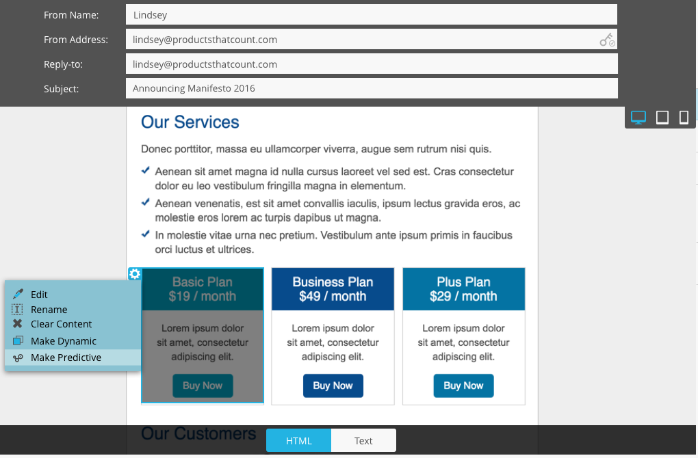

# Versionshinweise: Herbst 16 {#release-notes-fall}

Die folgenden Funktionen sind in der Herbstversion 16 enthalten. Überprüfen Sie Ihre Marketo-Edition auf Funktionsverfügbarkeit. Klicken Sie auf die Titel-Links, um detaillierte Artikel zu den einzelnen Funktionen anzuzeigen.

## Predictive Content in Email {#predictive-content-in-email}

Es gibt eine neue Benutzererfahrung für unsere Predictive Content-Anwendung, mit der Sie Ihre Inhalte mithilfe unserer maschinellen Lernalgorithmen und Prognosealgorithmen über die Web- und E-Mail-Kanäle hinweg verfolgen, verwalten und empfehlen können.

>[!NOTE]
>
>Alle Kunden mit dem Predictive-Modul werden am 10. Januar aktiviert.

Sie können jetzt Ihrer E-Mail prädiktiven Inhalt hinzufügen. Wenn die E-Mail geöffnet wird, erhält der Empfänger automatisch relevante, empfohlene Inhalte, die zur Steigerung der Interaktion mit Inhalten und zur Steigerung der Konversionen beitragen.

## [Facebook Offline-Conversions](/help/marketo/product-docs/demand-generation/facebook/understanding-facebook-offline-conversions.md) {#facebook-offline-conversions}

Bei der Integration von Facebook-Offline-Konversionen werden Konversionsdaten in Marketo (für Lead-AnzeigenLeads) automatisch zurück an Facebook gesendet, damit Ihr Werbeteam seine Anzeigenausgaben besser optimieren kann. In diesem Facebook Ad Manager-Bericht werden die Offline-Konversionen hervorgehoben.

## [Universal-ID](/help/marketo/product-docs/administration/settings/using-a-universal-id-for-subscription-login.md) {#universal-id}

Mit einer universellen ID können Sie mit einer einzigen Anmeldung auf mehrere Marketo-Abonnements zugreifen und schnell zwischen Abonnements wechseln. Sie können ein einzelnes Community-Profil für alle Ihre Abonnements verwenden.

>[!NOTE]
>
>Wenden Sie sich an den Marketo-Support , um diese Funktion zu aktivieren.

## Verbesserungen des kontobasierten Marketing für Marketo {#marketo-account-based-marketing-enhancements}

Jetzt können Sie im Account Based Marketing (ABM) Kontoteams benannten Konten zuweisen, z. B. Kontoinhaber, Vertriebsmitarbeiter, Geschäftsentwicklungsmitarbeiter und Kundenbetreuer. Sie können auch kontoeigentümerspezifische Kontolisten erstellen und dem Account-Team personalisierte wöchentliche ABM-Berichte senden.

**REST-API**

Mit dieser Version können Sie auch benannte Kontoattribute und Kontobewertungen in ABM mithilfe der Marketo REST API verwalten. Weitere Informationen zu den API-Vorgängen finden Sie im [Marketo Developer-Website](https://experienceleague.adobe.com/en/docs/marketo-developer/marketo/rest/lead-database/named-accounts).

## [Verbesserungen am Audit-Protokoll](/help/marketo/product-docs/administration/audit-trail/change-details-in-audit-trail.md) {#audit-trail-enhancements}

Das Audit-Protokoll bietet einen umfassenden Verlauf der Änderungen, die innerhalb Ihres Marketo-Abonnements vorgenommen wurden. Wir haben zusätzliche Tracking-Funktionen für Programme hinzugefügt sowie wichtige Änderungsdetails für Smart-Kampagnen, Smart-Listen und Änderungen an Benutzern und Rollen angezeigt.

## [Neuzulassungen](/help/marketo/product-docs/administration/users-and-roles/descriptions-of-role-permissions.md) {#new-permissions}

**E-Mail-Betrieb**

Vorbei sind die Tage, an denen Sie sich Sorgen machen mussten, dass Benutzer Transaktions-E-Mails an Personen in Ihrer Datenbank senden, die sich abgemeldet haben. Sie können jetzt festlegen, welche Benutzer eine E-Mail in Betrieb nehmen oder betriebliche E-Mails bearbeiten können.

**Kampagnenbeschränkungen bearbeiten**

Warum [Kampagnenbeschränkungen](/help/marketo/product-docs/administration/email-setup/enable-person-restrictions-for-smart-campaigns.md) wenn Sie sie nicht durchsetzen können? Wenn Sie die Kampagnenbegrenzungseinstellungen so festlegen, dass die Anzahl der Personen in Ihrer Datenbank, die für eine einzelne Kampagne infrage kommen, begrenzt wird, können Sie jetzt einschränken, welche Benutzer diese Einstellungen bei der Planung einer Kampagne außer Kraft setzen können.

## [Ton für Push-Benachrichtigungen auf Mobilgeräten](/help/marketo/product-docs/mobile-marketing/push-notifications/configure-mobile-push-notification.md) {#sound-for-mobile-push-notifications}

Lassen Sie Ihre Push-Benachrichtigung in iOS durch die Aktivierung von Ton unzählige Informationen erhalten. Mit dieser neuen Funktion können Sie einen Ton Trigger, wenn die Push-Benachrichtigung auf einem Mobilgerät angezeigt wird.

>[!NOTE]
>
>* Gerätehersteller können verhindern, dass Töne in den Geräteeinstellungen abgespielt werden, und App-Entwickler können Geräteherstellern Optionen innerhalb der App bereitstellen, um zu verhindern, dass Töne abgespielt werden.
>* Töne werden automatisch abgespielt, wenn eine Push-Benachrichtigung auf einem Android-Gerät angezeigt wird.

## [Sales Insight-Kompatibilität mit der Salesforce-Verschlüsselung](/help/marketo/product-docs/marketo-sales-insight/msi-for-salesforce/installation/install-marketo-sales-insight-package-in-salesforce-appexchange.md) {#sales-insight-compatible-with-salesforce-encryption}

Market Sales Insight ist jetzt mit der Salesforce Shield-Verschlüsselung kompatibel. Alle Sales Insight-Kunden sollten ein Upgrade auf dieses neueste verwaltete Paket durchführen (Version 1.4359.2). [auf der Appexchange](https://appexchange.salesforce.com/listingDetail?listingId=a0N30000001SVZmEAO).

## [APIs für benannte Konten](https://experienceleague.adobe.com/en/docs/marketo-developer/marketo/rest/lead-database/named-accounts) {#named-accounts-apis}

Mit dieser Version können ABM-Benutzer von Marketo benannte Konten über die API &quot;Spezifische Konten&quot;verwalten. Benutzer können benannte Konten erstellen, aktualisieren und löschen sowie von ABM benannte Kontobewertungen lesen und aktualisieren.

## [API-Unterstützung für Email Editor v2.0](https://experienceleague.adobe.com/en/docs/marketo-developer/marketo/email-scripting) {#email-editor-v-api-support}

Verwalten Sie Variablen und Module für E-Mails im v2.0-Format mithilfe der Marketo REST-API.

## [Änderungen an der Salesforce-Synchronisierung in Marketo](https://nation.marketo.com/docs/DOC-3840) {#changes-to-marketo-salesforce-sync}

Die Salesforce-Integration von Marketo entwickelt sich weiter, um die Synchronisierung von Marketo-Feldern mit Salesforce zu verbessern. Anstatt eine große Gruppe von Feldern zu synchronisieren, die Sie möglicherweise benötigen oder nicht, können Sie jetzt auswählen, welche Felder Sie einbeziehen möchten. Weitere Informationen finden Sie in unserer Dokumentation: [https://nation.marketo.com/docs/DOC-3840](https://nation.marketo.com/docs/DOC-3840).
