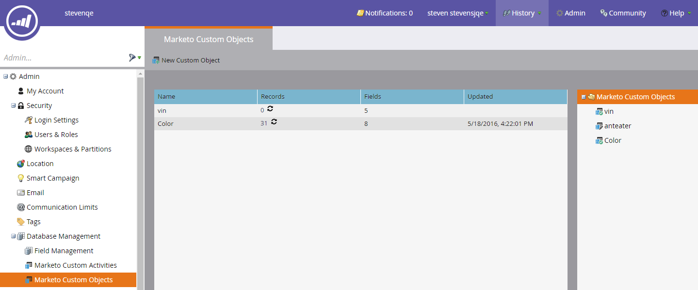

# Versionshinweise: Frühling &#39;16 {#release-notes-spring}

Die folgenden Funktionen sind in der Version vom Frühjahr 1916 enthalten. Bitte klicken Sie auf die Titel-Links, um detaillierte Artikel für jede Funktion anzuzeigen.

## [E-Mail-Insights](/help/marketo/product-docs/reporting/email-insights/email-insights-overview.md) {#email-insights}

E-Mail-Einblicke ist ein brandneues, historisches, aggregiertes Daten-E-Mail-Analyseerlebnis, das von Anfang bis Ende neu gestaltet wurde, um eine blitzschnelle Leistung zu erzielen. Es verfügt über ein völlig neues Design der Benutzeroberfläche, das an die Anforderungen und den Workflow von E-Mail-Marketing-Experten angepasst ist.

>[!NOTE]
>
>Ab dem 3. Juni starten wir Batches-E-Mail-Einblicke für Kunden. Unser Ziel ist es, dies in den nächsten Monaten abzuschließen. Wir benachrichtigen Sie per E-Mail, wenn Sie aktiviert sind.

## [Auswahl der E-Mail-Vorlagen](/help/marketo/product-docs/email-marketing/general/email-editor-2/email-template-picker-overview.md) {#email-template-picker}

Erstellen Sie schöne E-Mails mit unseren neuen Starter-Vorlagen! Suchen Sie Ihre Vorlagen auch schnell anhand der Live-Miniaturansichten.

>[!NOTE]
>
>E-Mail-Editor 2.0 (mit der Vorlagenauswahl) wird ab dem 3. Juni schrittweise eingeführt. Wir werden den Rollout bis zum 30. Juni abschließen. Im Gegensatz zu E-Mail-Einblicken werden Sie nicht benachrichtigt, wenn Sie Zugriff haben. Um dies zu überprüfen, folgen Sie bitte den Schritten in [diesem Artikel](/help/marketo/product-docs/email-marketing/general/email-editor-2/transitioning-to-email-editor-2-0.md).

## [E-Mail-Bearbeitung - neu erfunden](/help/marketo/product-docs/email-marketing/general/email-editor-2/email-editor-v2-0-overview.md) {#email-editing-re-imagined}

Genau, ein brandneuer E-Mail-Editor! Verwenden Sie die einfache Drag-and-Drop-Funktion, um Inhalte hinzuzufügen und neu anzuordnen. Neue Elemente, einschließlich Bilder, Videos, Variablen und Module, verbessern mit Sicherheit das Bearbeitungserlebnis. Sehen Sie sich auch den aktualisierten Code-Editor sowie die Unterstützung für Vorschau und Preheader an.

## [Mobile In-App-Nachrichten](/help/marketo/product-docs/mobile-marketing/in-app-messages/understanding-in-app-messages.md) {#mobile-in-app-messages}

Erstellen Sie beeindruckende In-App-Nachrichten für Ihre App direkt in Marketo. Definieren Sie mit dem In-App-Nachrichtenprogramm genau, wer es wann sehen soll. Überwachen Sie die Leistung einfach mit dem Programm-Dashboard.

## [Keine Entwurfsausschnitte](/help/marketo/product-docs/administration/users-and-roles/enable-no-draft-for-snippets.md) {#no-draft-snippets}

Vorbei sind die Zeiten, in denen Sie jedes Mal, wenn ein Snippet aktualisiert wird, alles erneut genehmigen müssen! Mit „Kein Entwurf“ erhalten alle E-Mails und Landingpages, die einen Ausschnitt verwenden, die Ausschnitt-Aktualisierungen und behalten ihren vorherigen Status bei. Jedes Mal, wenn Sie einen Ausschnitt genehmigen, haben Sie die Wahl, „Kein Entwurf“ auszuführen und alles zu aktualisieren oder Entwürfe zu erstellen. Es liegt an dir! Kein Entwurf steht allen Kunden zur Verfügung und wird von einer neuen Berechtigung in Admin gesteuert.

## [Landingpage, Landingpage-Vorlage und Formular-APIs](https://developers.marketo.com/blog/spring-2016-updates/) {#landing-page-landing-page-template-and-form-apis}

Die Marketo-REST-APIs unterstützen jetzt die Kontrolle über Marketo-Landingpages, Landingpage-Vorlagen und Formulare. Benutzer können jetzt Inhalte direkt über die Marketo-REST-API erstellen, aktualisieren, genehmigen und löschen.

## [IP-Zulassungsauflistung für API-Zugriff](/help/marketo/product-docs/administration/additional-integrations/create-an-allowlist-for-ip-based-api-access.md) {#ip-allowlisting-for-api-access}

Ähnlich wie bei der IP-Zulassungsauflistung für Marketo-Benutzeranmeldungen können Marketo-Administratoren jetzt eine Zulassungsliste von IP-Adressen einrichten, die auf die Marketo-SOAP und REST-APIs zugreifen können, wodurch der Zugriff von nicht autorisierten IP-Adressen blockiert wird. Dies bietet eine zusätzliche Sicherheitsebene für Ihre Marketo-Instanz und stellt sicher, dass der API-Zugriff nur innerhalb des Netzwerks Ihres Unternehmens erfolgen kann. Einzelheiten zum Einrichten finden Sie auf der Dokumentations-Site zu Marketo .

## [Neuer Hochgeschwindigkeits-Microsoft Dynamics-Sync-Connector](/help/marketo/product-docs/crm-sync/microsoft-dynamics-sync/microsoft-dynamics-sync-details/sync-status.md) {#new-high-speed-microsoft-dynamics-sync-connector}

Der neue, schnelle Dynamics-Connector bietet Geschwindigkeiten, die bis zu 20-mal höher für die Erstsynchronisierung und bis zu 5-mal höher für die inkrementelle Synchronisierung sind. Alle neuen Kunden werden diesen Connector am Veröffentlichungsdatum integrieren und wir werden ihn im Laufe der Sommerveröffentlichung schrittweise für Bestandskunden bereitstellen.

**Daten für neue Felder aktualisieren**: Jetzt können Sie neue Synchronisierungsfelder jederzeit aktivieren und alle Datenwerte für dieses Feld werden von Dynamics CRM in Marketo aktualisiert. Keine Sorgen mehr, dass bei der Ersteinrichtung alle Felder ausgewählt werden müssen. Wenn Sie ein vorhandenes Synchronisierungsfeld deaktivieren und später erneut aktivieren, werden alle Datenwerte für dieses Feld von Dynamics CRM in Marketo aktualisiert.

**Lead als Kontakt synchronisieren**: Die Flussaktion Lead mit Microsoft synchronisieren bietet eine neue Option zum Synchronisieren als Lead oder Kontakt.

**Registerkarte „Admin“ für Synchronisierungsfehler**: Durchsuchen, Suchen oder Exportieren von Leads (und anderen Objekten), die nicht mit Details wie Vorgang, Richtung, Fehlercode und Fehlermeldung synchronisiert werden konnten.

**Microsoft Dynamics 2016**: Der Connector ist für Dynamics 2016 Online- und On-Premise-Versionen vollständig zertifiziert.

**Plug-in-Updates sind jetzt dokumentiert:** Siehe den [Artikel zu Plug-in-Updates](/help/marketo/product-docs/crm-sync/microsoft-dynamics-sync/marketo-plugin-releases-for-microsoft-dynamics.md).

## [Anzeigename der Instanz](/help/marketo/product-docs/administration/settings/edit-subscription-settings.md) {#friendly-instance-name}

Heute ist es schwierig, zwischen Marketo-Instanzen wie Sandbox- und Produktionsinstanzen zu unterscheiden. Mit dieser Funktion erfahren Sie, an welchen Instanzen Sie derzeit arbeiten.

## [Zeitbeschränkter Zugriff für Abonnements](/help/marketo/product-docs/administration/users-and-roles/managing-marketo-users.md) {#limited-time-access-for-subscriptions}

Heute werden Benutzende auf unbestimmte Zeit zum Marketo-Abonnement eingeladen. Mit dieser Funktion können Administratoren Benutzer für einen begrenzten Zeitraum zu Abonnements einladen, z. B. für zwei Wochen oder einen Monat.

## [Raster für benutzerdefinierte Objekte](/help/marketo/product-docs/administration/marketo-custom-objects/understanding-marketo-custom-objects.md) {#custom-objects-grid}

Jetzt können Sie die Anzahl der Datensätze und Felder für alle veröffentlichten benutzerdefinierten Objekte anzeigen.

## Eigene Aktivitäten {#custom-activities}

Marketo-Administratoren können jetzt ihre benutzerdefinierten Aktivitätstypen über den Marketo Custom Activity Definition Modeler definieren und verwalten. Ähnlich wie (und in Verbindung mit) dem benutzerdefinierten Objekt Modeler von Marketo können Admins das Datenmodell jetzt entsprechend ihren Geschäftsanforderungen erweitern. Weitere Informationen zur Verwendung dieser Funktion finden Sie auf der Dokumentations-Site zu [Marketo](/help/marketo/product-docs/administration/marketo-custom-activities/understanding-custom-activities.md).
