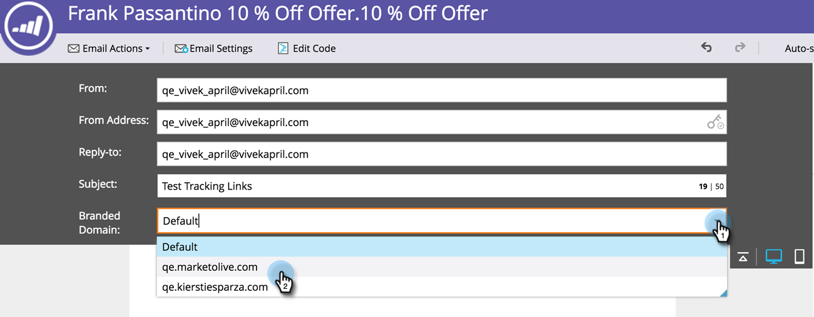

# Versionshinweise – Sommer 2016 {#release-notes-summer}

Die folgenden Funktionen sind in der Version vom Sommer 1916 enthalten. Überprüfen Sie Ihre Marketo Edition auf die Verfügbarkeit der Funktionen. Bitte klicken Sie auf die Titel-Links, um detaillierte Artikel für jede Funktion anzuzeigen.

## [Account-based Marketing](https://docs.marketo.com/display/docs/account+based+marketing) {#account-based-marketing}

Account-Based-Marketing von Marketo bietet alle Grundlagen in einer zentralen Plattform:

* **Target** - Kontoerkennung, Lead-Konto-Zuordnung und spezifische Kontolisten
* **Engage** - Account-basierte Personalization, kanalübergreifende Interaktion und Account-spezifische Workflows
* **Kennzahlen** - Einblicke auf Konto- und Listenebene, Kontointeraktionswert und Auswirkungen auf Pipeline und Umsatz

>[!NOTE]
>
>ABM ist als Add-on zu Ihrem Marketo-Abonnement verfügbar. Wenden Sie sich daher zur Implementierung an Ihren Vertriebsmitarbeiter.

## [Audit-Protokoll](/help/marketo/product-docs/administration/audit-trail/audit-trail-overview.md) {#audit-trail}

Das Audit-Protokoll enthält einen umfassenden Verlauf der Änderungen, die in Ihrem Marketo-Abonnement vorgenommen wurden. Sie schafft Rechenschaftspflicht zwischen Benutzern und Administratoren, hilft bei der Identifizierung der Ursache von unerwartetem Verhalten und bietet die Sicherheit zu wissen, wer was und wann tut. Diese Informationen stehen zu jedem Zeitpunkt zur Verfügung und können zur Beantwortung von Fragen verwendet werden, wie z. B.:

* Was ist mit diesem Asset oder dieser Einstellung passiert und wer hat es zuletzt aktualisiert?
* Was hat Benutzer X so gemacht?
* Wer meldet sich bei unserem Konto an?

## Marketo-Vibes SMS LaunchPoint-Integration

Einfaches Erstellen von SMS-Nachrichten direkt in Marketo. Personalisieren und Targeting Ihrer Nachricht mit Ihren umfangreichen Marketo-Daten und einfache Überwachung der Leistung mithilfe des SMS-Nachrichten-Dashboards.

>[!NOTE]
>
>Für diese Funktion müssen Sie über ein vorhandenes [!DNL Vibes SMS] verfügen.

## [Verbesserungen in Email 2.0](/help/marketo/product-docs/email-marketing/general/email-editor-2/email-editor-v2-0-overview.md) {#email-enhancements}

**Variablen auf Modulebene**

Zuvor waren alle in E-Mail 2.0-Vorlagen angegebenen Variablen im Umfang „global“. Bei der Verwendung von Variablen innerhalb von Modulen ist dies nicht immer wünschenswert, wenn Sie mehrere Instanzen des Moduls verwenden möchten. Mit dieser Version können Variablen jetzt als „Modulebene“ angegeben werden, was Ihnen ermöglicht anzugeben, dass der Benutzer in der Lage sein sollte, eindeutige Werte für jedes Modul festzulegen, in dem er verwendet wird.

**Syntaxaktualisierungen**

* Sie können jetzt „mktoAddByDefault“ für Module verwenden, die in E-Mail-2.0-Vorlagen angegeben sind, um anzugeben, welche Module standardmäßig in neuen E-Mails angezeigt werden sollen. Dies ist viel praktischer, wenn Sie eine E-Mail-Vorlage mit einer großen Anzahl von Modulen erstellen.
* Bei Bildelementen können Sie jetzt angeben, ob die Eigenschaften „height“ und „width“ des zugrunde liegenden `` HTML-Elements gesperrt werden sollen oder für den Endbenutzer bzw. die Endbenutzerin bearbeitbar sein sollen. motoLockImgSize=„true“ bewirkt, dass Höhe/Breite gesperrt werden (auch wenn das Bild geändert wird). Ähnlich führt motoLockImgStyle=„true“ dazu, dass die Eigenschaft „style“ gesperrt wird.

**Code-Suche**

Verwenden Sie neue Suchfunktionen, um Inhalte im Code Ihrer E-Mail effizient zu finden und zu ersetzen. Diese Funktion ist auch im E-Mail-Vorlageneditor verfügbar.

**Token-Unterstützung in Bildelementen**

Token können jetzt im Bereich „Externe URL“ des Bilderlebnisses zum Einfügen verwendet werden! Wenn Sie Bilder mit `{{my.tokens}}` angegeben haben, können Sie jetzt diese Token im E-Mail-Editor 2.0 referenzieren. Beachten Sie, dass das Bild auf der Arbeitsfläche des E-Mail-Editors 2.0 weiterhin beschädigt angezeigt wird. Sie sehen sie jedoch in der Vorschau gerendert und Beispiele senden , bevor Sie Ihre E-Mail versenden.

## Mehrmarken-Domainen {#multiple-branding-domains}

Vorbei sind die Zeiten, in denen E-Mail-Tracking-Links nur mit einer Branding-Domain gebrandet werden konnten. Sie können jetzt mehrere Branding-Domains hinzufügen, um das Vertrauen der Verbraucher zu wecken, einen optimierten Look zu erstellen, sich auf die Marke zu konzentrieren, die E-Mail-Zustellbarkeit zu verbessern und für jede E-Mail zu wählen, welche Branding-Domain für die Tracking-Links der einzelnen E-Mails verwendet werden soll.

## [Programm-Token](/help/marketo/product-docs/demand-generation/landing-pages/personalizing-landing-pages/tokens-overview.md) {#program-tokens}

Wir haben einen neuen Token-Typ für Programme erstellt. Sie können jetzt Programmname, Beschreibung und ID in den Schritten Assets und Smart-Campaign-Fluss rendern.

## [Konzernschlüssel](/help/marketo/product-docs/marketo-sales-insight/msi-outlook-plugin/authorize-the-marketo-outlook-plugin.md) {#enterprise-key}

Es kann mühsam sein, von jeder Person in Ihrem Vertriebsteam zu verlangen, unser [!DNL Sales Insight]-Plug-in für [!DNL Outlook] zu installieren. Wir haben eine neue Möglichkeit eingeführt, das Plug-in für [!DNL Outlook] remote mit einem Unternehmensschlüssel zu installieren. Senden Sie Ihrem IT-Team den eindeutigen Schlüssel, der im Abschnitt &quot;Marketo-[!DNL Sales Insight]&quot; von [!UICONTROL Admin] zu finden ist, und überlassen Sie ihm den Rest.

## [Kampagnen zur Web-Personalisierung](/help/marketo/product-docs/web-personalization/working-with-web-campaigns/create-a-new-dialog-web-campaign.md) {#web-personalization-campaigns}

Geben Sie eine Zeitverzögerung an, damit Web-Kampagnen auf Ihrer Website reagieren.

## [Export von Content Analytics und Recommendations](/help/marketo/product-docs/web-personalization/understanding-web-personalization/understanding-content-analytics.md) {#content-analytics-and-recommendations-export}

Anzeigen von Inhaltsanalysen und Recommendations-Daten offline.

## [API-Support für Email Editor 2.0](https://developers.marketo.com/documentation/asset-api/) {#api-support-for-email-editor}

Vorhandene Asset-APIs, die zuvor nur mit E-Mails und Vorlagen der Version 1.0 kompatibel waren, sind jetzt für E-Mail-Assets der Version 2.0 aktiviert.

## [Marketo Developers-Website](https://developers.marketo.com/) {#marketo-developers-site}

Neu und noch besser!

## [Datenschutzeinstellungen](/help/marketo/product-docs/administration/settings/understanding-privacy-settings.md) {#privacy-settings}

Marketing-Experten können anhand von Datenschutzeinstellungen entscheiden, ob Besucher mithilfe von [!DNL Munchkin]- und Web Personalization-Funktionen verfolgt werden sollen oder nicht. Die Tracking-Stufe wird mithilfe der Einstellung „Nicht verfolgen“ des Browsers, eines Opt-out-Cookies oder einer unspezifischen IP-Adresse gesteuert. Diese Methoden können sich auf den Wert und die Funktionalität von Marketo in bestimmten Bereichen auswirken. Wenn der Marketer jedoch nichts ändert, bleibt die Marketo-Funktionalität unverändert.

Diese Funktion wird über einen Zeitraum von sechs Wochen schrittweise für Kunden veröffentlicht. Wenn Sie es sofort benötigen, wenden Sie sich an den Marketo-Support.
