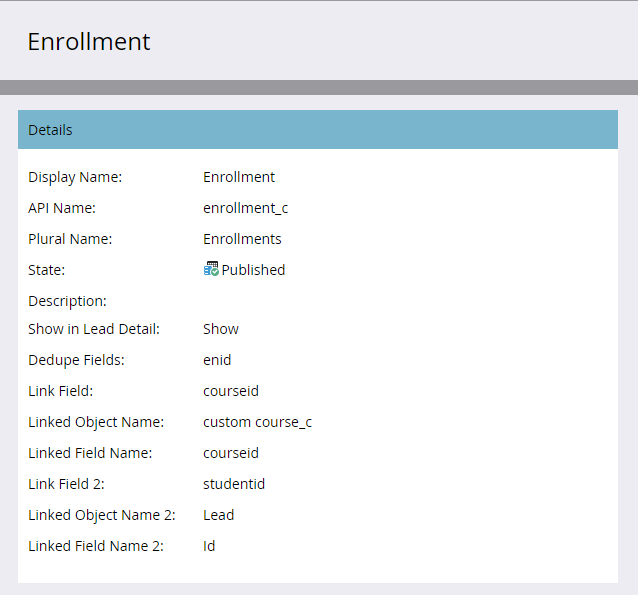

# Versionshinweise: Winter &#39;16 {#release-notes-winter}

Die folgenden Funktionen sind in der Version Winter 16 enthalten. Klicken Sie auf die Titel-Links, um detaillierte Artikel zu den einzelnen Funktionen anzuzeigen.

## [Ist anonymer Filter](/help/marketo/product-docs/administration/additional-integrations/add-munchkin-tracking-code-to-your-website/next-generation-munchkin-tracking-faq.md) {#is-anonymous-filter}

Der Filter Ist anonym wurde für Smart-Listen entfernt. Weitere Informationen finden Sie im Dokument [Häufig gestellte Fragen zur Munchkin-Verfolgung der nächsten Generation](/help/marketo/product-docs/administration/additional-integrations/add-munchkin-tracking-code-to-your-website/next-generation-munchkin-tracking-faq.md) . Diese Änderung betrifft nicht Web Personalization (RTP), das anonyme und bekannte Webbesucher weiterhin identifiziert und Inhalte für diese Besucher in Echtzeit personalisiert.

## [Datenbank-Dashboard](/help/marketo/product-docs/core-marketo-concepts/smart-lists-and-static-lists/managing-people-in-smart-lists/database-dashboard.md) {#database-dashboard}

Die Lead-Datenbank verfügt über ein aktualisiertes Zusammenfassungs-Dashboard, das die Gesamtgröße der Personendatenbank, die Anzahl der vermarktbaren Leads und eine Aufschlüsselung der Leads nach den fünf wichtigsten Quellen enthält.

## [Microsoft Edge Browser](/help/marketo/product-docs/administration/setup-administration/supported-browsers.md) {#microsoft-edge-browser}

Microsoft Edge wurde zur Liste der von Marketo unterstützten Browser [ hinzugefügt.](https://docs.marketo.com/display/public/DOCS/Supported+Browsers)

## [Microsoft Outlook 2016](/help/marketo/product-docs/marketo-sales-insight/msi-outlook-plugin/install-the-marketo-email-add-in-for-outlook-with-a-registration-code.md) {#microsoft-outlook}

[Microsoft Outlook 2016](/help/marketo/product-docs/marketo-sales-insight/msi-outlook-plugin/install-the-marketo-email-add-in-for-outlook-with-a-registration-code.md) wird jetzt unterstützt.

## [E-Mail-Programm Head Start](/help/marketo/product-docs/email-marketing/email-programs/email-program-actions/head-start-for-email-programs.md) {#email-program-head-start}

Verwenden Sie Head Start , um anzugeben, dass die Verarbeitung für Ihren Versand vorzeitig erfolgen soll. Anstatt Leads zu qualifizieren und E-Mails zum geplanten Zeitpunkt des Programms vorzubereiten, stellt Head Start sicher, dass diese Aufgaben vorab durchgeführt werden. Auf diese Weise erhält Ihre Audience zum geplanten Zeitpunkt E-Mails.

Um diese Funktion nutzen zu können, muss das E-Mail-Programm mindestens 12 Stunden im Voraus geplant und die Smart-Liste wird 12 Stunden vor dem Versand gesperrt.

>[!NOTE]
>
>Diese Funktion wird eine Woche nach der Winterversion 16 schrittweise eingeführt. Sie ist nicht für die Verwendung mit Smart-Kampagnen oder der API verfügbar.

## [Mobile-Marketing-Erweiterungen](/help/marketo/product-docs/mobile-marketing/admin/add-a-mobile-app.md) {#mobile-marketing-enhancements}

**PhoneGap-Unterstützung:** Wir bieten jetzt PhoneGap-Unterstützung für Ihre Mobile App an. [Weitere Infos](https://experienceleague.adobe.com/en/docs/marketo-developer/marketo/mobile/phonegap).

**Unterstützung für Sandbox-Apps**:

## [Programm-API](https://experienceleague.adobe.com/en/docs/marketo-developer/marketo/rest/assets/programs) {#program-api}

Erstellen, aktualisieren und klonen Sie Programme über die REST-API. Dies umfasst nicht die Erstellung oder Aktualisierung von Smart-Listen und Smart-Kampagnen innerhalb eines Programms.

## [Erweiterung von Microsoft Dynamics](/help/marketo/product-docs/crm-sync/microsoft-dynamics-sync/microsoft-dynamics-sync-details/sync-status.md) {#microsoft-dynamics-enhancements}

**[Synchronisierungsstatus](/help/marketo/product-docs/crm-sync/microsoft-dynamics-sync/microsoft-dynamics-sync-details/sync-status.md)**: Behalten Sie die Tabs zum aktuellen Durchsatz und zum Rückstand des Synchronisierungsprozesses bei. Schlüsseln Sie sie anhand der Anzahl der Einfügungen und Aktualisierungen nach Objekt auf.

**[Benachrichtigungen](/help/marketo/product-docs/core-marketo-concepts/miscellaneous/understanding-notifications/notification-types.md)**: Erhalten Sie eine Benachrichtigung über häufige Synchronisierungsfehler zusammen mit einer Liste von Leads, die diesen Fehler aufweisen.

## [Erweiterung der benutzerdefinierten Objekte](/help/marketo/product-docs/administration/marketo-custom-objects/create-marketo-custom-objects.md) {#custom-objects-enhancements}

Sie können jetzt eine n:n-Beziehung zwischen Leads/Konten und einem benutzerdefinierten Objekt erstellen, indem Sie ein intermediäres Objekt mit mehreren Verknüpfungsfeldern verwenden.

## [Facebook-Lead-Anzeigen](/help/marketo/product-docs/demand-generation/facebook/set-up-facebook-lead-ads.md) {#facebook-lead-ads}

[Facebook-Lead-Anzeigen](https://www.facebook.com/business/a/lead-ads) sind eine direktere Möglichkeit für ein Unternehmen, Lead-Generierungskampagnen in Facebook durchzuführen. Personen füllen ein Formular aus, um ihr Interesse an einem Produkt oder einer Dienstleistung zum Ausdruck zu bringen, damit das Unternehmen sie nachverfolgen kann. Die Marketo-Integration mit Facebook Lead Ads erfasst automatisch die Informationen, die ein Lead im Lead-Anzeigenformular bereitstellt. Folgeaktionen und Benachrichtigungen können dann mithilfe des neuen Triggers Füllt Facebook-Lead-Anzeigen aus automatisiert werden.

## [Web-(Echtzeit-Personalization-)Kampagnenplaner](/help/marketo/product-docs/web-personalization/working-with-web-campaigns/schedule-a-web-campaign.md) {#web-real-time-personalization-campaign-scheduler}

Planen Sie Ihre Kampagne im Voraus. Richten Sie ein Start- und Enddatum für personalisierte Webinhalte ein und wiederholen Sie Kampagnen an bestimmten Tagen und Uhrzeiten. Personalisieren Sie den Zeitplan, um die Kampagne entsprechend der Zeit oder der ausgewählten Zeitzone des Webbesuchers anzuzeigen.

