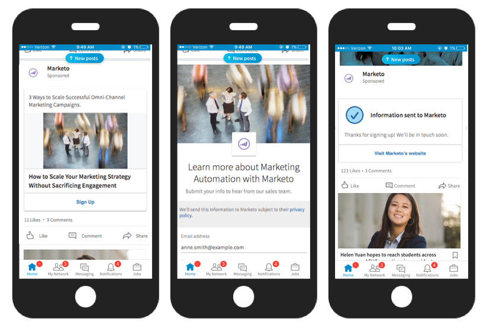
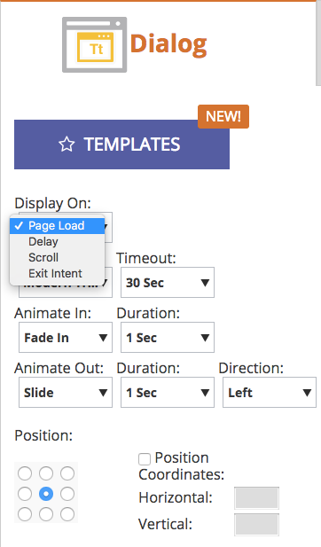

# Versionshinweise: Frühling &#39;17 {#release-notes-spring}

Die folgenden Funktionen sind in der Version Frühjahr 17 enthalten. Überprüfen Sie Ihre Marketo-Edition auf Funktionsverfügbarkeit.

Klicken Sie auf die Titel-Links, um detaillierte Artikel zu den einzelnen Funktionen anzuzeigen. **Hinweis**: Wenn ein Thema mehrere Unterüberschriften enthält, werden die Links dort platziert.

## [LinkedIn Lead Gen Forms](/help/marketo/product-docs/demand-generation/social/social-functions/set-up-linkedin-lead-gen-forms.md) {#linkedin-lead-gen-forms}

[LinkedIn Lead Gen Forms](https://business.linkedin.com/marketing-solutions/native-advertising/lead-gen-ads) ist eine direktere Möglichkeit für ein Unternehmen, Lead-Generierungskampagnen in LinkedIn durchzuführen. Personen können Formulare ausfüllen, um ihr Interesse an einem Produkt oder Dienst zum Ausdruck zu bringen, sodass das Unternehmen die Details des Kontakts erfassen und mit Marketo synchronisieren kann, wo automatisierte Folgeprozesse und Lead-Routing-Aktivitäten stattfinden können.

Die Marketo-Integration mit LinkedIn Lead Gen Forms erfasst automatisch die Informationen, die ein Lead im Lead Gen-Formular bereitstellt. Folgeaktionen und Benachrichtigungen können dann mit dem neuen Trigger **LinkedIn Lead Gen Form ausfüllen** automatisiert werden.

## [MSI-Vorlage abgelaufen](/help/marketo/product-docs/marketo-sales-insight/msi-for-salesforce/features/actions-in-the-msi-panel/send-marketo-email/publish-an-email-to-sales-insight.md) {#expire-msi-template}

Die Tage der Bereinigung veralteter Vorlagen in Sales Insight sind vorbei. Legen Sie ein Ablaufdatum fest, an dem Ihre E-Mail veröffentlicht wird, und wir werden dafür sorgen, dass die Veröffentlichung für Sie rückgängig gemacht wird, sobald das Ablaufdatum umkehrt.

>[!NOTE]
>
>Wenn Sie das Ablaufdatum auf den 31.05.17 festlegen, wird die Vorlage am Ende des Tages am 31.05.17 aus Sales Insight entfernt.

## [Massenextraktions-APIs für Personen und Aktivitäten](https://experienceleague.adobe.com/en/docs/marketo-developer/marketo/rest/bulk-extract/bulk-extract) {#bulk-extract-apis-for-people-and-activities}

Einfache Übertragung großer Mengen von Personen- und Aktivitätsdaten von Marketo an Ihre externen Systeme.

## ABM-Verbesserungen {#abm-enhancements}

**[Benutzerdefinierte Felder für von ABM benannte Konten](https://docs.marketo.com/x/1wnG)**

Mit Marketo ABM können Sie jetzt bis zu 10 benutzerdefinierte Felder in Ihren spezifischen Konten erstellen. Sie können diese benutzerdefinierten Felder Feldern in Ihrem CRM-Konto-Objekt zuordnen. Marketo ABM synchronisiert die Daten, sodass Sie Ihre von ABM benannten Konten erweitern und Ihr Marketing fördern können.

**[Perzentil-Scoring auf von ABM benannten Konten](https://docs.marketo.com/display/docs/assets/abmpercentiles.png)**

Die Punktzahl für benannte Konten kann stark variieren. Marketo ABM berechnet nun automatisch ein Perzentil für jeden Ihrer Punktzahlen, sodass Sie auf einen Blick sehen können, wo jedes benannte Konto unter Ihren anderen benannten Konten rangiert.

**[ABM-Kontolisten-APIs](https://experienceleague.adobe.com/en/docs/marketo-developer/marketo/rest/lead-database/named-account-lists)**

Nutzen Sie die umfassenden und robusten ABM-Partnerintegrationen mit verbesserter API-Unterstützung für Named Account Lists.

## Verbesserte Web-Personalisierung {#web-personalization-enhancements}

**[Web-Kampagne bei Bildlauf](/help/marketo/product-docs/web-personalization/working-with-web-campaigns/set-how-your-web-campaign-displays.md)**

Neue Web-Campaign-Effekte bieten Ihren Webbesuchern ein personalisierteres Erlebnis. Stellen Sie Ihre personalisierten Web-Kampagnen so ein, dass sie nur angezeigt werden, wenn ein Web-Besucher auf Ihrer Webseite nach unten scrollt. Sie können Ihre Dialogfeld-Web-Kampagnen so einstellen, dass sie beim Scrollen angezeigt werden, basierend auf:

* Prozentsatz des Bildlaufs der Seite
* Pixelanzahl erreicht
* Scrollen unterhalb des Seitenbereichs

**[Web-Kampagne bei Exit-Absicht](/help/marketo/product-docs/web-personalization/working-with-web-campaigns/set-how-your-web-campaign-displays.md)**

Erfassen Sie die Aufmerksamkeit Ihres Besuchers, bevor er Ihre Seite schließt. Stellen Sie Ihre personalisierten Web-Kampagnen so ein, dass sie nur angezeigt werden, wenn eine Mausbewegung darauf hinweist, dass der Besucher die Seite verlässt.

**[Animationseffekte für Web-Kampagnen](/help/marketo/product-docs/web-personalization/working-with-web-campaigns/create-a-new-dialog-web-campaign.md)**

Legen Sie die Animationseffekte für Ihre Web-Kampagne im Dialogfeld fest, um anzupassen, wie eine Kampagne beim Einstieg oder Verlassen Ihrer Webseite angezeigt wird. Sie können aus 6 verschiedenen Effekten auswählen und den Zeitpunkt und die Richtung des Dialogfelds steuern.

**[Anpassung des Schließen-Dialogs](/help/marketo/product-docs/web-personalization/working-with-web-campaigns/create-a-new-dialog-web-campaign.md)**

Passen Sie die Schaltfläche &quot;Schließen&quot;für Dialogfelder an. Wählen Sie aus einer Reihe von Optionen aus, die in Web-Kampagnen für Transparent Dialog Style verwendet werden. Wählen Sie das Symbol, die Farbe und die Position für die Schaltfläche &quot;Schließen&quot;aus. Sie können auch ein eigenes Schaltflächenbild hinzufügen.

**[Web-Kampagnen-Archiv](/help/marketo/product-docs/web-personalization/working-with-web-campaigns/archive-a-web-campaign.md)**

Archivieren ist ein neuer Web-Kampagnenstatus, mit dem Sie Web-Kampagnen archivieren und von der standardmäßigen Webkampagnenansicht ausblenden können. Dadurch können Sie sich auf Ihre relevantesten, aktiven Kampagnen konzentrieren und ältere archivierte Kampagnen nach Bedarf abrufen.

**[Lokalisierung](/help/marketo/product-docs/administration/settings/select-your-language-locale-and-time-zone.md)**

Web Personalization wird jetzt in allen von Marketo unterstützten Sprachen angeboten (Englisch, Japanisch, Deutsch, Spanisch, Französisch und Portugiesisch).

## Prädiktive Verbesserungen {#predictive-enhancements}

**[Lokalisierung](/help/marketo/product-docs/administration/settings/select-your-language-locale-and-time-zone.md)**

Predictive Content wird jetzt in allen von Marketo unterstützten Sprachen angeboten (Englisch, Japanisch, Deutsch, Spanisch, Französisch und Portugiesisch).

## [Veraltete Rich-Text-Editor- und Formular-Editor 1.0-Einstellung](https://nation.marketo.com/docs/DOC-4315) {#legacy-rich-text-editor-and-form-editor-deprecation}

Ab dem 1. August 2017 werden Kunden, die weiterhin den alten Rich-Text-Editor und den Formular-Editor 1.0 verwenden, automatisch zum neuen Erlebnis weitergeleitet.
