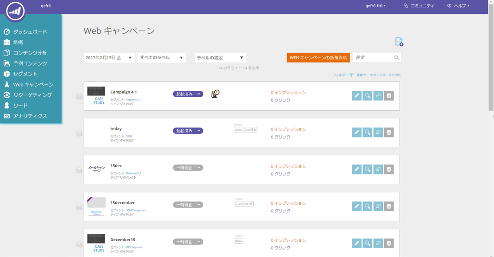

# Versionshinweise: Winter &#39;17 {#release-notes-winter}

Die folgenden Funktionen sind in der Version Winter &#39;17 enthalten. Überprüfen Sie Ihre Marketo Edition auf die Verfügbarkeit der Funktionen.

Bitte klicken Sie auf die Titel-Links, um detaillierte Artikel für jede Funktion anzuzeigen.

>[!NOTE]
>
>Wenn ein Thema mehrere Unterüberschriften hat, werden die Links dort platziert.

## [Erweiterte Abgleichung für benutzerdefinierte Facebook-Zielgruppen](/help/marketo/product-docs/demand-generation/ad-network-integrations/add-facebook-custom-audiences-as-a-launchpoint-service.md) {#advanced-matching-for-facebook-custom-audiences}

Bei der einfachen Zuordnung werden nur E-Mail-Adressen verwendet, bei der neuen erweiterten Zuordnung werden jedoch sieben zusätzliche Felder verwendet, was die Übereinstimmungsrate für mehr Konversionen erhöht.

## [API für den Import benutzerdefinierter Objekte](https://developers.marketo.com/rest-api/lead-database/custom-objects/) {#custom-object-import-api}

Diese API bietet eine schnellere Schnittstelle zum Synchronisieren benutzerdefinierter Objekte in Marketo. Sie können CSV-, TSV- oder SSV-Tabellendateien als benutzerdefinierte Objekte in Marketo importieren.

## [Export von Web Personalization-Kampagnen](/help/marketo/product-docs/web-personalization/working-with-web-campaigns/export-web-campaign-data.md) {#web-personalization-campaigns-export}

Exportieren Sie alle Web-Kampagnendetails und Analysen im CSV-Format. Anschließend können Sie Ihre Daten in einem praktischen Layout anzeigen.

## Lokalisierung {#localization}

Die Apps Web Personalization[!UICONTROL Predictive Content] und Email Insights sind jetzt auf Japanisch, Deutsch und Spanisch verfügbar. Sie [ Ihre Sprache und Ihr Gebietsschema ](/help/marketo/product-docs/administration/settings/select-your-language-locale-and-time-zone.md), um Ihre Inhalte in diesen Sprachen anzuzeigen.

## Verbesserungen beim Account-basierten Marketing {#account-based-marketing-enhancements}

**[Spezifische Konten importieren](/help/marketo/product-docs/target-account-management/target/named-accounts/import-named-accounts.md)**

Mit der Option [!UICONTROL Benanntes Konto] Importieren können Sie mehrere Datensätze gleichzeitig über den CSV-Upload erstellen oder aktualisieren.

**[Email Insights-Unterstützung](/help/marketo/product-docs/reporting/email-insights/filtering-in-email-insights.md)**

Verwenden [!UICONTROL Benanntes Konto] oder [!UICONTROL Kontoliste] als Dimensionen in E-Mail-Einblicken.

## [!UICONTROL Verbesserungen bei prädiktiven &#x200B;]) {#predictive-content-enhancements}

**[Filtern nach [!UICONTROL Source aktiviert]](/help/marketo/product-docs/predictive-content/working-with-predictive-content/understanding-predictive-content.md)**

Filtern Sie [!UICONTROL prädiktiven Inhalt] Teile, die für [!UICONTROL E-Mail], [!UICONTROL Rich-Media] oder die [!UICONTROL Empfehlungsleiste] sind.

**[Filtern [!UICONTROL Analytics nach Source]](/help/marketo/product-docs/predictive-content/working-with-predictive-content/understanding-predictive-content.md)**

Filtern [!UICONTROL prädiktive Inhalte] Analysen nach bestimmten Quellen - [!UICONTROL E-Mail], [!UICONTROL Rich-Media] oder [!UICONTROL Empfehlungsleiste].

**[!UICONTROL Prädiktiver Inhalt] Editor**

Die Inhaltsvorbereitung wird durch ein verbessertes Bearbeitungserlebnis und Layout nach Quelle aufgeteilt - [!UICONTROL E-Mail], [!UICONTROL Rich Media] oder [!UICONTROL Empfehlungsleiste].

**[Automatische Erkennung prädiktiver Inhalte](/help/marketo/product-docs/predictive-content/getting-started/enable-content-discovery.md)**

Bild-URL und Metadaten werden jetzt im Prozess zur automatischen Erkennung von Inhalten verwendet.

## [SDK-Verbesserungen](https://developers.marketo.com/mobile/) {#sdk-enhancements}

Entwickler haben jetzt zusätzliche Kontrolle über den Versand von Push-Benachrichtigungen, indem sie einen neuen SDK-API-Aufruf hinzufügen, mit dem Entwickler Push-Token entfernen können.

## Integration von Vibes SMS LaunchPoint

Verbessern Sie Ihr Targeting mit der neuen Filteroption „Mitglied der Vibes-Liste“.

## [Veralteter Rich-Text-Editor und Formular-Editor 1.0 eingestellt](https://nation.marketo.com/docs/DOC-4315) {#legacy-rich-text-editor-and-form-editor-deprecation}

Ab dem 1. August 2017 werden Kunden, die noch den alten Rich-Text-Editor und Formular-Editor 1.0 verwenden, automatisch auf das neue Erlebnis umgestellt.

## [Marketo-Aktivitäts-APIs](https://developers.marketo.com/blog/important-change-activity-records-marketo-apis/) {#marketo-activity-apis}

Bei den Aktivitäten-APIs von Marketo gibt es eine wichtige Änderung. Seid ihr vorbereitet?
