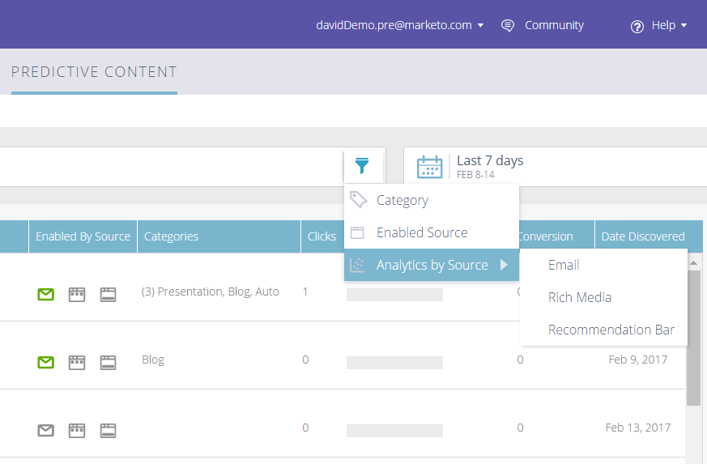
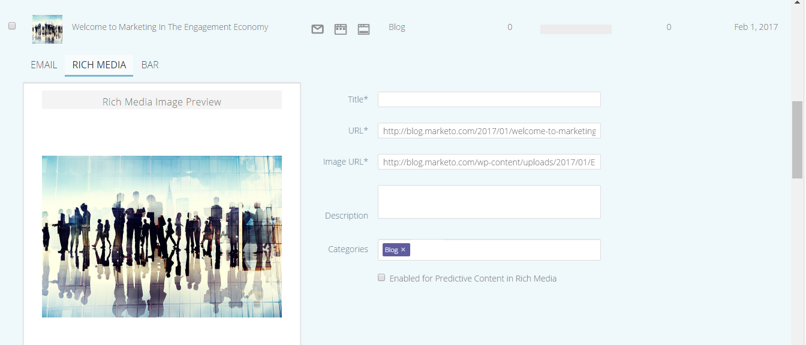

# Versionshinweise: Winter &#39;17 {#release-notes-winter}

Die folgenden Funktionen sind in der Version Winter 17 enthalten. Überprüfen Sie Ihre Marketo-Edition auf Funktionsverfügbarkeit.

Klicken Sie auf die Titel-Links, um detaillierte Artikel zu den einzelnen Funktionen anzuzeigen.

>[!NOTE]
>
>Wenn ein Thema mehrere Unterüberschriften enthält, werden die Links dort platziert.

## [Erweiterte Abgleichung für benutzerdefinierte Facebook-Zielgruppen](/help/marketo/product-docs/demand-generation/ad-network-integrations/add-facebook-custom-audiences-as-a-launchpoint-service.md) {#advanced-matching-for-facebook-custom-audiences}

Die grundlegende Übereinstimmung verwendet nur E-Mail-Adressen, aber die neue erweiterte Übereinstimmung verwendet zusätzliche sieben Felder, wodurch die Übereinstimmungsrate für mehr Konversionen erhöht wird.

## [API für den Import benutzerdefinierter Objekte](https://developers.marketo.com/rest-api/lead-database/custom-objects/) {#custom-object-import-api}

Diese API bietet eine schnellere Schnittstelle zur Synchronisierung benutzerdefinierter Objekte mit Marketo. Sie können CSV-, TSV- oder SSV-Tabellenkalkulationsdateien als benutzerdefinierte Objekte in Marketo importieren.

## [Export von Web-Personalisierungskampagnen](/help/marketo/product-docs/web-personalization/working-with-web-campaigns/export-web-campaign-data.md) {#web-personalization-campaigns-export}

Exportieren Sie alle Details und Analysen Ihrer Web-Kampagne in ein CSV-Format. Anschließend können Sie Ihre Daten in einem bequemen Layout anzeigen.

## Lokalisierung {#localization}

Die Apps Web Personalization, Predictive Content und Email Insights sind jetzt auf Japanisch, Deutsch und Spanisch verfügbar. You [Sprache und Gebietsschema auswählen](/help/marketo/product-docs/administration/settings/select-your-language-locale-and-time-zone.md) um Ihre Inhalte in diesen Sprachen anzuzeigen.

## Kontobasierte Marketing-Verbesserungen {#account-based-marketing-enhancements}

**[Benannte Konten importieren](/help/marketo/product-docs/target-account-management/target/named-accounts/import-named-accounts.md)**

Erstellen oder aktualisieren Sie mit der Option Import benannter Konten mehrere Datensätze gleichzeitig per CSV-Upload.

**[Unterstützung von E-Mail-Insights](/help/marketo/product-docs/reporting/email-insights/filtering-in-email-insights.md)**

Verwenden Sie &quot;Benanntes Konto&quot;oder &quot;Kontoliste&quot;als Dimensionen in E-Mail-Insights.

## Verbesserungen bei prädiktiven Inhalten {#predictive-content-enhancements}

**[Filtern nach aktivierter Quelle](/help/marketo/product-docs/predictive-content/working-with-predictive-content/understanding-predictive-content.md)**

Filtern Sie prädiktive Inhalte, die für E-Mail, Rich Media oder die Empfehlungsleiste aktiviert sind.

**[Analytics nach Quelle filtern](/help/marketo/product-docs/predictive-content/working-with-predictive-content/understanding-predictive-content.md)**

Filtern Sie prädiktive Inhaltsanalysen nach bestimmten Quellen - E-Mail, Rich Media oder Empfehlungsleiste.

**Editor für prädiktive Inhalte**

Es gibt ein verbessertes Bearbeitungserlebnis und -layout, das die Inhaltsvorbereitung nach Quelle aufteilt - E-Mail, Rich Media oder Empfehlungsleiste.

**[Automatische Erkennung prädiktiver Inhalte](/help/marketo/product-docs/predictive-content/getting-started/enable-content-discovery.md)**

Bild-URL und Metadaten werden jetzt im Prozess der automatischen Inhaltserkennung verwendet.

## [SDK-Verbesserungen](https://developers.marketo.com/mobile/) {#sdk-enhancements}

Entwickler haben jetzt zusätzliche Möglichkeiten, die Bereitstellung von Push-Benachrichtigungen zu steuern. Dazu wurde ein neuer SDK-API-Aufruf hinzugefügt, mit dem Entwickler Push-Token entfernen können.

## [Integration von Vibes SMS LaunchPoint](/help/marketo/product-docs/mobile-marketing/vibes-sms-messages/use-vibes-sms-messages-in-smart-list-triggers-and-filters.md) {#vibes-sms-launchpoint-integration}

Verbessern Sie Ihre Zielgruppenbestimmung mit der neuen Filteroption &quot;Mitglied der Vibes-Liste&quot;.

## [Veraltete Rich-Text-Editor- und Formular-Editor 1.0-Einstellung](https://nation.marketo.com/docs/DOC-4315) {#legacy-rich-text-editor-and-form-editor-deprecation}

Ab dem 1. August 2017 werden Kunden, die weiterhin den alten Rich-Text-Editor und den Formular-Editor 1.0 verwenden, automatisch zum neuen Erlebnis weitergeleitet.

## [Marketo-Aktivitäts-APIs](https://developers.marketo.com/blog/important-change-activity-records-marketo-apis/) {#marketo-activity-apis}

Bei den Aktivitäten-APIs von Marketo gibt es eine wichtige Änderung. Bist du vorbereitet?
