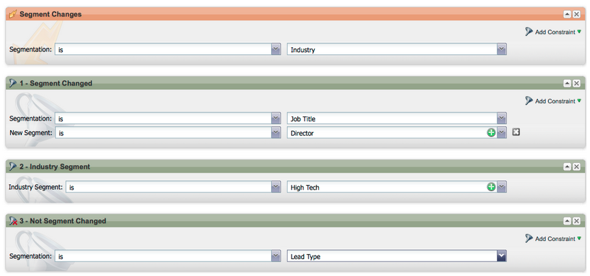
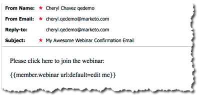
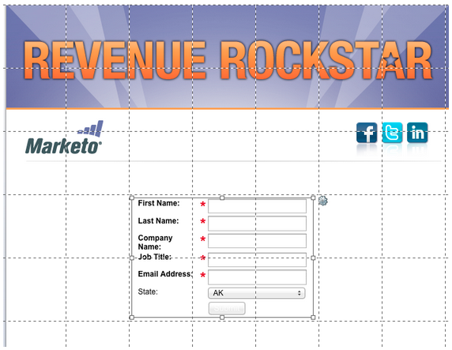
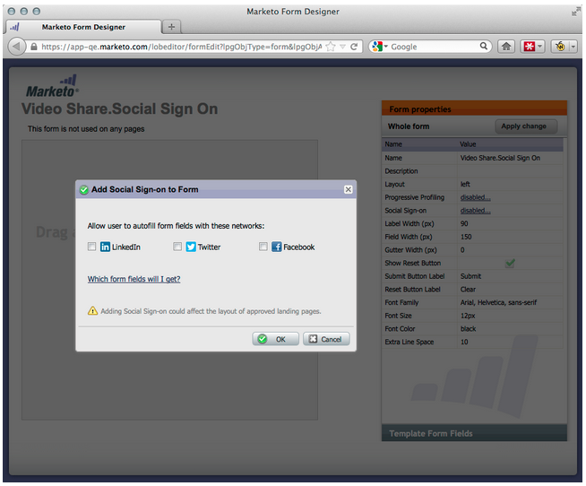

# 2012

## Januar/Februar 2012 {#january-february}

Die folgenden Funktionen sind in der Version vom Januar/Februar enthalten. Überprüfen Sie Ihre Marketo Edition auf die Verfügbarkeit der Funktionen. Kehren Sie nach der Veröffentlichung wieder zurück, um Links zu detaillierten Funktionsdokumentationen zu erhalten.

## Erweiterte dynamische Inhalte {#advanced-dynamic-content}

_Verfügbar für Pro- und Enterprise-Versionen_

Mit erweiterten dynamischen Inhalten können Sie ansprechende E-Mail-Nachrichten und Landingpages erstellen, die für Ihre Audience relevant sind, ohne mehrere Assets für dieselbe Nachricht erstellen zu müssen. Aktualisierte Previewer ermöglichen es Ihnen, jede einzelne Version in einem einzigen Bildschirm anzuzeigen.

## Segmentierung  {#segmentation}

_Verfügbar für Pro- und Enterprise-Versionen_

Die Segmentierung ist eine Gruppe von Segmenten, d. h. eine Zielgruppe von Einzelpersonen, an die Sie vermarkten. Segmente werden durch Regeln definiert, die durch Filterkriterien ähnlich wie Smart Lists gesteuert werden. Ihre Segmente können auf demografischen Daten basieren, z. B. Berufsbezeichnung oder Branche, oder auf Verhaltensweisen wie besuchten Web-Seiten oder angeklickten Links.

## Ausschnitte {#snippets}

_Verfügbar für Pro- und Enterprise-Versionen_

Speichern Sie umfangreiche Inhalte, die immer wieder verwendet werden können, um statische oder dynamische E-Mails und Landingpages zu erstellen.

## PURLs {#purls}

_Verfügbar für Pro- und Enterprise-Versionen_

Marketing-Experten können jetzt mithilfe von personalisierten URLs (PURLs) kontaktspezifische URLs erstellen, um die Personalisierung, Messbarkeit und Steigerung von Antworten in Multi-Touch-Marketing-Programmen sowohl für Briefpost- als auch für E-Mail-Kampagnen zu fördern.

## Unterstützung der EU-Datenschutzrichtlinie {#eu-privacy-directive-support}

Zu den neuen Funktionen zur Einhaltung der Einstellungen für „Do Not Track“ im Browser gehört die Möglichkeit, das Tracking für anonyme Leads zu deaktivieren. Dies erleichtert die Einhaltung der strengeren EU-Vorschriften zum Datenschutz-Tracking.

## Single Sign-on {#single-sign-on}

Unternehmen können jetzt über SAML 2.0 eine nahtlose Anmeldung bei der Marketo-Anwendung für einmaliges Anmelden über ein Unternehmensportal unterstützen.

## Aktualisierte E-Mail- und Landingpage-Editoren {#updated-email-and-landing-page-editors}

Die E-Mail- und Landingpage-Editoren wurden überarbeitet und bieten eine einladendere Benutzeroberfläche, eine intuitivere Navigation und ein deutlich verbessertes Benutzererlebnis. Dazu gehören:

Eine HTML- und Textansicht nebeneinander

Die Felder Absendername, Absender-E-Mail, Antwort an (NEU) und Betreff werden im Editor angezeigt. Alle anderen Einstellungen sind über die Schaltfläche Einstellungen bearbeiten verfügbar.

## Browser-Unterstützung {#browser-support}

* [!DNL Mozilla Firefox] 9.0
* [!DNL Google Chrome] 16
* [!DNL Microsoft Internet Explorer] 8 &amp; 9
* **Hinweis**: [!DNL Internet Explorer] 7 wird nicht mehr unterstützt

## Programm-Management {#program-management}

Vereinfachte Programmverwaltung verbessert die Benutzerfreundlichkeit durch Token-Löschung und das einfachere Löschen von Programmen.

## Abonnement-Bericht kündigen {#unsubscribe-from-subscription-report}

Jetzt können Sie sich direkt aus dem Bericht vom Abonnement abmelden!

## Munchkin-Updates {#munchkin-updates}

Neue Munchkin-Aufrufe reduzieren die Ladezeiten von Web-Seiten und bieten eine konsistentere Leistung bei Link-Klickereignissen.

## Opportunity-Analyse im Programm (nur RCA) {#program-opportunity-analysis-rca-only}

Verstehen des Marketing-Beitrags zum individuellen Opportunity-Umsatz

## Stadienanalyse zum Programmumsatz {#program-revenue-stage-analysis}

Gewinnen Sie insight in die Geschwindigkeit der Programmleitung, indem Sie verstehen, welche Programme die schnellen Einsteiger erworben haben

## März 2012 {#march}

## Meine Token auflösen {#resolve-my-tokens}

Meine Token (Programm-Token) werden bei der Vorschau einer E-Mail, beim Senden einer Test-E-Mail und beim Senden einer lokalen E-Mail über eine einzelne Flussaktion aufgelöst. Sie müssen nicht mehr eine intelligente Kampagne innerhalb des Programms erstellen, um Ihre My Tokens zu testen!

## Zwischen Vorschau und Editor in E-Mails und Landingpages wechseln {#toggle-between-previewer-and-editor-in-emails-and-landing-pages}

Mit einem Klick können Sie ganz einfach zwischen Editor und Vorschau hin und her wechseln.

Editor für Vorschau:

Vorschau für Editor:

## Snippet-Vorschau {#snippet-previewer}

Wenn Sie im Menü „Ausschnitt in der Vorschau“ auswählen, können Sie einen Ausschnitt anzeigen, ohne ihn zu einem Entwurf zu machen. Wenn Sie nur Lesezugriff auf einen freigegebenen Ausschnitt (über Arbeitsbereiche) haben, können Sie den Ausschnitt mit dieser Aktion anzeigen.

## Mehrere Test-E-Mails senden {#send-multiple-test-emails}

Durch das Hinzufügen dynamischer Inhalte wird es immer wichtiger, alle Varianten der E-Mails, die an Ihre Leads gesendet werden können, in der Vorschau anzuzeigen und zu testen. Bei der Vorschau mit Nach Lead-Detail anzeigen haben Sie die Möglichkeit, einen Test für die Varianten aus der Lead-Liste zu senden (bis zu 100 Test-E-Mails).

## Dynamische Landingpages auf der Grundlage von URL-Parametern {#dynamic-landing-pages-based-on-url-parameter}

Anonyme Leads machen einen erheblichen Teil Ihrer Landingpage-Besuche aus. Durch das Hinzufügen dynamischer Inhalte und die Möglichkeit, die Segmentierung als Parameter in Ihre URL einzufügen, können Sie den Inhalt Ihrer Landingpage dynamisch anzeigen, wenn ein anonymer oder bekannter Lead auf den Link klickt.

## April 2012 {#april}

## Segmentierungsfilter und -Trigger {#segmentation-filters-and-triggers}

Sprechen Sie dieselbe Gruppe von Leads konsistent an? Ist dies der Fall, verwenden Sie die Segmentierung in Ihren Smart Lists für das Targeting von Leads. Bei der Segmentierung wird die gesamte Lead-Datenbank immer segmentiert und kann programmübergreifend wiederverwendet werden, um Konsistenz zu gewährleisten. Segmentierungsergebnisse werden schnell abgerufen, da die Smart-Liste zum Zeitpunkt der Anfrage nicht ausgeführt werden muss.

## Einfügen externer Werte in E-Mail-Inhalte und andere Flussschritte durch erweiterte API-Funktionen {#insert-external-values-into-email-content-and-other-flow-steps-through-expanded-api-capabilities}

* Mit der Request Campaign-API können Sie jetzt Werte für meine Token für diesen bestimmten Kampagnenvorgang senden. Dies ist besonders nützlich, um E-Mail-Inhalte über die API zu füllen
* Die neuen APIs zum Hochladen in Listen und Planen von Kampagnen unterstützen die oben genannten Listen von Leads und Batch-Kampagnen.

## Einfachere Bestätigungs-E-Mails für [!DNL GoToWebinar] und [!DNL WebEx] (Adobe Connect und [!DNL ON24] in Kürze!) {#easier-confirmation-emails-for-gotowebinar-and-webex-adobe-connect-and-on-coming-soon}

Wir haben die Bestätigungs-URL vereinfacht, indem wir ein Mitglieds-Token erstellt haben, das die eindeutige Registrierungs-Bestätigungs-URL für jeden Lead anzeigt. Sie müssen diese URL dann nicht mehr mit anderen Token erstellen. Dies ist derzeit für [!DNL GoToWebinar] und [!DNL WebEx] Kunden verfügbar und wird in unserer nächsten Version für Adobe Connect und [!DNL ON24] verfügbar sein.

## Laden Sie mehrere Bilder und Dateien mit einem Klick hoch! {#upload-multiple-images-and-files-with-a-single-click}

Sparen Sie Zeit und arbeiten Sie effizienter beim Importieren von Bildern und Dateien in Marketo! Wenn Sie [!DNL Firefox] oder [!DNL Google Chrome] verwenden, können Sie mehrere Dateien auswählen und sie alle gleichzeitig hochladen. Die Anzahl der Dateien, die Sie hochladen können, ist nicht beschränkt. Die individuelle Größenbeschränkung pro Datei beträgt jedoch 50 MB.

Hinweis: Aufgrund von Einschränkungen des Browsers wird diese Funktion derzeit nicht in [!DNL Internet Explorer] unterstützt.

## Text in eine E-Mail verschieben {#move-text-in-an-email}

Sie können Textblöcke in einer E-Mail neu anordnen. Wählen Sie im Texteditor einen Textblock aus. Wenn Sie auf das Bearbeitungssymbol klicken, wird die Option angezeigt, den Block nach oben oder unten zu verschieben.

## [!DNL Salesforce] für Nicht-[!DNL Salesforce]-Benutzer entfernt {#salesforce-references-removed-for-non-salesforce-users}

Wenn Sie Ihr Abonnement nicht mit [!DNL Salesforce] synchronisieren, werden Sie feststellen, dass alle Ordner und Flussaktionen, die auf [!DNL Salesforce] verweisen, entfernt werden.

## Marketo-Umsatzzyklusanalyse {#marketo-revenue-cycle-analytics}

**Verbesserte Gate-Stadien im Umsatzzyklus Modeler**

Ermöglicht Benutzenden, eine Reihenfolge für ihre Übergangsregeln zu definieren.

## Mai 2012 {#may}

## Umgestaltung des E-Mail-Leistungsberichts {#email-performance-report-redesign}

Hinweis: Dies wird ein gestaffelter Rollout sein, beginnend mit der Mai-Version

Die Berichte E-Mail-Performance und Kampagnen-E-Mail-Performance wurden beschleunigt. Wir haben auch die Definitionen bestimmter Metriken verbessert und die Metriken „Gesendete Nachrichten“ und „Leads gesendet“ zu einer einzigen Metrik, „Gesendet“, zusammengefasst. Wir haben „Zugestellte Nachrichten“ und „Leads zugestellt“ zu „Zugestellt“ zusammengeführt.

## Verbesserungen bei Warteschritten {#wait-step-enhancements}

Mit den neuen erweiterten Warteeigenschaften können Sie den Warteschritt in einer Smart Campaign Flow-Aktion so konfigurieren, dass er bis zu einem bestimmten Wochentag, dem nächsten Werktag, einem bestimmten Datum oder einer bestimmten Uhrzeit „wartet“. Diese Verbesserungen stellen sicher, dass Ihre Pflege-E-Mails während der Geschäftszeiten im Posteingang eingehen!

Abbildung 1. Angeben, welcher Warteschritt an einem Geschäftstag beendet werden soll

## Archivierte Assets ausgeblendet {#archived-assets-hidden}

Archivierte Assets werden automatisch aus AutoSuggest, Dropdown-Menüs und Berichten gefiltert, was das Auffinden Ihrer gesuchten Inhalte erleichtert!

Abbildung 2. Beispiel für den Filter „Archivierte E-Mails“

## Neue App zum Einchecken von Ereignissen für iPad {#new-event-check-in-app-for-ipad}

Vereinfachen Sie Ihren Check-in-Prozess für Veranstaltungen mit unserer neuen iPad-App! Die Event Check-in-App synchronisiert sich mit Ihrem Marketo-Programm und ermöglicht Ihnen das einfache Einchecken von Teilnehmern in eine Veranstaltung sowie das spontane Hinzufügen neuer Leads.

Erfordert iOS 5.1 oder höher; nur iPad.

Abbildung 3. Startseite zum Einchecken von Ereignissen

Abbildung 4. Event-Check-In: Wählen Sie Ihre Veranstaltung!

Abbildung 5. Check sie in

## URL zur Bestätigung von erweiterten Webinaren {#enhanced-webinar-confirmation-url}

Jetzt für [!DNL ON24] und Adobe Connect verfügbar! Fügen Sie für jeden registrierten Teilnehmer mithilfe des neuen `{{member.webinar URL}}`-Tokens einen eindeutigen Link in die Bestätigungs-E-Mail ein. Zu den Adobe Connect-Verbesserungen gehört auch die Möglichkeit, die E-Mail mit den Adobe-Kontoinformationen, die die Anmelde-ID und das Passwort für den Benutzer enthalten, ein-/auszuschalten.

Abbildung 6. Personen zu Ihrem Webinar hinzufügen

## Vorlagenvorschau {#template-preview}

Sie suchen beim Erstellen Ihrer E-Mail oder Landingpage nach einer bestimmten Vorlage, sind sich aber nicht sicher, wie sie aussieht? Mit der neuen Vorlagenvorschau-Funktion können Sie die ausgewählte Vorlage überprüfen, bevor Sie ein neues Asset speichern!

Abbildung 7. Vorschau der ausgewählten Vorlage

## Konfigurierbares Vorbefüllen von Formularen {#configurable-form-prefill}

Steuern Sie das Vorausfüllen von Formulardaten auf Abonnementebene und das Überschreiben auf der Landingpage-Ebene. Ohne Vorausfüllen können Sie sicherstellen, dass der Lead die aktuellsten Informationen bereitstellt.

Abbildung 8. Konfiguration zum Vorbefüllen von Formularen in Admin

Abbildung 9. Bearbeiten der Einstellung zum Vorbefüllen von Formularen auf einer Landingpage

## Marketo Treasure Chest {#marketo-treasure-chest}

Zugriff auf experimentelle Funktionen, die von Marketo-Technikern entwickelt wurden, um das Anwendererlebnis zu verbessern. Diese Version umfasst das Rückgängigmachen von E-Mails sowie die Möglichkeit, Kommentare einzugeben und mit anderen Benutzern auf Ihren Landingpages zusammenzuarbeiten.

\

Abbildung 10. Manager Treasure Chest-Funktionen in Admin

## [!DNL Microsoft Dynamics]® CRM-Integration {#microsoft-dynamics-crm-integration}

Synchronisieren Sie Konten, Kontakte und Leads zwischen Marketo und [!DNL Microsoft Dynamics] CRM Online mithilfe unserer neuen vordefinierten Integration!

Abbildung 11. [!DNL Microsoft Dynamics]

## Marketo[!DNL Sales Insight]Produktverbesserungen {#marketo-sales-insight-enhancements}

**Optionen für Fußzeile abmelden**

Konfigurieren Sie, wann und ob die Abmelde-Fußzeile für E-Mails angezeigt wird, die über [!DNL Sales Insight] gesendet werden.

Abbildung 12. [!DNL Sales Insight] Einstellungen in Admin

## Ordner für Verkaufs-E-Mail-Vorlagen {#folders-for-sales-email-templates}

Sie können jetzt die mit Marketo [!DNL Sales Insight] freigegebenen E-Mail-Vorlagen in bestimmten Ordnern organisieren, um Ihren Vertriebsmitarbeitern die Suche nach der richtigen E-Mail zu erleichtern.

Abbildung 13. Ordner für E-Mails auswählen

## Zugriff auf Opportunity Analyzer über [!DNL Sales Insight] {#access-opportunity-analyzer-from-sales-insight}

Stellen Sie Ihren Vertriebsmitarbeitern insight zur Verfügung, in das die Marketing-Aktivitäten die Interaktion fördern, indem Sie direkten Zugriff auf den Opportunity Analyzer von Marketo [!DNL Sales Insight] aus nutzen. Hinweis. Erfordert die Lizenz für Revenue Cycle Analytics.

## Benutzerdefiniertes Feld für Kontaktstatus {#custom-field-for-contact-status}

Sie können jetzt ein benutzerdefiniertes Feld in zuordnen, [!DNL Salesforce] das Feld Status für Kontakte in den Meine besten Bets, Die besten Bets meines Teams und die benutzerdefinierten Ansichten auszufüllen.

Abbildung 14. Zuordnen eines benutzerdefinierten Felds zu Kontakten

Siehe von anonymen Leads besuchte Seiten

Führen Sie einen Drilldown zu den Seiten durch, die von einem anonymen Lead in der Ansicht [!UICONTROL Anonyme Web-Aktivität] angezeigt wurden.

Abbildung 15. Siehe Anonyme Web-Aktivität

## Verbesserter Lead und Kontakt Abonnieren {#enhanced-lead-and-contact-subscribe}

Folgen Sie einem Lead oder Kontakt jederzeit über die neue Schaltfläche Abonnieren auf der Seite Datensatzdetails .

## Juni 2012 {#june}

## Verbesserungen bei der Marketo-Lead-Verwaltung {#marketo-lead-management-enhancements}

### Umbenennen {#rename}

Sie können Smart Lists, statische Listen und Kampagnen umbenennen. Wenn Sie diese Assets in Filtern, Triggern oder Flüssen verwenden, wird der Name auch dort automatisch aktualisiert. Sie konnten Ihre E-Mails, Formulare und Ordner immer umbenennen.

Und als Bonus haben wir die Eingabe und Anzeige von Beschreibungstexten für Assets verbessert.

## Feldzuordnung importieren {#import-field-mapping}

Wir haben den Import einer Liste in Marketo erheblich vereinfacht! Während des Importvorgangs können Sie den Namen des Marketo-Felds dem Namen der Spaltenüberschrift in der Importdatei zuordnen. Darüber hinaus können Sie in [!UICONTROL Admin] Aliasnamen einrichten, die dem Feldnamen in Marketo zugeordnet sind, sodass Ihre Benutzerinnen und Benutzer jedes Mal das richtige Feld auswählen.

Wenn Sie weiterhin Felder importieren und zuordnen, speichert Marketo die Zuordnungen und zeigt sie während des Imports an, um die Verwendung zu erleichtern. Und um das Leben noch einfacher zu gestalten, können Sie auf die Kopfzeile Beispielwert klicken, um die verschiedenen Werte anzuzeigen, die in das Feld eingefügt würden. Dadurch wird sichergestellt, dass Sie jedes Mal das richtige Feld zuordnen!

## [!UICONTROL Zusammenfassung] Seite für Smart- und statische Listen {#summary-page-for-smart-lists-and-static-lists}

Haben Sie sich schon einmal gefragt, wo Ihre Listen verwendet werden? Oder wer hat die Liste erstellt oder zuletzt geändert? Die neue Zusammenfassungsseite, die für Smart-Listen und statische Listen verfügbar ist, bietet Ihnen diese wichtigen Details.

Auf den bestehenden Übersichtsseiten für Programme und Kampagnen wurden das Erstellungsdatum/der Benutzer sowie das Datum/die Benutzerinformationen der letzten Änderung hinzugefügt.

## [!UICONTROL Von] für Assets verwendet {#used-by-for-assets}

Wir haben eine neue Registerkarte zu unseren Asset[!UICONTROL Zusammenfassungs-] namens &quot;[!UICONTROL &#x200B; von“ &#x200B;]!

Beispiel: [!UICONTROL Verwendet von] für statische Listen

## Gitternetzlinien für Landingpages {#landing-page-gridlines}

Das Hinzufügen von Gitternetzlinien für Einstiegsseiten erleichtert das Ausrichten von Text, Grafiken und Formularen auf der Einstiegsseite erheblich. Schalten Sie sie für jede Landingpage ein und aus und passen Sie auch die Breite zwischen den Zeilen an!

## Leads durch E-Mails blockiert {#leads-blocked-from-mailings}

Bei der Planung einer Kampagne können Sie auf den Link klicken, um die Liste der Leads anzuzeigen, die vom Versand blockiert sind.

## [!UICONTROL Warten] Schritt - Lead-Token und mein Token {#wait-step-lead-token-and-my-token}

In unserer Mai-Version haben wir erweiterte Optionen zum [!UICONTROL Warten]-Flussschritt hinzugefügt. Mit diesen Änderungen können Sie einen Geschäftstag, ein Datum und eine Uhrzeit angeben. In dieser Version haben wir die Möglichkeit hinzugefügt, im Warteschritt ein Token zu verwenden. Beispielsweise können Sie `{{lead.Birthday}}` verwenden, um eine E-Mail an den Geburtstag zu senden, oder `{{my.Event Date}}`, um eine endgültige Webinar-Erinnerung zu senden.

## [!UICONTROL Anzeigen] als [!UICONTROL Miniaturansichten] in Design Studio {#view-as-thumbnails-in-design-studio}

Wechseln Sie Ihre Ansicht von einer Bildliste zu einer Miniaturansicht!

Hinweis: Ab dieser Version gilt die vorherige Sortierung in Smart-Listen-Rastern nicht mehr für die nächste Smart-Liste, die Sie anzeigen. Wenn Sie beispielsweise eine Smart-Liste nach Firmenname sortieren, wird die nächste Smart-Liste, die in demselben Feld angezeigt wird, nicht automatisch sortiert.

Erinnerung: Aktualisierung des E-Mail-Leistungsberichts läuft!

## Verbesserungen bei der Marketo-Umsatzzyklusanalyse {#marketo-revenue-cycle-analytics-enhancements}

### Neue Metriken in der Programm-Opportunity-Analyse  {#new-metrics-in-program-opportunity-analysis}

Sie können jetzt Einblicke in die durchschnittliche Anzahl der Marketing-Kontakte erhalten, bevor Opportunitys erstellt oder geschlossen werden, sowie in den durchschnittlichen Wert einer Marketing-Berührung.

## Anzeigen von mehreren Diagrammen {#displaying-multi-charts}

Mit der Funktion für mehrere Diagramme können Sie mehrere Diagramme in einem einzigen Bericht des Umsatzzyklus-Explorers anzeigen. Sie können diese Funktion beispielsweise verwenden, wenn Sie dieselben Daten über verschiedene Monate hinweg anzeigen möchten. Diese Funktion verhindert auch, dass Sie separate Filter und Berichte erstellen müssen.

## Diagrammtyp des Wärmenetzes  {#heat-grid-chart-type}

Mit Wärmerastern können Sie Daten visualisieren, um Muster der Marketing-Leistung zu identifizieren. Dieser Visualisierungstyp farbcodiert Ihre Ergebnisse, damit Sie komplexe Geschäftsanalysen in einer leicht verständlichen Visualisierung anzeigen können.

## Streudiagrammtyp  {#scatter-chart-type}

Mit Streudiagrammen können Sie Daten für mehrere Dimensionen in einem Diagramm visualisieren. Bei diesem Visualisierungstyp wird basierend auf den verwendeten Attributen eine Sprechblase in einem Diagramm dargestellt. Anschließend können Sie eine Kennzahl verwenden, um die Blase farblich zu kennzeichnen, und/oder eine Kennzahl verwenden, um die Größe der Blase anzugeben.

## September 2012 {#september}

Diese Version enthält mit Spannung erwartete, integrierte Social-Media-Funktionen und gute Tipps für das Lead-Management! Hinweis: Social-Media-Funktionen sind als Add-on oder als Teil ausgewählter Bundles verfügbar.

## Veröffentlichen eines YouTube-Videos mit Social Sharing {#publish-a-youtube-video-with-social-sharing}

Verstärken Sie die Zielgruppe für Ihre Videos, indem Sie Ihre Besucher mithilfe der neuen Videofreigabe auf Ihren Landingpages dazu ermutigen, sie in sozialen Netzwerken zu teilen.

## Schaltfläche „Freigeben“ hinzufügen {#add-a-share-button}

Geben Sie Nachrichten und das Erscheinungsbild eines neuen Satzes von Schaltflächen zum Teilen in sozialen Netzwerken vollständig an. Erfassen Sie außerdem Social-Media-Profildaten, wenn Ihre Leads Ihre Inhalte freigeben.

## Social-Anmeldung {#social-sign-on}

Gewinnen Sie insight und reduzieren Sie Reibungen, indem Sie Leads erlauben, Formulare mit Informationen aus ihren sozialen Netzwerken vorzufüllen.

## Veröffentlichen von Landingpages in [!DNL Facebook] {#publish-landing-pages-to-facebook}

Erweitern Sie die Reichweite Ihrer Landingpages, indem Sie diese direkt in [!DNL Facebook] veröffentlichen - mit Social-Media-Apps, Formularen und der vollen Funktionalität der Landingpages von Marketo.

## [!DNL ReadyTalk] Ereignisadapter {#readytalk-event-adapter}

Nahtlose Verbindung eines Marketo-Ereignisses mit einem [!DNL ReadyTalk]. Verwenden Sie ein Marketo-Formular, um Registrierende zu erfassen und automatisch in [!DNL ReadyTalk] zu registrieren. Bei einer bidirektionalen Synchronisierung können Anwesenheitsinformationen in Marketo eingefügt werden.

## Microsoft [!DNL Dynamics] On-Premise {#microsoft-dynamics-on-premise}

Wir unterstützen jetzt Microsoft [!DNL Dynamics] 2011 On-Premise mit einer Bereitstellung mit Internetzugriff.

## Webhooks (Schatztruhe) {#webhooks-treasure-chest}

Ein Webhook ist ein benutzerdefinierter HTTP-Callback. Es ist eine großartige Möglichkeit, Daten von Marketo an jeden anderen Service zu übertragen. Diese Funktion ist derzeit in der Schatztruhe verfügbar und wird derzeit nur in Trigger-Kampagnen unterstützt.

Beispiele für die Verwendung von Webhooks sind: Senden von Benutzernamen- und Kennwortinformationen an ein anderes System, um ein Testkonto zu erstellen, und Senden einer SMS-Textnachricht, wenn Sie einen neuen Lead erhalten.

## Aktualisierung für getMultipleLeads-API {#update-to-getmultipleleads-api}

Wir haben dem Aufruf der getMultipleLeads-API neue Filterkriterien hinzugefügt. Zusätzlich zur Filterung nach Datum unterstützen wir jetzt weitere Kriterien:

* Datumsbereiche
* Statische Listennamen
* Arrays von Lead Keys

## Oktober 2012 {#october}

Die Oktober-Version enthält weitere aufregende neue Funktionen! Social-Media-Funktionen sind als Add-on oder als Teil ausgewählter Bundles verfügbar.

## Programme und Programmaustausch importieren {#import-programs-and-program-exchange}

Ein Programm kann von einem Marketo-Abonnement in ein anderes importiert werden. Sie können beispielsweise ein Programm in einer Sandbox erstellen und es dann in Ihr Live-Abonnement importieren. Außerdem können Sie ein vordefiniertes Programm aus der Marketo-Programmbibliothek importieren.

>[!NOTE]
>
>Nur Marketo-Benutzer, denen von einem Marketo-Admin-Benutzer die Berechtigung erteilt wurde, können Programme importieren.
>
>Wenden Sie sich an den Marketo-Support, um ein Sandbox-Konto mit Ihrem Live-Abonnement zu verbinden.

## Benachrichtigungen {#notifications}

Benachrichtigungen halten Sie über Systemereignisse in Ihrem Marketo-Abonnement auf dem Laufenden. Beispielsweise benachrichtigt Sie das System automatisch, wenn eine Kampagne fehlschlägt oder Ihre CRM-Synchronisierung bearbeitet werden muss. Benachrichtigungen sind auf der Registerkarte Meine Marketo verfügbar. Darüber hinaus können Sie eine Benachrichtigung abonnieren, damit Sie sie in Echtzeit in Ihrer E-Mail erhalten können.

## Umfragen {#polls}

Erstellen Sie Umfragen, um Ihre Leads mit Ihren Inhalten zu interagieren! Sie können für ihr Lieblingsnetzwerk oder -film stimmen und dann die Umfrage über ihre sozialen Netzwerke mit Freunden teilen. Sie können umfangreiche Analysen darüber sammeln, wofür Ihre Leads gestimmt haben.

## Verfolgen von Social-Media-Aktivitäten {#track-social-activities}

Finden Sie heraus, wer Ihre Inhalte und Ihre Stimme in Ihren Umfragen geteilt hat, indem Sie Smart Lists erstellen, die auf bestimmten sozialen Aktivitäten basieren. Erstellen Sie beispielsweise eine intelligente Kampagne, um die Punktzahl der Leads zu erhöhen, die Ihre Inhalte am häufigsten teilen!

## Soziale Profile {#social-profiles}

Sie können jetzt Informationen über Ihre Leads sammeln, wenn diese Inhalte teilen oder Formulare mithilfe ihrer Social-Media-Profile ausfüllen. Dazu gehören [!DNL Facebook]-, [!DNL LinkedIn]- und [!DNL Twitter]-Griffe, die Anzahl der Freunde und mehr.

## [!UICONTROL Revenue Explorer] Berichtsabonnements {#revenue-explorer-report-subscriptions}

Erstellen Sie Berichtsabonnements und senden Sie [!UICONTROL Revenue Explorer]-Berichte regelmäßig an Ihre wichtigsten Stakeholder, einschließlich Nicht-Marketo-Benutzender. Die E-Mail enthält eine Vorschau Ihrer Berichtsdatentabelle(n) und eine [!DNL Excel] Tabelle mit allen Berichtsdaten.

>[!NOTE]
>
>Nur für Benutzer verfügbar, die [!UICONTROL Umsatz-Explorer] durch den Kauf von Umsatzzyklusanalysen mit Enterprise oder Select Edition haben.

## Dezember 2012 {#december}

Die Dezember-Version enthält die viel erwartete **Forward to Friend**-Funktion sowie mehrere andere Leckereien! Mit einem Sternchen (&#42;) gekennzeichnete Funktionen sind nur in der Select Edition und in RCA (Revenue Cycle Analytics) verfügbar.

## An einen Freund weiterleiten {#forward-to-friend}

Aktivieren Sie die Freigabe von Inhalten für andere, indem Sie in Ihre E **Mails einen Link „Weiterleiten an**&quot; einfügen. Das Hinzufügen neuer Filter und Trigger hilft Ihnen, Ihre Einflussnehmer zu identifizieren, indem Sie Benutzende identifizieren, die eine E-Mail weitergeleitet haben, sowie diejenigen, die die weitergeleiteten E-Mails erhalten haben.

Um eine Einladung **Weiterleiten an Freund** in Ihre E-Mail einzufügen, öffnen Sie sie im Editor und fügen Sie das `{{system.forwardToFriendLink}}`-Token ein.

Verwenden Sie die entsprechenden Trigger und Filter, um Benutzer zu identifizieren, die den **Weiterleiten an Freund**-Link verwendet haben, sowie diejenigen, die die E-Mail erhalten haben.

## Granulare Administratorberechtigungen {#granular-admin-permissions}

Unsere neueste Version bietet Ihnen besseren Zugriff und bessere Kontrolle über [!UICONTROL Admin]-Rollen, indem sie den Zugriff auf verschiedene Funktionen im Bereich „Admin[!UICONTROL &#x200B; von Marketo &#x200B;] jede Rolle steuert. Wenn Sie eine neue Rolle erstellen, können Sie dieser Rolle bestimmte [!UICONTROL Admin]-Funktionen zuweisen, auf die diese Rolle zugreifen kann.

>[!NOTE]
>
>Standardmäßig haben vorhandene Rollen mit der Berechtigung [!UICONTROL Zugriff auf Admin] Zugriff auf alle [!UICONTROL Admin]-Funktionen, bis und sofern nicht geändert.

## [!UICONTROL BrightTALK]-Adapter {#brighttalk-adapter}

Mit dem Marketo [!UICONTROL BrightTALK]-Adapter können Sie Anwesenheitsdaten aus einem Live- oder On-Demand-Webcast direkt in einer Marketo-Veranstaltung erfassen!

## Marketo [!DNL Sales Insight] für [!DNL Microsoft Dynamics] {#marketo-sales-insight-for-microsoft-dynamics}

[!DNL Sales Insight] ist jetzt für [!DNL Microsoft Dynamics] Kunden verfügbar!

## Opportunity-Synchronisierung [!DNL Dynamics] {#dynamics-opportunity-sync}

Opportunity-Daten zwischen Marketo und [!DNL Microsoft Dynamics] synchronisieren.

## Bericht zu durch Marketing beeinflussten Opportunities&#42; {#marketing-influenced-opportunities-report}

Sehen Sie sich an, welcher Prozentsatz der Pipeline und des Umsatzes Ihres Unternehmens durch Ihre Marketing-Programme beeinflusst wurde. Im **[!UICONTROL Umsatz-Explorer]** können Sie jetzt benutzerdefinierte Berichte mit dem neuen gelben Punkt „Marketing-beeinflusste Opportunity“ in der Opportunity-Analyse erstellen. Sie können auch die beiden folgenden Berichte im Ordner Standard verwenden:

* Marketing-Einfluss auf erstellte Opportunities
* Marketing-Einfluss auf abgeschlossene Opportunities gewonnen

## Benutzerdefinierte Opportunity-Felder in der Programm-Opportunity-Analyse&#42; {#custom-opportunity-fields-in-program-opportunity-analysis}

Fügen Sie benutzerdefinierte Opportunity-Felder hinzu, um die Berichte zur Analyse von Programm-Opportunities in [!UICONTROL Revenue Explorer) &#x200B;].

## Kampagnenprüfung {#campaign-inspector}

Haben Sie sich jemals gefragt, welche Kampagnen eine bestimmte Flussaktion verwenden, z. B[!UICONTROL &#x200B; &quot;]&quot; oder [!UICONTROL Kampagne anfordern]? Oder wo ein bestimmter Filter verwendet wird? Mit dem neuen [!UICONTROL Kampagneninspektor] (verfügbar über die Schatztruhe) können Sie diese Kampagnen sowie aktive Kampagnen und Kampagnen mit Fehlern identifizieren.

Gehen Sie **[!UICONTROL Admin]** > **[!UICONTROL Schatztruhe]** um den **[!UICONTROL Kampagneninspektor]** zu aktivieren.

