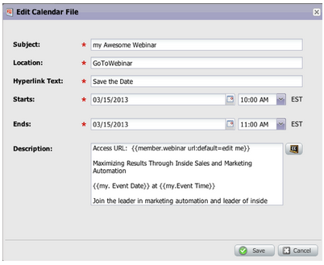
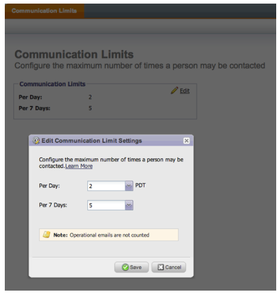
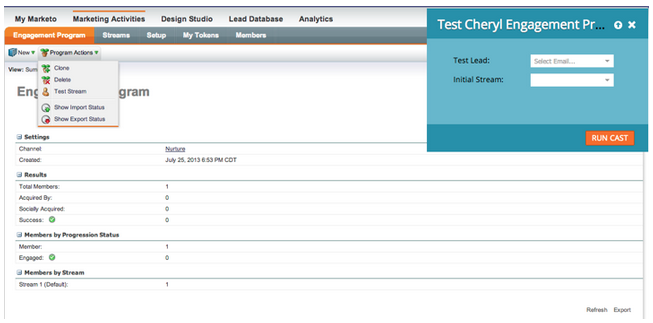
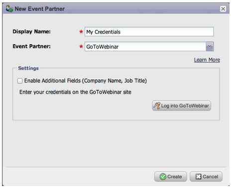
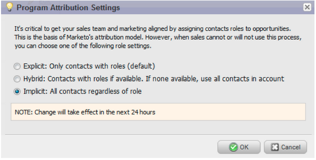
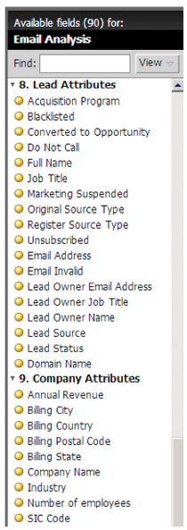

# 2013

## Januar 2013 {#january}

Die Version vom Januar erweitert unser Social-Media-Angebot um **Empfehlungsangebote**. Darüber hinaus können [!DNL Marketo Lead Management] ihre Zeitzone, Sprache und Gebietsschema-Voreinstellungen festlegen. Bitte beachten Sie, dass Funktionen, die mit einem &#42; gekennzeichnet sind, nur in der Select Edition verfügbar sind.

## Empfehlungsangebote {#referral-offers}

Ein **Empfehlungsangebot** bietet Ihren Leads einen Anreiz, ihre Freunde zu verweisen. Erstellen Sie Ziele und Belohnungen für erfolgreiche Empfehlungen. Sie können ihn auf Landingpages, auf Ihrer Website und sogar auf Facebook verwenden.

## Voreinstellung für Zeitzone {#time-zone-preference}

Sie können die Standardzeitzone für Ihr persönliches Marketo-Konto ändern. Selbst wenn der Standardwert für das Abonnement beispielsweise Pacific Time ist, können Sie ihn für Ihr eigenes Konto in Eastern Time ändern.

## [!DNL Marketo Lead Management] auswählen {#select-your-marketo-lead-management-language}

Sie können die Standardsprache für Ihr Marketo-Benutzerkonto ändern. Selbst wenn der Standardwert für das Abonnement Englisch ist, können Sie ihn für den Eigengebrauch in Deutsch oder Französisch ändern.

## Mehrsprachige Formularfehlermeldungen {#multi-lingual-form-error-messages}

Wenn ein Lead ein Marketo-Formular ausfüllt, werden einige Validierungsmeldungen automatisch integriert. Sie können für diese Fehlermeldungen eine andere Anzeigesprache auswählen. Wir unterstützen jetzt Englisch, Deutsch und Französisch.

Beispiel für ein französisches Formular:

## [!DNL Sales Insight] auswählen (nur [!DNL Salesforce]) {#select-your-sales-insight-language-salesforce-only}

Wenn Ihre [!DNL Salesforce] Spracheinstellung auf Französisch oder Deutsch festgelegt ist, berücksichtigt Marketo [!DNL Sales Insight] diese Einstellung. Laden Sie das neueste MSI-Paket herunter, um diese Funktion zu erhalten (verfügbar in der Woche vom 14. Januar).

## Anzeigename des Feldes {#field-display-name}

Anzeigenamen in Feldern können Text in verschiedenen Sprachen anzeigen (z. B. werden Multi-Byte-Zeichen unterstützt).

## Programmdaten ändern {#change-program-data}

Mit [!UICONTROL  Schritt &quot;] ändern“ können Sie den [!UICONTROL Erfolgsstatus] und das [!UICONTROL Erfolgsdatum] eines Programmmitglieds manuell über eine Kampagne ändern. Sie können diesen Flussschritt verwenden, um einen Fehler zu korrigieren oder ein Mitglied, das möglicherweise nicht wie vorgesehen am Programm teilgenommen hat, manuell zu ändern.

## Februar 2013 {#february}

Die Februarversion enthält eine stark nachgefragte Funktion, Unterstützung für [!DNL Apple Safari] und andere kleine Verbesserungen.

## Öffentliche Unterstützung für [!DNL Apple Safari] {#official-support-for-apple-safari}

Die neuesten Versionen von [!DNL Apple Safari] für Mac und [!DNL Windows] werden vollständig zur Verwendung mit der Marketo-Lead-Verwaltung unterstützt. Hinweis: [!DNL Safari] auf iOS ist nicht vollständig kompatibel.

## Webhooks - Verbesserungen {#webhooks-enhancements}

Webhooks wurden verbessert, um Token in der URL/Payload zu escapen, und können auch Marketo-Lead-Felder aktualisieren, indem XML-/JSON-Antworten aus Drittanbietersystemen analysiert werden (in der [!DNL Spark SMB Edition] nicht verfügbar).

## Aktualisierter SOAP-API-Endpunkt {#updated-soap-api-endpoint}

Der bevorzugte SOAP-API-Endpunkt wurde aktualisiert und wird unter &quot;[!UICONTROL &quot; ] &quot;SOAP-API“ angezeigt. Aktualisieren Sie Ihre Aufrufe, um diesen neuen Endpunkt zu verwenden. API-Aufrufe an den alten Endpunkt sind veraltet, funktionieren aber weiterhin. (SOAP-API in der [!DNL Spark SMB Edition] nicht verfügbar)

## Mobile-Unterstützung für [!DNL Facebook] Registerkarten {#mobile-support-for-facebook-tabs}

[!DNL Facebook] von Marketo veröffentlichten Registerkarten erkennen Mobilgeräte und leiten sie an eine Landingpage weiter. Dadurch wird sichergestellt, dass Benutzende die richtigen Inhalte auf Mobilgeräten erhalten, auf denen [!DNL Facebook] Registerkarten nicht unterstützt werden (verfügbar in [!DNL Spark], [!DNL Standard], [!DNL Select SMB Editions] und [!DNL Marketo Social Marketing]).

## In Kürze verfügbar: Unterstützung für mehrere Modelle {#coming-soon-support-for-multiple-models}

Wir legen den Grundstein für die Unterstützung mehrerer Umsatzzyklusmodelle, die in einer zukünftigen Version #1 Idee für RCA in der Community gewählt wurden. In dieser Version werden Sie einige Änderungen bemerken, darunter Filter für Smart-Listen und Optionen in Flussschritten hinzufügen , um die Auswahl eines Modells und einer Phase zu unterstützen. Außerdem verschieben wir die Felder „Lead-Umsatz-Phase“ und „Lead-Umsatz-Zyklusmodell“ aus der Registerkarte „Smartes Listen-Lead-Raster“.

## März 2013 {#march}

Die folgenden Funktionen sind in der -Version vom März enthalten.

## Marketo-Kalenderdateien {#marketo-calendar-files}

Erstellen Sie eine Kalenderdatei als **Mein Token** zur Verwendung in Ihren Ereignis-Bestätigungs- und Erinnerungs-E-Mails. Diese integrierte Kalenderdatei (z. B. .ics-Datei) rendert alle Token, einschließlich My Tokens und `{{member.webinar URL}}` Token.

## Warten bis +/- {#wait-until}

Erstellen Sie Warteschritte, die eine bestimmte Anzahl von Tagen vor oder nach einem Datumstoken ausführen können. Sie können beispielsweise einen Warteschritt erstellen, der 3 Tage vor dem Ereignisdatum wartet und dann eine Erinnerung sendet!

Sie können einen Warteschritt erstellen, der 14 Tage vor dem Geburtstag des Leads wartet. Durch Auswahl von „Nächsten Jahrestag dieses Datums verwenden“ ignoriert das System automatisch das mit dem Datum verknüpfte Jahr und verwendet stattdessen das aktuelle oder nächste Kalenderjahr.

## Gewinnspiele in sozialen Netzwerken {#social-sweepstakes}

Ein Gewinnspiel gibt Ihren Leads die Chance, einen Preis zu gewinnen und ihre Freunde über Sie zu informieren. Sie wählen aus den Teilnehmern zufällige Gewinner aus und senden ihnen eine E-Mail.

## Zusätzliche [!UICONTROL  (Fehlermeldung] Sprachen {#additional-form-error-message-languages}

Mehr als ein Dutzend Sprachen wurden zu den Formularfehlermeldungen hinzugefügt!

## Support-Nachrichten und -Warnhinweise {#support-news-and-alerts}

Bleiben Sie in Verbindung mit dem Marketo-Kunden-Support, indem Sie die Supportnachrichten und Warnhinweise für P1-Warnhinweise, bekannte Probleme, Hinweise und Tipps unserer Support-Experten und Updates vom Marketo-Kunden-Support abonnieren.

## April 2013 {#april}

Die folgenden Funktionen sind in der Version vom April enthalten.

## [!DNL Box]-Integration {#box-integration}

Verbinden Sie Marketo mit Ihrem [!DNL Box]-Konto, um Dateien einfach in das Design-Studio zu kopieren.

## Plug-in [!DNL Gmail] {#gmail-plugin}

Wenn Sie sowohl Marketo [!DNL Sales Insight] als auch [!DNL Gmail] verwenden, können Sie unser neues [!DNL Gmail]-Plug-in über den [!DNL Chrome] Store installieren. Mit dem Plug-in können Sie Nachrichten mit Marketo protokollieren, Marketo-E-Mail-Vorlagen laden und Nachrichten mit Marketo-Tracking-Funktionen senden.

## E-Mail-Analyse {#email-analysis}

Erweiterte E-Mail-Berichte im [!UICONTROL Umsatz-Explorer] erstellen, z. B. den Bericht zum Klick-Aktivitäts-Wärmenraster . Dieser Bericht gibt insight Aufschluss über den Tag und die Uhrzeit, zu der Personen auf Links in Ihren E-Mails klicken.

Die E-Mail-Analysefunktion wird während der Migration Ihrer E-Mail-Daten für 2012 und 2013 schrittweise im April und Mai aktiviert. Mit anderen Worten, einige Kunden werden früher Zugriff auf diese Funktion haben als andere.

## Programm-APIs {#program-apis}

Unterstützung für Programme im SOAP-API-Aufruf, einschließlich Nur-Lese-Zugriff auf Programmdaten wie: Anzahl der Programmmitgliedschaften, Erworben von, Erfolg, Einstellungen, Kanäle, Tags, Token und Kosten. Weitere Informationen finden Sie in der Dokumentation zur SOAP-API .

## [!DNL ON24] {#on-enhancement}

Tätigkeitsbezeichnung und Firmenname werden mit [!DNL ON24] aus Ihrem Marketo-Registrierungsformular synchronisiert.

## Mai 2013 {#may}

Die folgenden Funktionen sind in der Version vom Mai enthalten.

## Kalenderdateien für Landingpages {#calendar-files-for-landing-pages}

Erstellen Sie eine Kalenderdatei als Mein Token, das Sie Ihrer Landingpage hinzufügen können. Diese integrierte Kalenderdatei (z. B. .ics-Datei) rendert alle Token, einschließlich „Meine Token“ auf lokalen Asset-Landingpages.

## Registerkarte &quot;Modellmitgliedschaft&quot; {#model-membership-tab}

Zeigen Sie alle Daten Ihrer Modellmitglieder an einem Ort an, um sie einfach zu überwachen und zu beheben. Die neue Registerkarte [!UICONTROL Mitglieder] ist eine schreibgeschützte Ansicht, die verfügbar ist, wenn Sie ein genehmigtes Umsatzzyklusmodell auswählen.

## Reorganisierte Fluss-Aktionsstruktur {#reorganized-flow-action-tree}

Mit der neu organisierten Fluss-Aktionsstruktur finden Sie Fluss-Aktionen schneller.

## Umbenannte Fluss-Aktionen {#renamed-flow-actions}

Der Status für das Ändern des Verlaufs [!UICONTROL  jetzt „Programmstatus ändern]. Programmdaten ändern heißt jetzt [!UICONTROL Programm erfolgreich ].

## Juni 2013 {#june}

Die folgenden Funktionen sind in der Version vom Juni enthalten.

## Zusätzliche Benutzersprachen {#additional-user-languages}

Sehen Sie sich die Marketo-Lead-Management-Oberfläche in Ihrer bevorzugten Sprache an - jetzt wird Spanisch und Portugiesisch unterstützt.

## Cobalt-Benutzeroberfläche {#cobalt-user-interface}

In den nächsten Monaten wird ein neues Design in verschiedenen Teilen des Programms eingeführt werden, was sich beispielsweise auf modale Fenster auswirkt.

## Klonen von Unterordnern {#subfolder-cloning}

Klonen von Assets in Unterordnern.

## Mehrere Modelle {#multiple-models}

Diese Funktion ist eine hervorragende Idee für die Analyse des Umsatzzyklus (Revenue Cycle Analytics, RCA) in der Community und ermöglicht es Ihnen, mehrere Modelle zu erstellen, um einen detaillierteren Überblick über Ihren Umsatz mit funnel nach Produktlinie, Geschäftseinheit oder Region zu erhalten. Die Berichte Leads nach Umsatzstadium, Erfolgspfad-Analyzer, Programm-Analyzer und Umsatz-Explorer unterstützen jetzt die Möglichkeit, ein bestimmtes Berichtsmodell auszuwählen.

Standardmäßig sind zwei Modelle für Select SMB Edition und fünfzehn Modelle für Enterprise Edition verfügbar. Sie können auch zusätzliche Modelle erwerben.

## Juli 2013 {#july}

Die folgenden Funktionen sind in der Juli-Version enthalten, die für Freitag, den 26. Juli, geplant ist.

## Widget „Erschöpfter Inhalt“ im Dashboard {#exhausted-content-widget-on-the-dashboard}

Enthält Informationen dazu, wann Leads den Inhalt im Stream abschließen. Das System informiert Sie darüber, wie viele Leads bald erschöpfte Inhalte erreichen werden oder wie lange die Leads erschöpft sind.

## Kommunikationsbeschränkungen {#communication-limits}

Möchten Sie verhindern, dass Leads zu oft per E-Mail verschickt werden? Jetzt ist es einfach, die Frequenz automatisch auf jeden einzelnen zu begrenzen. Legen Sie einfach ein tägliches und wöchentliches Kommunikationslimit fest, und das System erledigt den Rest. Verfügbar in Select, Enterprise und mit dem Add-On-Paket für Standard-Kunden.

## Cobalt-Benutzeroberfläche {#cobalt-user-interface-july}

In den nächsten Monaten werden Sie feststellen, dass mehr von unserem neuen Thema in verschiedenen Teilen der Anwendung eingeführt wird. Es werden keine Funktionen verschoben oder entfernt.

## Datumsspalte für Programmteilnehmer {#program-member-date-column}

Zeigen Sie das Elementraster an und sortieren Sie es nach dem Datum, an dem der Lead hinzugefügt wurde.

## Änderungen an der Rechtschreibprüfung im WYSIWYG-Editor {#changes-to-spell-check-in-wysiwyg-editor}

Der vom WYSIWYG-Editor für die Rechtschreibprüfung verwendete Service wurde eingestellt. Wir haben die Schaltfläche für die Rechtschreibprüfung aus dem Editor entfernt, bis wir einen Ersatz gefunden haben.

## August 2013 {#august}

Die folgenden Funktionen sind in der Version vom August 2013 enthalten.

**Nur-Text-E-Mails**

Jetzt können Sie [nur die Textversion](/help/marketo/product-docs/email-marketing/general/creating-an-email/create-a-text-only-email.md) einer E-Mail senden. Beachten Sie, dass Links bei Verwendung dieser Option nicht dekoriert werden.

## Verbesserungen der Engine für Kundeninteraktion {#customer-engagement-engine-enhancements}

### Erschöpften Inhalt ignorieren {#ignore-exhausted-content}

Konfigurieren Sie das Interaktionsprogramm so, dass [Erschöpfung ignoriert](/help/marketo/product-docs/email-marketing/drip-nurturing/using-engagement-programs/disable-and-enable-exhausted-content-notifications.md) einschließlich der Unterdrückung von Benachrichtigungen.

## Interaktions-Stream-Tests {#engagement-stream-testing}

Verwenden Sie die [neue Testfunktion](/help/marketo/product-docs/email-marketing/drip-nurturing/engagement-program-streams/test-an-engagement-stream.md) um eine Besetzung zu simulieren und neu hinzugefügte Inhalte zu einem Live-Stream zu testen.

## Personalisierten Test senden {#personalized-send-test}

Beim Senden eines E-Mail-Tests können Sie den Namen eines Leads auswählen, um die Test-E-Mail zu personalisieren.

## System-Token „E-Mail als Web-Seite anzeigen“ und „Abmelden“ {#view-email-as-web-page-and-unsubscribe-system-tokens}

Nutzen Sie diese [neuen Token](/help/marketo/product-docs/email-marketing/general/using-tokens/system-tokens-glossary.md) um die Platzierung in E-Mails besser kontrollieren zu können.

## Automatische Bereinigung von Auslöser-Kampagnen {#automatic-trigger-campaign-cleanup}

Marketo benachrichtigt Sie jetzt in regelmäßigen Abständen und [deaktiviert Trigger-Kampagnen automatisch](/help/marketo/product-docs/core-marketo-concepts/smart-campaigns/using-smart-campaigns/automatic-trigger-campaign-cleanup.md) die in den letzten sechs Monaten nicht ausgeführt wurden.

## Verbesserung des Marketo-Finanzmanagements {#marketo-financial-management-enhancement}

### Aktualisierung der Programmkosten  {#program-cost-update}

Die Programmkostensynchronisierung ermöglicht die Verfolgung von Programmkosten über mehrere Plattformen hinweg.

### Cobalt-Benutzeroberfläche {#cobalt-user-interface-august}

Wir setzen den Rollout unserer neuen Cobalt-Schnittstelle fort. Dieses Projekt macht alles in Marketo super schnippisch! Das Upgrade wird für den Rest des Jahres fortgesetzt.

## September 2013 {#september}

Die folgenden Funktionen sind in der Version vom September enthalten.

## Kürzere URLs {#shorter-urls}

Die E-Mail-URLs wurden gekürzt, um die Benutzerfreundlichkeit für den Empfänger zu erhöhen. Die Funktionen zur Nachverfolgung bleiben hiervon unberührt.

>[!CAUTION]
>
>Wenn wir zu kurzen URLs wechseln, laufen Links in E-Mails, die vor der September-Version gesendet wurden, 90 Tage nach dieser Version ab.

Verwenden Sie Daten aus benutzerdefinierten Marketo-Objekten oder fügen Sie Ihrem E-Mail-Inhalt mithilfe der Velocity-Vorlagensprache eine bedingte Logik hinzu.

## Ändern von „Test senden“ zum Senden von Beispielen {#change-send-test-to-send-sample}

Die Aktion Test senden wurde in Beispiel senden umbenannt

## Personalisiert [!UICONTROL Beispiel-E-Mail senden] {#personalized-send-sample-email}

Wenn Sie ein E-Mail-Beispiel senden, können Sie den Namen eines Leads auswählen, um die Beispiel-E-Mail zu personalisieren.

## Zusätzliche Feldsynchronisierung für [!DNL GoToWebinar] {#additional-field-sync-for-gotowebinar}

Sie können den Firmennamen und die Stellenbezeichnung aus Ihrem Marketo-Formular mit [!DNL GoToWebinar] synchronisieren. Um diese zusätzlichen Felder zu aktivieren, gehen Sie zu Ereignispartner und aktivieren Sie „Zusätzliche Felder aktivieren“.

## Benutzeranmeldung auf SSO beschränken {#restrict-user-login-to-sso-only}

Konfigurieren Sie Abonnements so, dass sich Marketo-Benutzer nur über SSO und nicht über den normalen Anmeldebildschirm anmelden können

## Virenüberprüfung der hochgeladenen Dateien {#virus-scan-of-uploaded-files}

Die in Design Studio hochgeladenen Dateien werden nun automatisch überprüft und im Falle eines Virenfunds blockiert.

## Analyzer für Opportunity-Einfluss exportieren {#export-opportunity-influence-analyzer}

Sie können die Daten jetzt im Opportunity Influence Analyzer nach [!DNL Excel] exportieren. Jede exportierte [!DNL Excel]-Datei enthält alle Marketing-Interaktionen für alle Leads (einschließlich der Leads ohne Rolle in der Opportunity) sowie alle Opportunitys unter dem im Analyzer ausgewählten Konto. Die Opportunity-Zeilen sind grün hervorgehoben. Sie können die nativen Datenfilterfunktionen von [!DNL Excel] verwenden, wenn Sie sich auf bestimmte Leads oder Marketing-Aktivitäten konzentrieren müssen.

## Programmzuordnung – Einstellungen {#program-attribution-settings}

Sie können die Art und Weise ändern, wie Marketo Kontakte und Chancen für Erstkontakt- und Multi-Touch-Attributionsmetriken verknüpft, einschließlich der Möglichkeit, kontobasierte Attributionen durchzuführen. Diese Einstellungen wirken sich auf Attributionsmetriken in [!UICONTROL Umsatz-Explorer]-Berichten im Bereich „Programm-Opportunity-Analyse“ und im Bereich „Opportunity-Analyse“ aus. Dies wirkt sich auch auf die Attributionsmetriken in Program Analyzer aus.

Sie können die Einstellungen für die Programmzuordnung in eine von drei Optionen ändern. Wenn Sie diese Einstellung ändern, werden keine Marketo- oder CRM-Daten geändert. Sie ändern lediglich die Ausführung Ihrer Berichte und können jederzeit rückgängig gemacht werden.

Mit der Einstellung Explizit werden nur Kontakte mit Rollen geprüft (aktuelles Verhalten). Implizit werden alle mit dem Konto verbundenen Kontakte unabhängig von der Rolle untersucht. Es wird dringend empfohlen, nach Möglichkeit den Modus Explizit zu verwenden. Die Verwendung von Implizit kann zu falsch positiven Ergebnissen führen, d. h. zu Personen, die eine Opportunity als kreditwürdig erachten, obwohl sie keinen echten Einfluss auf die Opportunity haben.

## [!UICONTROL Sales Insight] nur auf Französisch und Deutsch verfügbar ([!DNL Salesforce]) {#sales-insight-available-in-french-and-german-salesforce-only}

Laden Sie die neueste Version von Marketo Lead Management und Marketo [!UICONTROL Sales Insight] von [!DNL AppExchange] herunter, damit Ihre französischen und deutschen Vertriebsmitarbeiter [!UICONTROL Sales Insight] Inhalte in ihrer bevorzugten Sprache sehen können.

## Cobalt-Benutzeroberfläche {#cobalt-user-interface-september}

In den nächsten Monaten wird ein neues Design in verschiedenen Bereichen des Programms eingeführt. In diesem Monat werden Sie möglicherweise mehr neue blaue modale Fenster bemerken.

## Oktober 2013 {#october}

Die folgenden Funktionen sind in der Version vom Oktober 2013 enthalten.

## templates.marketo.com {#templates-marketo-com}

[Templates.marketo.com](/help/marketo/product-docs/demand-generation/landing-pages/landing-page-templates/guided-landing-page-template-list.md) präsentiert E-Mail- und Landingpage-Vorlagen (einschließlich responsiver mobiler E-Mail-Vorlagen), die Sie von der [!DNL Marketo Program Library] herunterladen können. Wir fügen monatlich Vorlagen hinzu, schauen Sie oft wieder vorbei!

## developers.marketo.com {#developers-marketo-com}

[developer.adobe.com](https://experienceleague.adobe.com/de/docs/marketo-developer/marketo/home) ist für Entwickler, die Integrationen in Marketo erstellen möchten. Sie können auf verschiedene Integrationsoptionen verweisen, einschließlich Munchkin JavaScript-APIs, SOAP-API-Code-Beispiele, Webhooks und E-Mail-Scripting. Eine Java-SDK ist auch auf [GitHub](https://github.com/Marketo/SOAP-API-Java-Client) verfügbar.

## [!DNL BrightTALK] Ereignisadapter aktualisiert {#updated-brighttalk-event-adapter}

Synchronisieren Sie zusätzliche Felder von [!DNL BrightTALK] mit Marketo, einschließlich Firmenname, Stellenbezeichnung, Branche und Unternehmensgröße.

## Android Tablet-Ereignis-Check-in-App {#android-tablet-event-check-in-app}

Checken Sie Teilnehmer mit unserer neuen Android-basierten Check-in-App, die auf Google Play verfügbar ist, in Ihre Veranstaltung ein.

## Dezember 2013 {#december}

Die folgenden Funktionen sind in der Version vom Dezember enthalten.

Sehen Sie sich nach der Veröffentlichung die Registerkarte Neue Version in der Community an, um detaillierte Artikel in der Wissensdatenbank für jede Funktion zu erhalten!

## E-Mail-Programm {#email-program}

Das Senden einer E-Mail war noch nie so einfach. Verwenden Sie das neue [E-Mail](/help/marketo/product-docs/email-marketing/email-programs/creating-an-email-program/understanding-email-programs.md)Programm) anstelle des Standardprogramms, um eine Batch-E-Mail zu senden. Definieren Sie die Smart-Liste, E-Mail, planen Sie sie, und Sie sind aus!

Sehen Sie sich auch das neue [E-Mail-Metriken-Dashboard](/help/marketo/product-docs/email-marketing/email-programs/email-program-data/view-the-email-program-dashboard.md) an, um zu sehen, wie Ihre E-Mail funktioniert.

## E-Mail-A/B-Test {#email-a-b-testing}

Führen Sie im neuen E-Mail-Programm einen [A/B-Test](/help/marketo/product-docs/email-marketing/email-programs/email-program-actions/email-test-a-b-test/add-an-a-b-test.md) für einen Prozentsatz der gesamten Population des E-Mail-Versands aus. Wählen Sie aus 4 verschiedenen Arten von Tests: Betreffzeile, Absenderadresse, Datum/Uhrzeit und Gesamte E-Mail. Sie können den Gewinner sogar manuell bewerben oder ihn vom System auf der Grundlage vordefinierter Gewinnkriterien bewerben lassen. Das neue E-Mail-Programm, einschließlich A/B-Test, kann in Ereignisse und das Standardprogramm verschachtelt werden, um den E-Mail-Versand so einfach zu gestalten!

## E-Mail-Tests von Champion/Challenger {#email-champion-challenger-testing}

[Champion/Challenger-](/help/marketo/product-docs/email-marketing/general/functions-in-the-editor/email-tests-champion-challenger/add-an-email-champion-challenger.md)) ähnelt A/B-Tests, der Unterschied besteht jedoch darin, dass sie für ausgelöste E-Mails verwendet werden und Sie nicht automatisch einen Gewinner senden. Dieser Test ermöglicht es, eine etablierte Methode herauszufordern, etwas zu tun, das Champion genannt wird, und Sie testen, ob es immer noch die beste ist, indem Sie einen Challenger vorstellen. Darüber hinaus können Champion-/Challenger-E-Mail-Tests innerhalb von Interaktions-Programm-Streams verwendet werden.

## Lead-Details in [!UICONTROL E-Mail-] {#lead-details-in-email-analysis}

Wir haben in „E-Mail-Analyse[!UICONTROL  zusätzliche Lead- und ] eingeführt. Sie können jetzt Ihre E-Mail-Statistiken gruppiert nach neuen Attributen wie [!UICONTROL Branche] und [!UICONTROL Lead Source] anzeigen.

## Erweiterter [!DNL BrightTALK] Ereignisadapter {#enhanced-brighttalk-event-adapter}

Jetzt können Sie aus Ihrem [!DNL BrightTALK] Kanal und Ihrer Veranstaltung Teilnehmer in Marketo abrufen. Sie können diese Informationen verwenden, um andere Marketing-Kampagnen zu informieren!
