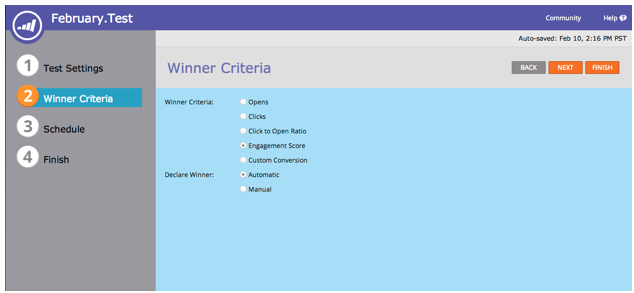
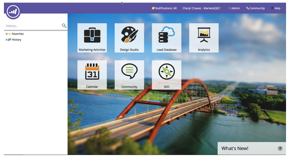
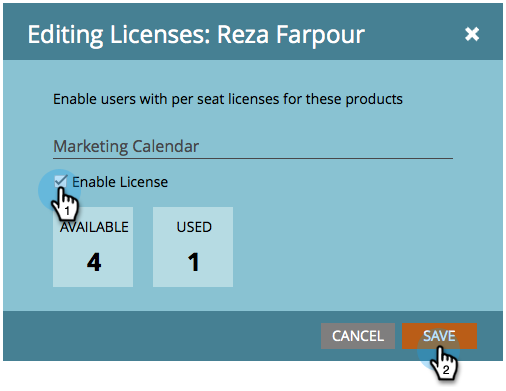
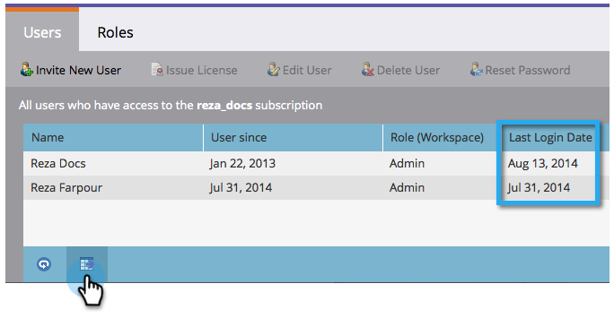
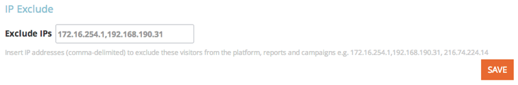
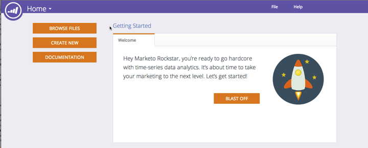

# 2014

## Januar 2014 {#january}

Die folgenden Funktionen sind in der Version vom Januar 2014 enthalten. Bitte überprüfen Sie Ihre [Marketo Edition](https://www.marketo.com/pricing/) auf Funktionsverfügbarkeit.

## Formulare 2.0 {#forms}

Heads Up: Die Dokumentation für Forms 2.0 ist in Kürze verfügbar!

Übernehmen Sie die Kontrolle über den Prozess der Formularerstellung und gönnen Sie Ihren Webentwicklern eine Pause. Forms 2.0 wurde entwickelt, um es Marketing-Experten zu ermöglichen, sowohl visuell als auch funktionell robuste Formulare zu erstellen, ohne Programmierkenntnisse zu benötigen.

**Verleihen Sie Ihrer Forms das visuelle Makeover, das sie verdienen:**

Designdesigns, Schaltflächenanpassung und flexible Layouts ermöglichen es Ihnen, moderne Formulare zu entwerfen, die genau in das Erscheinungsbild Ihrer Site passen.

**Bedingte Sichtbarkeit und Folgeseitenlogik:**

Möchten Sie, dass „Bundesland“ nur angezeigt wird, wenn ein Benutzer USA als „Land“ auswählt? Wie wäre es, wenn Kunden verschiedene Whitepaper präsentiert werden, die darauf basieren, wie sie Fragen in Ihrem Formular beantworten? Erstellen Sie eine bedingte Logik direkt im Editor in Ihre Formulare. Keine [!DNL javascript] erforderlich!

**Einfaches Einbetten von Forms auf eigenen Landingpages:**

Die Zeiten, in denen HTML-Code aus Formularen auf Marketo-Landingpages entfernt und in einem [!DNL iFrame] abgelegt wurde, sind vorbei. Nehmen Sie einfach den Einbettungs-Code und platzieren Sie ihn auf der Landingpage an der Stelle, an der das Formular gerendert werden soll. Zwei Modi - normal und Lightbox - bieten Ihnen noch mehr Flexibilität bei Marketo-Formularen auf Ihrer Site.

## Kommunikationsbeschränkungen für das E-Mail-Programm {#communication-limits-for-email-program}

[Legen Sie Kommunikationsbeschränkungen für ein E-Mail](/help/marketo/product-docs/email-marketing/email-programs/email-program-actions/enable-disable-communication-limits-in-an-email-program.md)Programm fest, um sicherzustellen, dass Sie mit Ihrer Datenbank nicht übermäßig kommunizieren. Wenn eine Person das festgelegte Limit überschreitet, erhält sie die E-Mail nicht.

## Zusätzliche Felder in Programmmitgliedschafts-Analyse {#additional-fields-in-program-membership-analysis}

Jetzt können Sie Ihre Metriken zur Programmmitgliedschaftsanalyse hinzufügen und nach Lead- und Unternehmensattributen gruppieren. Sie können beispielsweise das Feld Branche hinzufügen, um die Aufteilung Ihrer Programmmitglieder und Erfolge anzuzeigen.

## Februar 2014 {#february}

Die folgenden Funktionen sind in der Version vom Februar 2014 enthalten. Bitte überprüfen Sie Ihre Marketo Edition auf Funktionsverfügbarkeit. Kehren Sie nach der Veröffentlichung immer wieder zu Links zu detaillierten Knowledge Base-Artikeln für jede Funktion zurück!

## [!UICONTROL Engagement Score] als Gewinnkriterium {#engagement-score-as-winning-criteria}

[Verwenden Sie den Interaktionswert](/help/marketo/product-docs/email-marketing/email-programs/email-program-actions/email-test-a-b-test/define-the-a-b-test-winner-criteria.md) um die Gewinnervariante in Ihrem A/B-Split-Test oder Champion-/Challenger-Test zu bestimmen. Der Test muss mindestens 24 Stunden laufen, um einen angemessenen Interaktionswert zu erhalten.

## Registerkarte [!UICONTROL Ergebnisse] des E-Mail-Programms {#email-program-results-tab}

[Ergebnisse anzeigen](/help/marketo/product-docs/email-marketing/email-programs/email-program-data/view-email-program-results.md) und Aktivitäten protokolliert für das E-Mail-Programm.

## Personen/[!UICONTROL Leads] vom Mailing blockiert {#people-leads-blocked-from-mailing}

[Klicken Sie auf die Personen/Leads, die von der ](/help/marketo/product-docs/email-marketing/email-programs/managing-people-in-email-programs/define-an-audience-with-a-smart-list.md) gesperrt sind, um anzuzeigen, wer die E-Mail nicht erhalten wird, da er sich abgemeldet hat, auf der schwarzen Liste steht, eine ungültige oder leere E-Mail-Adresse hat oder vom Marketing suspendiert wurde.

## Exportieren von E-Mail-Programmdaten {#export-email-program-data}

[Exportieren von E-Mail-Metriken nach [!DNL Excel]](/help/marketo/product-docs/email-marketing/email-programs/email-program-data/export-email-program-dashboard-to-excel.md), einschließlich AB-Testvariantendaten.

## [!UICONTROL Engagement Score] im [!UICONTROL Engagement Stream Performance] Bericht {#engagement-score-in-engagement-stream-performance-report}

Wir haben die Interaktionsbewertung zum Bericht [[!UICONTROL Interaktionsstrom-Leistung] hinzugefügt](/help/marketo/product-docs/email-marketing/drip-nurturing/reports-and-notifications/engagement-stream-performance-report.md) damit Sie sehen können, wie effektiv der Inhalt in Ihrem Interaktionsprogramm ist.

## Programmdetails in der E-Mail-Analyse {#program-details-in-email-analysis}

Jetzt können Sie Ihre E-Mail-Metriken nach Programmname, Kanal und Tags gruppieren. Der Programmname wird zum Feld E-Mail-Name hinzugefügt, wenn die E-Mail ein lokales Asset des Programms ist. Das Feld Neuer Programmname zeigt den Programmnamen der Smart-Kampagne an, die die E-Mail gesendet hat. Dies kann sich vom Programm im Feld E-Mail-Name unterscheiden, wenn die E-Mail ein lokales Asset eines anderen Programms ist.

## Aktualisierung der Klicks auf Link-Filter und -Trigger {#update-to-clicks-link-filters-and-trigger}

Die folgenden Filter- und Trigger-Namen wurden aktualisiert:

* Klicks Link zu [!UICONTROL Klicks Link auf Web-Seite]
* Auf Link geklickt [!UICONTROL auf Link auf Webseite geklickt]
* Nicht geklickt Link zu [!UICONTROL Nicht geklickt Link auf Webseite]

## Verbesserungen für Formulare 2.0 {#forms-enhancements}

Mit dieser Version haben wir Forms 2.0 mehrere Updates zur „Lebensqualität“ bereitgestellt. Zusätzlich zur Aktivierung der progressiven Profilerstellung in eingebetteten Formularen haben wir auch Workflow- und UX-Änderungen vorgenommen, die die Verwendung der erweiterten Funktionen im Editor erleichtern, [einschließlich der Sichtbarkeitsregeln](/help/marketo/product-docs/demand-generation/forms/form-fields/dynamically-toggle-visibility-of-a-form-field.md), erweiterten Dankeseiten und ausgeblendeten Feldern.

## März 2014 {#march}

Die folgenden Funktionen sind in der Version vom März 2014 enthalten. Bitte überprüfen Sie Ihre Marketo Edition auf Funktionsverfügbarkeit. Vergewissern Sie sich, dass Sie nach der Veröffentlichung zu jeder Funktion zurückkehren, um Links zu Knowledge-Base-Artikeln zu erhalten.

## Schaltfläche „E-Mail-Programm-Dashboard aktualisieren“ {#email-program-dashboard-refresh-button}

Verwenden Sie die [Aktualisieren](/help/marketo/product-docs/email-marketing/email-programs/email-program-data/use-the-email-program-dashboard.md)-Schaltfläche, um aktuelle E-Mail-Metriken zu Ihrer E-Mail zu erhalten oder Ihren AB-Test zu senden!

## Rückgängig machen/Wiederholen im E-Mail-Editor und im Snippet-Editor {#undo-redo-in-the-email-editor-and-snippet-editor}

[Rückgängig machen oder ](/help/marketo/product-docs/email-marketing/general/email-editor-2/edit-elements-in-an-email.md): Bis zu 50 Aktionen für die aktuelle Sitzung.

## Programmstatusspalten im Programmleistungsbericht {#program-status-columns-in-program-performance-report}

Bei Verwendung des [Programmleistungsberichts](/help/marketo/product-docs/core-marketo-concepts/programs/program-performance-report/add-program-status-columns-to-a-program-report.md) können Sie jetzt sehen, wie viele Personen sich in welchen Programmstatus befinden.

## Enthaltene und betriebliche Programme für Analytics {#inclusive-and-operational-programs-for-analytics}

Sie können jetzt Programme ohne Periodenkosten in [!UICONTROL Umsatz-Explorer] und Analyzer einbeziehen, indem Sie die Analytics-Verhaltensoption auf „Inklusiv“ setzen, wenn Sie Programmkanäle bearbeiten. Sie können operationelle Programme auch von der gesamten Berichterstattung ausschließen, indem Sie „Operativ“ wählen.

## Hybride und implizite Optionen für die Lead-Konversion {#hybrid-and-implicit-options-for-lead-conversion}

Sie können die Art und Weise ändern, wie Marketo Kontakte und Opportunities für die Lead-Konversionsmetriken in der Lead-Analyse verknüpft. Sie können [ Attributionseinstellung ](/help/marketo/product-docs/administration/settings/change-attribution-settings-for-analytics.md) eine von drei Optionen ändern. Wenn Sie diese Einstellung ändern, werden keine Marketo- oder CRM-Daten geändert. Sie ändern lediglich die Ausführung Ihrer Berichte und können jederzeit rückgängig gemacht werden.

Die Einstellung Explizit behandelt nur Kontakte mit Rollen in einer Opportunity als konvertierte Leads (Standardverhalten). Implizit werden alle mit dem Konto in der Opportunity verbundenen Kontakte unabhängig von der Rolle als konvertiert behandelt. Hybrid behandelt Kontakte mit Rollen als konvertiert, falls verfügbar. Wenn nicht, behandeln wir alle Kontakte im Konto als konvertiert.

Zur Erinnerung: Diese Einstellung ändert auch die Programmzuordnungsmetriken.

## Zusätzliche Benutzersprache {#additional-user-language}

Wählen Sie Ihre [Marketo-Anwendungssprache](/help/marketo/product-docs/administration/settings/change-time-zone.md). Sehen Sie sich die Marketo-Lead-Management-Oberfläche in Ihrer bevorzugten Sprache an - jetzt wird Japanisch unterstützt.

## Marketo Developer-Blog {#marketo-developer-blog}

Der [Marketo Developer Blog](https://developers.marketo.com/blog/) ist für Web-Entwickler und Software-Ingenieure gedacht, die die sich schnell verändernden Anforderungen moderner Marketing-Experten unterstützen. Sie können Ankündigungen zu neuen Integrationsoptionen, API-Versionsaktualisierungen und einer neuen Reihe von Anleitungsartikeln abonnieren, die Codebeispiele und Best Practices zur Integration mit der Marketo-Plattform enthalten.

Der [erste Artikel](https://developers.marketo.com/blog/retrieving-customer-and-prospect-information-from-marketo-using-the-api/) in dieser Reihe führt Sie durch die effiziente Suche nach Informationen über die Personen (Kunden/Kontakte/Leads), die in Marketo mithilfe der -API gespeichert sind.

## Mai 2014 {#may}

Die folgenden Funktionen sind in der Version vom Mai 2014 enthalten. Bitte überprüfen Sie Ihre Marketo Edition auf Funktionsverfügbarkeit. Kehren Sie nach der Veröffentlichung immer wieder zu Links zu detaillierten Knowledge Base-Artikeln für jede Funktion zurück!

## Arbeitsbereich löschen {#delete-workspace}

Jetzt können Sie [nicht verwendeten Arbeitsbereich löschen](/help/marketo/product-docs/administration/workspaces-and-person-partitions/delete-a-workspace.md). Verschieben Sie alle Assets in einen anderen Arbeitsbereich, bevor Sie versuchen, den Arbeitsbereich zu löschen.

## Erstbesetzung planen {#schedule-first-cast}

In Interaktionsprogrammen können Sie das Datum für die (erste [) Ausführung ](/help/marketo/product-docs/email-marketing/drip-nurturing/engagement-program-streams/set-stream-cadence.md). Geben Sie beispielsweise die Kadenz an, die alle 2 Wochen erfolgen soll, und wählen Sie das Datum der ersten Besetzung aus.

## Erweiterte Engagement Programs {#enhanced-engagement-programs}

Jetzt erhält jeder mehrere Programme, Streams und Kommunikationsbeschränkungen.

## Linktracking in Textnachrichten {#link-tracking-in-text-emails}

[Fügen Sie doppelte eckige Klammern ](/help/marketo/product-docs/email-marketing/general/functions-in-the-editor/add-tracked-links-to-a-text-email.md) URLs in der Textversion Ihrer E-Mails hinzu, um anzugeben, wann Links in umgeleitete Marketo-Tracking-Links konvertiert werden sollen

>[!NOTE]
>
>**Beispiel**
>
>`[[https://www.marketo.com]]`

Standardmäßig werden in der Textversion von E-Mails keine Links verfolgt. Fügen Sie diese neue Syntax hinzu, um anzugeben, wann ein Link in einen Tracking-Link konvertiert werden soll. Das Verhalten von HTML-Links bleibt unverändert.  So fügen Sie Ihren E-Mails getrackte Links hinzu:

* **HTML-Version:** Fügen Sie einfach Ihren Link ein. Er wird standardmäßig verfolgt.
* **Textversion:** Geben Sie die URL ein, die von doppelten eckigen Klammern umgeben ist.

So fügen Sie Ihren E-Mails nicht getrackte Links hinzu:

* **HTML-Version:** Fügen Sie den Link ein und fügen Sie die Klasse „mktNoTrack“ zum Link hinzu.
* **Textversion:** Geben Sie einfach die URL ein. Die Verfolgung wird standardmäßig aufgehoben.

## Link-Markup in Beispiel-E-Mails {#link-markup-in-sample-emails}

Erfahren Sie, wie sich Ihre Links in E-Mails im Voraus verhalten werden. Beispiel-E-Mails zeigen jetzt Links genau so an, wie sie Ihren Leads erscheinen würden. Zeigen Sie in einer Vorschau an, welche Links in Tracking-Links konvertiert wurden, damit Sie sich ein besseres Bild davon machen können, wie die Nachricht den Empfängern tatsächlich angezeigt wird.

## [!UICONTROL Kampagne abbrechen] {#abort-campaign}

Keine Panik! Wenn Sie einen Fehler finden, verwenden Sie die neue Schaltfläche [Abbruchkampagne](/help/marketo/product-docs/core-marketo-concepts/smart-campaigns/using-smart-campaigns/abort-a-smart-campaign.md) , um Kampagnen sofort zu stoppen. Sie erhalten eine Benachrichtigung, in der angegeben wird, wie viele Leads in jedem Flussschritt zum Zeitpunkt des Stoppens der Kampagne ausstanden.

## [!UICONTROL Sales Insight] auf Japanisch, Portugiesisch und Spanisch {#sales-insight-in-japanese-portuguese-and-spanish}

Laden Sie die neueste Version von [!UICONTROL Sales Insight] von AppExchange herunter, damit Ihre japanisch, portugiesisch und spanischsprachigen Vertriebsmitarbeiter [!UICONTROL Sales Insight] Inhalte in ihrer bevorzugten Sprache anzeigen können.

## Programmstatus und Erfolgszeitrahmen in der Analyse der Programmmitgliedschaft {#program-status-and-success-timeframe-in-program-membership-analysis}

Anzeigen, wie viele Mitglieder sich in jedem Programmstatus befinden und wann sie zu jedem Status gewechselt haben, einschließlich des Datums, an dem sie den Programmerfolg erzielt haben.

## A/B-Test-E-Mails in [!UICONTROL E-Mail-Analyse] {#a-b-test-emails-in-email-analysis}

Erstellen Sie Berichte zu den einzelnen Varianten Ihrer A/B-Test-E-Mails in [!UICONTROL E-Mail-].

## Änderungen am Analytics-Paket {#analytics-packaging-changes}

Modeler und Success Path Analyzer sind jetzt in MA Standard Edition enthalten.

## Informationen zur mobilen Plattform {#mobile-platform-info}

[Segment und Trigger ](/help/marketo/product-docs/reporting/basic-reporting/report-activity/build-a-people-performance-report-with-mobile-platform-columns.md) von Leads, die E-Mails von ihren Mobilgeräten aus öffnen und klicken.

## Juni 2014 {#june}

Die folgenden Funktionen sind in der Version vom Juni 2014 enthalten. Bitte überprüfen Sie Ihre Marketo Edition auf Funktionsverfügbarkeit.

## Aktualisierte Benutzeroberfläche - in Kürze verfügbar! {#updated-ui-coming-soon}

Ein neues Look-and-Feel, einschließlich Navigation für [!DNL Marketo Lead Management], wird bald in einer späteren Version veröffentlicht!

## [!DNL Sales Insight] für [!DNL Outlook] 2013 {#sales-insight-plugin-for-outlook}

Dazu muss das neue Plug-in heruntergeladen werden. Sie können ihn von [hier](/help/marketo/product-docs/marketo-sales-insight/msi-outlook-plugin/install-the-marketo-email-add-in-for-outlook-with-a-registration-code.md) herunterladen.

## Token-Auflösung {#token-resolution}

Wenn Sie eine Test-E-Mail von [!DNL Sales Insight] senden, werden die Token in der E-Mail derzeit nicht aufgelöst, und der Standardwert wird gesendet. Diese Erweiterung gewährleistet, dass Token in Test-E-Mails aufgelöst werden.

## Prozentsätze für Sterne und Flammen anpassen {#customize-percentages-for-stars-and-flames}

[Legen Sie den Prozentsatz ](/help/marketo/product-docs/marketo-sales-insight/msi-for-salesforce/features/stars-and-flames/customize-stars-and-flames.md) Leads fest, die 1, 2 oder 3 Sterne und Flammen erhalten.

## Lead REST-API {#lead-rest-api}

Erstellen, lesen und aktualisieren Sie Leads programmatisch mithilfe unserer neuen ReST API. Um mit ReST zu beginnen, müssen Sie [einen benutzerdefinierten Service erstellen](/help/marketo/product-docs/administration/additional-integrations/create-a-custom-service-for-use-with-rest-api.md) in Marketo. Navigieren Sie dann zur [Entwickler-Site](https://experienceleague.adobe.com/de/docs/marketo-developer/marketo/rest/rest-api), um Details zur Verwendung dieser API zu erhalten.

## Real-Time Personalization (RTP, Echtzeit-Personalisierung) – Aktualisierung der Kampagnenseite {#marketo-real-time-personalization-rtp-campaigns-page-update}

RTP-Kampagnen enthalten jetzt ein neues Design mit Miniaturansichten und Kampagnenleistung. Darüber hinaus können Sie [ Kampagnen nach Datum ](/help/marketo/product-docs/web-personalization/working-with-web-campaigns/sort-web-campaigns-by-latest-or-top-performing.md) Spitzenleistung organisieren.

## Web-Analyse-Integrationen {#web-analytics-integrations}

Hängen Sie alle Ihre RTP-Daten an Ihre Web-Analyseplattform an.

Die Integration mit [Google Analytics](/help/marketo/product-docs/web-personalization/reporting-for-web-personalization/web-analytics-integrations/integrate-rtp-with-google-analytics.md) (GA) ist jetzt standardmäßig aktiviert. Aktivieren Sie daher unter „Kontoeinstellungen“ den Schalter, für den Sie Daten an benutzerdefinierte GA-Variablen und -Ereignisse senden möchten.

Wir haben auch die Integration mit [Adobe SiteCatalyst abgeschlossen](/help/marketo/product-docs/web-personalization/reporting-for-web-personalization/web-analytics-integrations/integrate-with-adobe-analytics.md).

## Juli 2014 {#july}

Die folgenden Funktionen sind in der Version vom Juli 2014 enthalten. Bitte überprüfen Sie Ihre Marketo Edition auf Funktionsverfügbarkeit. Kehren Sie nach der Veröffentlichung wieder zurück, um Links zu detaillierten Funktionsdokumentationen zu erhalten.

## Marketing-Kalender {#marketing-calendar}

Zeigen Sie alle Ihre Termine, E-Mails und dergleichen programmübergreifend an. [Dieses neue Produkt](/help/marketo/product-docs/core-marketo-concepts/marketing-calendar/understanding-the-calendar/navigating-the-marketing-calendar.md) wird Kunden mit 10 oder weniger [!DNL Marketo Lead Management] oder Dialog-Benutzern kostenlos zur Verfügung stehen.

Die Dokumentation zum Marketing-Kalender wird zum Zeitpunkt der Veröffentlichung verfügbar sein.

## Neues Aussehen, neue Navigation {#new-look-and-feel}

[!DNL Marketo Lead Management] wird mit einem neuen Look-and-Feel aktualisiert, das modern und elegant ist und eine aktualisierte Navigation enthält.

## Datumsoperatoren {#date-operators}

[Erweiterte Filter](/help/marketo/product-docs/core-marketo-concepts/smart-lists-and-static-lists/creating-a-smart-list/smart-list-filter-operators-glossary.md) für &quot;[!UICONTROL in der Vergangenheit]&quot;, &quot;[!UICONTROL in der ]&quot; und &quot;[!UICONTROL in der Zukunft danach]&quot;. Suchen Sie beispielsweise nach Leads, die in den nächsten 3 Monaten ein Geburtsdatum haben, oder nach einem Vertrag, der nach 6 Monaten abläuft.

## Ansicht „Programmplanung“ {#program-schedule-view}

Zusätzlich zum Marketing-Kalender können Sie Ihre Ereignisse und Standardprogramme mit einer neuen Zeitplanansicht direkt im Programm verwalten.

* Alle Termine gleichzeitig neu planen
* Neue Vorläufige Termine - Bleiben Sie dran!
* Benutzerdefinierte Eintragstypen - Aufgaben, Pressemitteilung, alles, was Sie wollen

## Listenvorgänge in der REST-API {#list-operations-in-the-rest-api}

Wir haben die folgenden Aufrufe im Zusammenhang mit Listenvorgängen in ReST hinzugefügt. Die vollständige Dokumentation finden Sie ](https://experienceleague.adobe.com/de/docs/marketo-developer/marketo/rest/rest-api) [https://experienceleague.adobe.com/en/docs/marketo-developer/marketo/rest/rest-api.

* Liste nach ID abrufen
* Abrufen mehrerer Listen
* In Liste importieren
* Import zum Listenstatus abrufen

## Schneller Listenimport {#fast-list-import}

Über **50-mal schneller** zoomen Ihre Dateien in Marketo! Die alten Importoptionen „Normal“ und „Für neue Leads optimiert“ wurden durch „Standard (schneller Import)“ ersetzt.

Die Option „Neue Leads und Aktualisierungen überspringen“ bleibt unverändert.

## Neues verbessertes Munchkin! {#new-improved-munchkin}

Der Rollout wird ab Mitte Juli geplant und in den nächsten Monaten fortgesetzt.

* Entfernt die [!DNL jQuery] für vollständige und zukünftige Kompatibilität
* Kompatibler mit anderen JavaScript auf Ihrer Site
* Vollständig getestet an vielen Standorten im vergangenen Jahr!

## RTP: Echtzeit-Personalization-Kampagnenvorlagen {#rtp-real-time-personalization-campaign-templates}

Die Seite RTP-Set-[ (enthält jetzt vorgefertigte Vorlagen](/help/marketo/product-docs/web-personalization/using-templates/using-templates-to-create-web-campaigns.md). Wählen Sie aus einer Vielzahl von Stilen, einschließlich Webinaren, Fallstudien und eBooks.

## RTP: JavaScript API-Verbesserungen {#rtp-javascript-api-enhancements}

Neuer RTP-API-Aufruf, um Echtzeit-Besucherdaten wie Organisation, Branche, Standort und Segment-Code abzugleichen. Darüber hinaus wird beim Bewegen des Mauszeigers über einen Segmentnamen auf der Seite Segmente eine QuickInfo mit dem Segment-Code angezeigt. Die vollständige Dokumentation finden [ auf unserer ](https://experienceleague.adobe.com/en/docs/marketo-developer/marketo/javascriptapi/rich-media-recommendation)-Website.

## RTP: HTML5-Unterstützung im Campaign Content Editor {#rtp-html-support-in-campaign-content-editor}

Der Content WYSIWYG-Editor auf der Seite Kampagnen festlegen ist jetzt mit HTML5 vollständig kompatibel. Klicken Sie im Editor auf das Symbol &quot;HTML&quot;, um HTML5-Code einzufügen.

## August 2014 {#august}

Die folgenden Funktionen sind in der Version vom August 2014 enthalten. Überprüfen Sie Ihre Marketo Edition auf die Verfügbarkeit der Funktionen. Kehren Sie nach der Veröffentlichung wieder zurück, um Links zu detaillierten Funktionsdokumentationen zu erhalten.

## Marketing-Kalender-Lizenzen {#marketing-calendar-licenses}

Nach dem 5. September 2014 haben nur noch 5 Benutzer freien Zugang zum Marketing-Kalender. Stellen Sie sicher[ dass Sie den Benutzern Ihrer Wahl zuvor eine Marketing-Kalender](/help/marketo/product-docs/core-marketo-concepts/marketing-calendar/understanding-the-calendar/issue-revoke-a-marketing-calendar-license.md)Lizenz erteilen/widerrufen, um einen unterbrechungsfreien Zugriff zu erhalten.

## Berechtigungen für neue Benutzer {#new-user-permissions}

Die folgenden neuen Benutzerberechtigungen wurden hinzugefügt:

| Berechtigung | Beschreibung |
|---|---|
| Auf Revenue Explorer zugreifen | Wenn Sie RCA erworben haben, haben Sie jetzt die Kontrolle darüber, wer darauf zugreifen kann. |
| Liste importieren | Benutzer vom Import von Listen in die Lead-Datenbank ausschließen. |
| Listenimport | Benutzer vom Import von Listen über ein Programm unter Marketing-Aktivitäten ausschließen. |
| Auslöser-Kampagne aktivieren | Legen Sie fest, wer Trigger-Kampagnen aktivieren darf und wer nicht. |
| Stapel-Kampagne planen | Kontrollieren, wer Batch-Kampagnendurchgänge planen kann und wer nicht. |

## Exportieren von Benutzern und Rollen aus [!UICONTROL Admin] {#export-users-and-roles-from-admin}

Sie können jetzt [Liste der Benutzer und Rollen exportieren](/help/marketo/product-docs/administration/users-and-roles/export-a-list-of-users-and-roles.md) aus Marketo. Sie können auch einen Zeitstempel „Letzte Anmeldung“ einfügen, der in den Export aufgenommen wird.

## Löschen von Kanälen und Tags {#delete-channels-and-tags}

Sie können jetzt alle nicht verwendeten Kanäle und Status löschen. Wie immer können Sie nur ein derzeit verwendetes ausblenden.

## Automatisierte [!DNL DKIM] {#automated-dkim}

Zur Verbesserung der Zustellbarkeit werden alle ausgehenden E-Mails [!DNL DKIM] (DomainKeys Identified Mail) signiert. Standardmäßig verwenden E-Mails die freigegebene [!DNL DKIM]-Signatur von Marketo. Sie haben die Möglichkeit, diese Signatur anzupassen.

>[!NOTE]
>
>[!DNL DKIM] wird langsam ausgerollt, Sie werden sie möglicherweise erst nach einigen Wochen sehen.

## Echtzeit-Personalization-Updates {#real-time-personalization-updates}

Wir haben der Kampagnenseite Kennzeichnungen hinzugefügt, damit Sie Ihren Heart-Inhalten Tags hinzufügen können.

## Mobile Targeting {#mobile-targeting}

Du hast nach der Community gefragt und wir haben geliefert! Sie können jetzt eine bestimmte call to action für Mobil- und Tablet-Benutzer ein- oder ausschließen oder festlegen.

## Verbesserte 1:1-Segmentierung und Zielgruppenbestimmung {#enhanced-segmentation-and-targeting}

Sie können jetzt erweiterte Filteroperatoren verwenden, um bekannte Besucher als Zielgruppe anzusprechen.

## Kampagnenfreigabe {#campaign-sharing}

Sie haben jetzt die Möglichkeit, einen Vorschau-Link für eine RTP-Kampagne schnell und einfach freizugeben.

## Bericht zur Inhaltsempfehlungs-Engine {#content-recommendation-engine-report}

Wir haben einen neuen Bericht zur Inhaltsempfehlungs-Engine hinzugefügt, damit Sie eine schöne Zusammenfassung sehen können.

## Verbesserte Benutzerverwaltung {#enhanced-user-administration}

Admin-Benutzer können jetzt Benutzer aufgrund mehrerer fehlgeschlagener Anmeldeversuche sperren. Sie können diese Benutzer bei Bedarf auch entsperren.

## Trackingkontrolle {#tracking-control}

Sie können jetzt bestimmte IPs aus allen Tracking- und Reporting-Funktionen in Real-Time Personalization ausschließen.

## Oktober 2014 {#october}

Überprüfen Sie Ihre Marketo Edition auf die Verfügbarkeit der Funktionen. Die Dokumentation wird zum Zeitpunkt der Veröffentlichung bereitgestellt.

## Programmfokus im Marketing-Kalender {#program-focus-in-marketing-calendar}

[Einträge erstellen und bearbeiten](/help/marketo/product-docs/core-marketo-concepts/marketing-calendar/understanding-the-calendar/understand-enable-program-focus.md) direkt aus dem Marketing-Kalender.

## Neue REST API-Aufrufe {#new-rest-api-calls}

Verwenden Sie die -API, um neue Aktivitäten oder Änderungen an Leads abzurufen:

* Lead-Änderungen abrufen
* Lead-Aktivitäten abrufen
* Aktivitätstypen abrufen
* Paging-Token abrufen

Alle Details werden nach der Veröffentlichung unter [https://experienceleague.adobe.com/en/docs/marketo-developer/marketo/rest/rest-api](https://experienceleague.adobe.com/de/docs/marketo-developer/marketo/rest/rest-api) verfügbar sein.

## MSI - Marketo-E-Mail senden für [!DNL Microsoft Dynamics] {#msi-send-marketo-email-for-microsoft-dynamics}

[Senden und Verfolgen von Verkaufs-E](/help/marketo/product-docs/marketo-sales-insight/msi-for-microsoft-dynamics/setting-up-and-using/send-a-marketo-sales-email-from-microsoft-dynamics.md)Mails an Leads und Kontakte aus [!DNL Microsoft Dynamics].

## MSI - Zu Marketo-Kampagnen für [!DNL Microsoft Dynamics] hinzufügen {#msi-add-to-marketo-campaigns-for-microsoft-dynamics}

[Hinzufügen von Leads und Kontakten zu Marketo Smart-Kampagnen](/help/marketo/product-docs/marketo-sales-insight/msi-for-microsoft-dynamics/setting-up-and-using/add-a-lead-contact-to-a-marketo-campaign-from-microsoft-dynamics.md) direkt aus [!DNL Microsoft Dynamics] heraus. Das Marketing kann auswählen, welche Marketo-Kampagnen dem Vertrieb zur Verfügung stehen.

## Unterstützung benutzerdefinierter Entitäten für [!DNL Microsoft Dynamics] Synchronisierung {#custom-entity-support-for-microsoft-dynamics-sync}

[Benutzerdefinierte Objektdaten verwenden](/help/marketo/product-docs/crm-sync/microsoft-dynamics-sync/microsoft-dynamics-sync-details/enable-sync-for-a-custom-entity.md) von [!DNL Microsoft Dynamics] zum Filtern und Auslösen in Smart-Listen, Smart-Kampagnen, Programmen usw.

## Shareholder Support für [!DNL Microsoft Dynamics] Sync {#shareholder-support-for-microsoft-dynamics-sync}

Synchronisieren Sie die Daten der Opportunity-Aktionäre aus [!DNL Dynamics]. Unterstützt werden auch Opportunities, die über das Feld &quot;Primäres Konto“ mit einem Konto verbunden sind, sowie Opportunitys, die über die Synchronisierung &quot;Primärer Kontakt“ mit dem Kontakt verbunden sind.

## RTP - Dashboard-Verbesserungen {#rtp-dashboard-enhancements}

Das Dashboard wurde nun erweitert, sodass es mehr Daten auf einen Blick enthält:

* Besuche der Organisation insgesamt
* Top 5 der leistungsstärksten Branchen
* Interaktive Besucherinnen und Besucher insgesamt

## RTP - Neue Mobile-Vorlagen für Kampagnen {#rtp-new-mobile-templates-for-campaigns}

Mit [ neuen Vorlagen können Sie schnell und einfach ](/help/marketo/product-docs/web-personalization/using-templates/using-templates-to-create-web-campaigns.md) Mobile-Kampagnen erstellen.

## RTP - User Context API {#rtp-user-context-api}

Verwenden Sie einen neuen Aufruf, der den Verlauf der letzten Besuche eines Besuchers verfolgt. Personalisieren Sie Kampagnen basierend auf den folgenden Kriterien des Besuchers:

* Frühere aufgerufene Seiten
* Interessierte Produkte
* Welche RTP-Kampagnen sie gesehen haben

Ausführliche Informationen finden Sie ](https://experienceleague.adobe.com/en/docs/marketo-developer/marketo/javascriptapi/rich-media-recommendation) [https://experienceleague.adobe.com/en/docs/marketo-developer/marketo/javascriptapi/rich-media-recommendation.

## Dezember 2014 {#december}

Die folgenden Funktionen sind in der Version vom Dezember 2014 enthalten. Bitte überprüfen Sie Ihre Marketo Edition auf Funktionsverfügbarkeit. Nach der Veröffentlichung sollten Sie unbedingt zurückkommen, um Links zu detaillierten Artikeln für jede Funktion zu finden!

## [!DNL Sales Insight] Berichte {#sales-insight-reports}

Mit [[!DNL Sales Insight] E-Mail-Leistungsbericht](/help/marketo/product-docs/marketo-sales-insight/msi-for-salesforce/features/performance-reports/sales-insight-email-performance-report.md) können Sie E-Mail-Metriken nach E-Mail-Adresse und Vertriebsmitarbeiter anzeigen. Es unterstützt E-Mails, die über [!DNL Salesforce], [!DNL Microsoft Dynamics], das [!DNL Outlook]-Plug-in und das [!DNL Gmail]-Plug-in gesendet werden.

## Benutzerdefinierte Zielgruppen [!DNL Facebook] {#facebook-custom-audiences}

Nachdem Ihr Marketo-Administrator [[!DNL Facebook] über [!UICONTROL Admin] > [!UICONTROL LaunchPoint]](/help/marketo/product-docs/demand-generation/ad-network-integrations/add-facebook-custom-audiences-as-a-launchpoint-service.md) hinzugefügt hat, können Sie eine benutzerdefinierte Zielgruppe einfach erstellen, aktualisieren oder [durch  [!DNL Facebook]  einer statischen oder intelligenten Marketo-Liste ersetzen](/help/marketo/product-docs/demand-generation/facebook/create-a-custom-audience-in-facebook.md). Suchen Sie nach dem neuen [!DNL Facebook] am unteren Rand des Lead-Rasters einer statischen oder intelligenten Liste.

## Verbessertes Klonen über Arbeitsbereiche hinweg  {#improved-cloning-across-workspaces}

[Klonen eines Programms](/help/marketo/product-docs/core-marketo-concepts/programs/working-with-programs/clone-a-program.md) in einen anderen Arbeitsbereich war noch nie so einfach! Wenn Sie auf Klonen klicken, wählen Sie den Zielarbeitsbereich aus. Kein Klonen mehr in einen Ordner und dann Verschieben des Ordners!

>[!NOTE]
>
>Diese neue Klon-Funktion ist derzeit nur für Programme verfügbar.

## Referenz-Smart-Liste {#reference-smart-list}

[Beim Erstellen einer Smart-Liste oder eines Flusses können Sie auf Smart](/help/marketo/product-docs/core-marketo-concepts/smart-lists-and-static-lists/using-smart-lists/reference-a-list-or-smart-list-across-workspaces.md)Listen verweisen, die für einen anderen Arbeitsbereich freigegeben sind.

## Verbesserungen bei Listenimporten {#list-import-improvements}

[Dateien importieren](/help/marketo/getting-started/quick-wins/import-a-list-of-people.md) in UTF-16, Shift-JIS oder EUC-JP kodiert. UTF-8-kodierte Dateien werden weiterhin unterstützt.

## Linktracking in E-Mail-Scripting {#link-tracking-in-email-scripting}

Links in E-Mail-Skripten werden jetzt verfolgt und sind im E-Mail-Link-Leistungsbericht verfügbar.

## Einstellung für Token-Kodierung {#token-encoding-setting}

Wir haben eine neue Sicherheitsfunktion zur automatischen Kodierung von HTML-Token eingeführt, die ab März 2015 standardmäßig aktiviert sein wird. Bis dahin können Sie diese Funktion in der Feldverwaltung umschalten, um das Verhalten im Voraus zu testen. Alle Lead- und Unternehmens-Token werden beim Einfügen in E-Mails oder Landingpages kodiert. Optionen stehen auch für einzelne Felder zur Verfügung.

## Neue REST API-Aufrufe {#new-rest-api-calls-december}

Drei neue Aufrufe für die Lead &amp; Activity REST-API:

・ Abrufen von Lead-Partitionen

・ Associate Lead

・ Lead zusammenführen

Alle Details werden nach der Veröffentlichung unter [https://experienceleague.adobe.com/en/docs/marketo-developer/marketo/home verfügbar sein](https://experienceleague.adobe.com/de/docs/marketo-developer/marketo/home)

## [!DNL Munchkin Javascript] {#munchkin-javascript-compatibility-enhancements}

Wir haben einige kleinere Verbesserungen an [!DNL Munchkin] vorgenommen, um sicherzustellen, dass es weiterhin schnell geladen wird und in Fällen mit anderen JavaScript auf der Seite wie gewünscht funktioniert.

Der Rollout wird Mitte Dezember beginnen und in den nächsten Monaten fortgesetzt.

## [!UICONTROL Umsatz-Explorer] Verbessertes Erscheinungsbild {#revenue-explorer-upgraded-look-and-feel}

## RTP: Modul Benutzerdefinierte Kontenliste {#rtp-named-account-list-module}

Verwalten und überwachen Sie Ihre wichtigsten Konten mit hoher Rendite auf der neuen Seite [!UICONTROL Benannte Konten]. Laden Sie neue Listen mit benannten Konten hoch, um diese Organisationen zu identifizieren und anzusprechen. Wir haben den Prozess automatisiert und bieten Ihnen mehr Kontrolle und Flexibilität, um Ihre Account-basierten Marketing-Pläne zu implementieren und Ihre wichtigen Accounts auf verschiedenen Kanälen (Web und Werbung) auszurichten.

## RTP: Gleitender Effekt für In-Zone-Kampagnen {#rtp-sliding-effect-for-in-zone-campaigns}

Für In-Zone-Kampagnen wurde ein neuer Gleiteffekt hinzugefügt, damit Ihre personalisierten Inhalte beim Laden der Seite eingefügt werden können.

