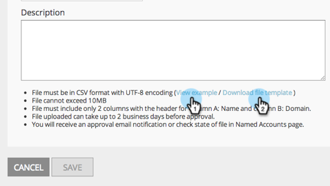
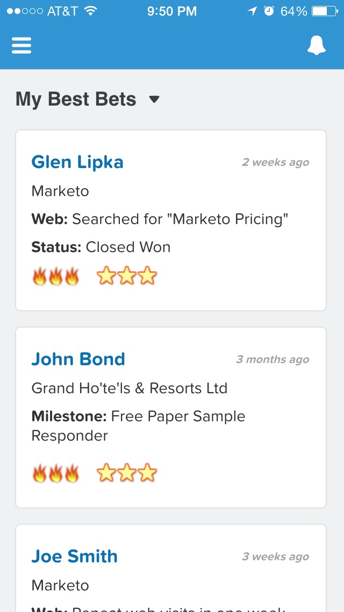
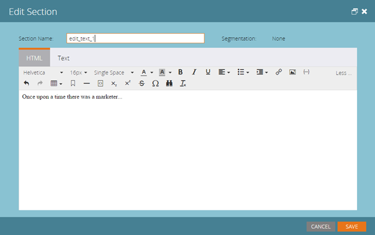
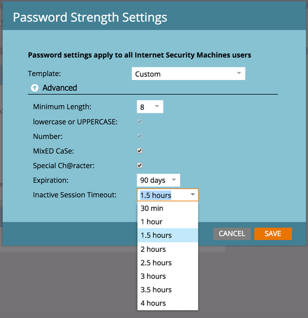

# 2015

## Januar 2015 {#january}

Die folgenden Funktionen sind in der Version vom Januar 2015 enthalten. Bitte überprüfen Sie Ihre Marketo Edition auf Funktionsverfügbarkeit. Nach der Veröffentlichung sollten Sie unbedingt zurückkommen, um Links zu detaillierten Artikeln für jede Funktion zu finden!

## Aktualisierungen der Marketing-Automatisierung {#marketing-automation-updates}

**Handy-freundliche Landingpages**

Sie können [im Landingpage-Editor &#x200B;](/help/marketo/product-docs/demand-generation/landing-pages/free-form-landing-pages/add-a-mobile-view-for-your-free-form-landing-page.md) mobile Ansichten für Landingpages erstellen). Stellen Sie Ihre Nachricht unabhängig vom Gerät effektiv bereit und steigern Sie die Interaktion, indem Sie Ihre Inhalte für den einfachen Gebrauch unterwegs anpassen. Diese Funktion wird in der Woche nach der Veröffentlichung schrittweise eingeführt.

[Video mit schrittweisen Anleitungen für -Landingpages](https://youtu.be/aPQHlG2X6c0)

**Neue REST API-Aufrufe**

Drei neue Aufrufe für die Lead &amp; Activity REST-API:

* Lead löschen
* Leads nach Programm-ID abrufen
* Gelöschte Leads abrufen

Außerdem gibt es eine neue Option für Lead synchronisieren , um die Lead-Änderung für einen schnelleren API-Aufruf asynchron zu schreiben. Alle Details werden nach der Veröffentlichung unter [https://experienceleague.adobe.com/de/docs/marketo-developer/marketo/home verfügbar sein](https://experienceleague.adobe.com/de/docs/marketo-developer/marketo/home)

**E-Mail-Skriptfunktionen: Support für benutzerdefinierte Objekte**

Greifen Sie jetzt über E-Mail-Skripte auf benutzerdefinierte Objekte zu, die mit dem Kontoobjekt verknüpft sind!

## Echtzeit-Personalisierung {#real-time-personalization}

**Personalisiertes Remarketing für Google und[!DNL Facebook]**

Remarketing zeigt Anzeigen an Personen, die Ihre Website besucht haben. Sie können jetzt Ihre Remarketing-Kampagnen auf [Google](/help/marketo/product-docs/web-personalization/website-retargeting/personalized-remarketing-in-google.md) personalisieren und mit Daten aus Real-Time Personalization [[!DNL Facebook]](/help/marketo/product-docs/web-personalization/website-retargeting/personalized-remarketing-in-facebook.md). Remarketing für Zielgruppen aus verschiedenen Branchen, benannte Kontolisten, Unternehmensgrößen oder Daten von bekannten Leads.

[Modul der Liste benannter Konten](/help/marketo/product-docs/web-personalization/account-based-web-marketing/create-a-new-account-list.md)

Verbesserungen am Modul Benannte Konten verbessern die Übereinstimmungsraten und Validierungen für Benutzer. Zu den Ergänzungen gehören:

* Abgleichen von Organisationen aus Ihrer Liste benannter Konten mithilfe der E-Mail-Adresse des Leads (auch für Kunden, die nur RTP verwenden)
* Unterstützung von bis zu 100.000 Datensätzen pro Konto
* CSV-Dateivorlage zum Anzeigen und Herunterladen



**Aktualisierte RTP-Tag-Optionen**

Die RTP-Tag-Optionen unter „Kontoeinstellungen“ wurden aktualisiert, um Folgendes einzuschließen:

1. CDN und Asynchron (Empfohlenes Tag)
1. CDN und synchron (hohe Geschwindigkeit)
1. Asynchrones Tag ohne CDN
1. Synchrones Tag ohne CDN

Um eine optimale Leistung zu erzielen, wird empfohlen, das -Tag nach dem `<head>` oben in der Kopfzeile Ihrer Web-Seite zu platzieren. Alle Tags ermöglichen die Verwendung der [RTP-](https://experienceleague.adobe.com/de/docs/marketo-developer/marketo/javascriptapi/rich-media-recommendation). Informationen zur Bereitstellung des RTP-Tags finden Sie unter [hier](/help/marketo/product-docs/web-personalization/rtp-tag-implementation/deploy-the-rtp-javascript.md).


## Februar 2015 {#february}

Die folgenden Funktionen sind in der Version vom Februar 2015 enthalten. Bitte überprüfen Sie Ihre Marketo Edition auf Funktionsverfügbarkeit. Vergewissern Sie sich, dass Sie nach der Veröffentlichung zurückkehren, um Links zu detaillierten Artikeln für jede Funktion zu finden. Trommelwirbel…

## Verbesserungen bei der Marketing-Automatisierung {#marketing-automation-enhancements}

**[Intelligente Kampagne verschieben](/help/marketo/product-docs/core-marketo-concepts/smart-campaigns/using-smart-campaigns/move-a-smart-campaign.md)**

Viel Spaß! Sie können jetzt intelligente Kampagnen per Drag-and-drop oder mit der Verschieben-Funktion in der Baumstruktur in Programme verschieben und daraus entfernen.

**[[!DNL Dynamics] 2015 (Online)](https://docs.marketo.com/display/docs/microsoft+dynamics+2013+on-premises)** - Unterstützt!

**HTTPS-Zertifikatänderungen**

Zum Schutz der Vertraulichkeit und Integrität von Kundendaten und SaaS-Services befolgt Marketo die Best Practices der SaaS-Branche

und wird die derzeit verwendeten Sicherheitsprotokolle (SHA-1 und SSL) durch sicherere Versionen (SHA-2 (auch bekannt als SHA-256) und TLS) für die folgenden Domains ersetzen:

* marketo.net (verschlüsselter [!DNL Munchkin] Traffic)

* [marketo.com](https://marketo.com) (SaaS-Hauptanwendungen)

Dies geschieht kurz nach dieser Version. Das SHA-1-Protokoll wird bis Dezember 2015 vorübergehend auf der [mktoapi.com](https://mktoapi.com)-Domain unterstützt, damit Besitzer älterer Systeme und Anwendungen ihre Systeme mit SHA-2-Kompatibilität aktualisieren können.

**Sichere[!DNL Munchkin]**

Wir entfernen unsere Unterstützung für SSL3. Bisher haben wir SSL3 beibehalten, um Unterstützung für alte Webbrowser zu erhalten, aber 2015 sehen wir keinen signifikanten Webtraffic mehr von diesen Browsern. Dies würde sich nur auf [!DNL Munchkin] auswirken, wenn es auf sicheren Seiten verwendet wird, und wird nach der Februarversion langsam eingeführt.

## Verbesserungen bei Real-Time Personalization {#real-time-personalization-enhancements}

**[Target-URL für Kampagnen](/help/marketo/product-docs/web-personalization/working-with-web-campaigns/adding-a-target-url-to-a-web-campaign.md)**

Wählen Sie mithilfe von „Ziel-URL hinzufügen“ die Seiten aus, die Ihre Echtzeit-Kampagne anzeigen soll. Diese Funktion funktioniert bei allen Kampagnentypen (Dialogfeld, In-Zone, Widgets), ist aber besonders für In-Zone-Kampagnen nützlich, bei denen eine Kampagne nur für die ausgewählte Ziel-URL in der Zonen-ID gerendert wird. Es unterstützt das Hinzufügen mehrerer URLs zu verschiedenen Web-Seiten.


**Land und Bundesland zum kontobasierten Targeting hinzugefügt**

Jetzt können Land und Bundesland zu Ihren Named-Accounts-Listen hinzugefügt werden. Zielen Sie auf wichtigste potenzielle Kunden an bestimmten Standorten ab.

## März 2015 {#march}

Die folgenden Funktionen sind in der Version vom März 2015 enthalten. Bitte überprüfen Sie Ihre Marketo Edition auf Funktionsverfügbarkeit. Vergewissern Sie sich, dass Sie nach der Veröffentlichung zurückkehren, um Links zu detaillierten Artikeln für jede Funktion zu finden.

## HD-Kalender {#calendar-hd}

Zeigen Sie die Marketing-Aktivitäten Ihres Teams im neuen Präsentationsmodus des Kalenders an. Diese sind ideal für Fernseher oder riesige Monitore rund um das Büro! Legen Sie Ziele fest und zeigen Sie sie basierend auf einer Smart-Liste oder benutzerdefinierten Metriken an.

>[!NOTE]
>
>Diese Funktion ist für Spark- und [!DNL Standard]-Editionen nicht verfügbar.


## [!DNL Google Adwords]-Integration {#google-adwords-integration}

Verknüpfen Sie Ihr [[!DNL Google AdWords] Konto mit Marketo](/help/marketo/product-docs/administration/additional-integrations/add-google-adwords-as-a-launchpoint-service.md), um Offline-Konversionsdaten automatisch von Marketo in [!DNL Google AdWords] hochzuladen. In der [!DNL AdWords] Benutzeroberfläche können Sie dann leicht erkennen, welche Klicks zu qualifizierten Leads, Chancen und neuen Kunden geführt haben (oder welche Umsatzphasen Sie verfolgen möchten).


## [!UICONTROL Revenue Explorer] Redesign {#revenue-explorer-redesign}

[!UICONTROL Revenue Explorer] hat ein brandneues Look-and-Feel sowie den neuen Sunburst-Diagrammtyp! Die Einführung ist für die ersten zwei Aprilwochen geplant.

## Neue Ressourcen-REST-APIs {#new-asset-rest-apis}

[Neue Ressourcen-REST-APIs](https://experienceleague.adobe.com/de/docs/marketo-developer/marketo/rest/assets/assets)

Wir bieten jetzt Unterstützung für das Erstellen und Bearbeiten von E-Mails, Vorlagen, meinen Token, Dateien und Snippets [über die API](https://developer.adobe.com/marketo-apis/api/asset/)!

## [!DNL Microsoft Dynamics] 2015 On-Premise {#microsoft-dynamics-on-premise}

Unterstützt mit dem neuesten Installationsprogramm ([&#x200B; über die App zugänglich](/help/marketo/product-docs/crm-sync/microsoft-dynamics-sync/sync-setup/update-the-marketo-solution-for-microsoft-dynamics.md).


## RTP: Personalisierte Webeinbindung mit Lead-Daten {#rtp-personalized-web-engagement-with-lead-data}

Nutzen Sie die [Lead-Datenfelder](/help/marketo/product-docs/web-personalization/using-web-segments/manage-person-data.md) die Sie in Ihrer Marketo-Lead-Datenbank haben, um Echtzeit-Segmentierung und personalisierte Inhaltskampagnen zu erstellen. Verwalten Sie Ihre Lead-Datenfelder in RTP und fügen Sie relevante Lead-Felder hinzu bzw. löschen Sie diese.

## RTP: Webinhalte nach E-Mail- oder Programmkampagnenname personalisieren {#rtp-personalize-web-content-by-email-or-program-campaign-name}

Setzen Sie das Gespräch mit Ihrem Lead über alle Kanäle von E-Mail bis Web fort. [Personalisieren eingehender Inhalte basierend auf der E-Mail-Kampagne oder dem &#x200B;](/help/marketo/product-docs/web-personalization/using-web-segments/web-segments.md), der in den Marketing-Aktivitäten von Marketo verwendet wird.

## April 2015 {#april}

Die folgenden Funktionen sind in der Version vom April 2015 enthalten. Bitte überprüfen Sie Ihre Marketo Edition auf Funktionsverfügbarkeit. Nach der Veröffentlichung sollten Sie unbedingt zurückkommen, um Links zu detaillierten Artikeln für jede Funktion zu finden!

## Überarbeitetes Design der Analysen-Startseite

[Überarbeitetes Design der Analysen-Startseite](/help/marketo/product-docs/reporting/basic-reporting/creating-reports/navigating-the-analytics-home-page.md)

>[!NOTE]
>
>Diese Funktion wird am Dienstag, dem 28. April veröffentlicht.

Die neue [[!UICONTROL Analytics]-Startseite](/help/marketo/product-docs/reporting/basic-reporting/creating-reports/navigating-the-analytics-home-page.md) ermöglicht den schnellen Zugriff auf die Ausführung von Ad-hoc-Berichten über alle verfügbaren Berichtstypen hinweg.


Darüber hinaus ist jetzt die Berichtsorganisation „Privat“ im Vergleich „Freigegeben“ verfügbar. Erstellen oder ziehen Sie Berichte in den Ordner [!UICONTROL Meine Berichte], damit sie von anderen Benutzern nicht angezeigt, bearbeitet oder gelöscht werden können. [!UICONTROL Gruppenberichte] werden für alle Benutzer freigegeben.

## Marketo Mobile Engagement {#marketo-mobile-engagement}

**Marketo Mobile-Interaktion**

Mit Marketo Mobile Engagement können Sie mühelos überzeugende mobile Erlebnisse bereitstellen. Erstellen Sie hochgradig personalisierte Kampagnen, die überzeugende Inhalte liefern, ohne auf ein App-Entwicklungs-Team angewiesen zu sein. Mit neuen Filtern und Triggern können Sie über Push-Benachrichtigungen auf dem mobilen Kanal zuhören und darauf reagieren.


## Integration [!DNL LinkedIn] Lead-Beschleunigers

[Integration [!DNL LinkedIn] Lead-Beschleunigers](/help/marketo/product-docs/demand-generation/social/social-functions/use-a-marketo-list-or-smart-list-as-a-linkedin-audience-segment.md)

Erweitern Sie Ihre Lead-Nurture-Strategie auf bezahlte Display- und Social-Media-Anzeigen. Die [Anzeigennetzwerkintegration](/help/marketo/product-docs/demand-generation/ad-network-integrations/add-linkedin-matched-audiences-as-a-launchpoint-service.md) mit [!DNL LinkedIn] Lead Accelerator ermöglicht Ihnen die sichere Erstellung eines Zielgruppensegments in [!DNL LinkedIn] basierend auf den Mitgliedern einer beliebigen intelligenten oder statischen Liste. Mitglieder innerhalb eines [!DNL LinkedIn] Zielgruppensegments können dann mit einer Sequenz relevanter Anzeigen gepflegt werden.


## Marketo [!DNL Sales Insight] für [!DNL Salesforce1] {#marketo-sales-insight-for-salesforce}

Ihre [!DNL Sales Insight] Funktionen - Lead-Feed, Best Bets, Interessante Momente und Hinzufügen zu Marketo Campaign - sind alle in der [!DNL Salesforce1]-App verfügbar.

 

## RTP: Kontobasierte Marketinganalysen {#rtp-account-based-marketing-analytics}

**RTP: Kontobasierte Marketinganalysen**

Mit dem neuen Leistungsdiagramm für die Liste der spezifischen Accounts erhalten Sie sofortigen Einblick in die Leistung Ihrer wichtigsten Named Account Listen, basierend auf jedem Stadium des Kaufzyklus. Das Diagramm zeigt die Phase des Besuchs in der wichtigsten Organisation, beginnend mit der Wahrnehmung bis hin zur Aktion, basierend auf der Anzahl der Besuche und dem Status des Besuchers.

## Mai 2015 {#may}

Die folgenden Funktionen sind in der Version vom Mai 2015 enthalten. Bitte überprüfen Sie Ihre Marketo Edition auf Funktionsverfügbarkeit. Nach der Veröffentlichung sollten Sie unbedingt zurückkommen, um Links zu detaillierten Artikeln für jede Funktion zu finden!

## Vollständig responsive Landingpages

[Vollständig responsive Landingpages](/help/marketo/product-docs/demand-generation/landing-pages/guided-landing-pages/create-a-guided-landing-page.md)

Wir veröffentlichen einen neuen Modus zur Bearbeitung von Landingpages und eine neue Vorlagensyntax. Im Gegensatz zu unserem „Freiform“-Landingpage-Editor bietet der neue „Geführte“ Landingpage-Editor ein strukturiertes Bearbeitungserlebnis für vollständig responsive Landingpages.


## Schließen von E-Mail-Programm

[Schließen von E-Mail-Programm](/help/marketo/product-docs/email-marketing/email-programs/email-program-actions/abort-email-program.md)

Haben Sie „Senden“ gedrückt, bevor ein E-Mail-Programm bereit war, auszugehen? Ziehen Sie die Bremsen mit der neuen Schaltfläche Abbruch E-Mail-Programm . Dadurch werden E-Mail-Programme in Flugzeugen gestoppt.

## E-Mail-Zustellbarkeit  {#email-deliverability}

Marketo führt nun wöchentlich automatisierte [!DNL SPF]- und [!DNL DKIM] für die hinzugefügten Domains durch. Bleiben Sie auf dem Laufenden, indem Sie Ihre Benachrichtigungen überprüfen.

## Verhaltensänderung E-Mail-Vorlage {#email-template-behavior-change}

Ab dieser Version sind gültige HTML-Kommentare jetzt zulässig und werden beim Erstellen neuer E-Mails nicht entfernt.

## RTP: Drag-and-drop-Segment-Editor {#rtp-drag-and-drop-segment-editor}

RTP: [Drag-and-Drop Segment Editor](/help/marketo/product-docs/web-personalization/using-web-segments/web-segments.md)

Ziehen Sie Ihre Kriterien per Drag-and-Drop in den Segment Builder, definieren Sie den Wert und Sie sind auf dem besten Weg, ein Echtzeit-Segment zu erstellen.

## RTP. Predictive Content-Empfehlungen {#rtp-predictive-content-recommendations}

[Predictive Content Recommendations](/help/marketo/product-docs/predictive-content/enabling-predictive-content/enable-predictive-content-for-web-rich-media.md)

Verwenden Sie die Algorithmen für maschinelles Lernen und prädiktive Analysen von RTP, um dem richtigen Interessenten den richtigen Inhalt zu empfehlen. Verbessern Sie Ihre Inhalts-Assets visuell mit Bildern und Textbeschreibungen und empfehlen Sie mehr als ein Inhalts-Asset.

## Juni 2015 {#june}

Die folgenden Funktionen sind in der Version vom Juni 2015 enthalten. Bitte überprüfen Sie Ihre Marketo Edition auf Funktionsverfügbarkeit. Nach der Veröffentlichung sollten Sie unbedingt zurückkommen, um Links zu detaillierten Artikeln für jede Funktion zu finden!

## [Attribution Email-Bericht](/help/marketo/product-docs/web-personalization/reporting-for-web-personalization/email-reports.md) {#attribution-email-report}

Erfahren Sie, welchen Wert Personalisierung und empfohlene Inhalte für Ihre Marketing-Aktivitäten haben. [Bericht „E-Mail-](/help/marketo/product-docs/web-personalization/reporting-for-web-personalization/email-reports.md) zur Attribution“ zeigt die direkten und unterstützten Leads an, die von den Personalisierungs- und empfohlenen Inhaltskampagnen von RTP zugewiesen wurden. Fügen Sie im RTP-Bericht, in den Benutzereinstellungen und im E-Mail-Bericht den E-Mail-Bericht zur Attribution hinzu, um monatliche oder vierteljährliche E-Mails zu erhalten.

## Juli 2015 {#july}

## [!DNL Marketo Moments] {#marketo-moments}

Sie sind zum Mittagessen unterwegs und müssen eine E-Mail neu planen? Mit der [!DNL Marketo Moments]-App, die über App Store oder [!DNL Google Play] verfügbar ist, können Sie die Leistung Ihrer E-Mail- und Veranstaltungskampagnen in Echtzeit sehen und sehen, was in Zukunft auf Ihrem iPhone-, iPad- oder Android-Handy kommen wird.


## Rich-Text-Editor aktualisieren {#rich-text-editor-update}

Aktualisierter Texteditor mit modernem Look-and-Feel, einschließlich optimierter Textformatierung, Bildbearbeitung, Link-Einfügen und HTML-Bearbeitung. Der HTML-Editor verfügt jetzt über eine minimale Validierung, was eine weniger restriktive Code-Bearbeitung ermöglicht.`<iframe width="420" height="315" src="https://www.youtube.com/embed/LmmBN6IQrII" frameborder="0" allowfullscreen></iframe>` Dieses Update wird automatisch innerhalb weniger Tage nach der Juli-Version eingeführt. Danach können Sie zwischen der neuen und der alten Version des Editors wechseln: **[!UICONTROL Admin] > [!UICONTROL Email] > [!UICONTROL Editor-Einstellungen bearbeiten]**.



Die Dialogfelder für Links und Bilder wurden aktualisiert.


Schalten Sie die Texteditorversion um.


## Single-Sign-On für die E-Mail-Zustellbarkeit {#email-deliverability-single-sign-on}

Wenn Sie auf die Kachel E-Mail-Zustellbarkeit klicken, müssen Sie Ihre Anmeldedaten nicht mehr angeben.

## Kampagnenpriorisierung {#campaign-prioritization}

Haben Sie mehrere personalisierte RTP-Kampagnen eingerichtet und festgestellt, dass sich einige von ihnen mit anderen überschneiden können? Legen Sie eine Priorität fest, für die der RTP von Kampagnen Vorrang vor anderen haben soll.


## Unternehmens-API {#company-api}

**Zugriff auf Unternehmensobjekte über die REST-**: Die REST-API bietet jetzt Zugriff auf das Objekt des Unternehmens Marketo (auch als Kontoobjekt bezeichnet). Das bedeutet, dass Sie Unternehmensobjekte, die Sie in Marketo erstellt haben, lesen, aktualisieren und löschen und mithilfe der aktualisierten [!DNL Lead]-API Leads mit diesen Unternehmen verknüpfen können.

Weitere [ (]<https://developer.adobe.com/marketo-apis/api/mapi/#tag/Companies>) finden Sie in unserem Referenzhandbuch für die Unternehmens-API.

## Zugriff auf die E-Mail-Zustellbarkeit {#access-email-deliverability}

**Access Email Deliverability Tool**: Mit dieser neuen Berechtigung können Administratoren Benutzern Zugriff auf das E-Mail-Zustellbarkeits-Tool gewähren.

## Herbst 2015 {#fall}

Die folgenden Funktionen sind in der Version vom Herbst 15 enthalten. Bitte überprüfen Sie Ihre Marketo Edition auf Funktionsverfügbarkeit.

## Abonnieren einer intelligenten Liste {#subscribe-to-a-smart-list}

[Abonnieren einer intelligenten Liste](/help/marketo/product-docs/reporting/basic-reporting/report-subscriptions/subscribe-to-a-smart-list.md)

Mit der Option „Smart-Liste abonnieren“ können Marketing-Experten eine Smart-Liste exportieren und per E-Mail an die Stakeholder senden, die Marketo nicht verwenden, z. B. Verkaufs- oder Telemarketing-Teams.

Der Export kann täglich, wöchentlich oder monatlich geplant werden, kann ein Endlieferdatum haben und so angepasst werden, dass eine begrenzte Anzahl von Spalten gemeinsam genutzt werden kann.


Es können mehrere Abonnements in einer Smart-Liste erstellt werden. Es gibt eine Beschränkung von 100 Abonnements mit 100.000 Leads pro Abonnement, über Workspaces hinweg und pro Marketo-Instanz.


## Benutzerdefinierte Marketo-Objekte {#marketo-custom-objects}

[Benutzerdefinierte Marketo-Objekte](/help/marketo/product-docs/administration/marketo-custom-objects/understanding-marketo-custom-objects.md)

Einfaches Erstellen benutzerdefinierter Objekte über die Admin-Benutzeroberfläche. Wir unterstützen derzeit die Möglichkeit, in Marketo ein benutzerdefiniertes 1::N-Objekt zu erstellen und es mit einem Lead oder einem Unternehmen zu verbinden.

>[!NOTE]
>
>Benutzerdefinierte Marketo-Objekte sind für Spark nicht verfügbar.


## Marketo Insights für [!DNL Google Chrome] {#marketo-insights-for-google-chrome}

[Marketo Insights für [!DNL Google Chrome]](/help/marketo/product-docs/marketo-sales-insight/msi-chrome-plugin/using-marketo-insights-for-google-chrome.md)

Wir freuen uns, die Veröffentlichung eines Updates für unsere [!DNL Google Mail] [!DNL Sales Insight]-Erweiterung bekannt geben zu können! Sehen Sie es sich in der [[!DNL Chrome Store]](https://chrome.google.com/webstore/detail/marketo-insights-for-goog/jjkfbhajlmoeegbjgjipliamplidmbjb) an.

Dieses Update enthält viele neue Funktionen:

* Vor der Kontaktaufnahme können Vertriebsmitarbeiter relevante Informationen über ihre potenziellen Kunden direkt in [!DNL Google Mail] sehen, einschließlich Stellenbezeichnungen, Twitter-Profile, Unternehmensinformationen, Fotos und mehr.
* Vertriebsmitarbeiter können in Echtzeit sehen, mit welchen Inhalten Interessenten kanalübergreifend interagieren, wie z. B. geöffnete oder angeklickte E-Mails, Online- oder persönliche Veranstaltungen, besuchte Webseiten, heruntergeladene eBooks und vieles mehr.
* E-Mails, die über [!DNL Google Mail] gesendet werden, werden in Marketo protokolliert und in Echtzeit verfolgt. Auf diese Weise können Vertriebsmitarbeiter sehen, wann potenzielle Kunden ihre E-Mails ansehen, damit sie genau zur richtigen Zeit nachfassen können. Marketo [!DNL Sales Insight] for [!DNL Google Mail] erleichtert es Vertriebsmitarbeitern außerdem, von Marketing-Experten erstellte Vorlagen zu nutzen, um aussagekräftige Einladungen, Angebote und andere Inhaltstypen zu versenden.


## Marketo Mobile-Interaktion - Token, Beispiel senden und Vorschau {#marketo-mobile-engagement-tokens-send-sample-preview}

* [Token](/help/marketo/product-docs/mobile-marketing/push-notifications/configure-mobile-push-notification.md)
* [Beispiel senden](/help/marketo/product-docs/mobile-marketing/push-notifications/send-a-push-notification-sample.md)
* [Vorschau](/help/marketo/product-docs/mobile-marketing/push-notifications/preview-a-push-notification.md)

Push-Benachrichtigungen einfach mit [Token](/help/marketo/product-docs/mobile-marketing/push-notifications/configure-mobile-push-notification.md) personalisieren.


Sie können auch [Vorschau](/help/marketo/product-docs/mobile-marketing/push-notifications/preview-a-push-notification.md) oder eine [-Push-Benachrichtigung senden](/help/marketo/product-docs/mobile-marketing/push-notifications/send-a-push-notification-sample.md) bevor Sie sie für Kunden bereitstellen.


## Intelligente Kampagnen in wenigen Augenblicken {#smart-campaigns-in-moments}

[Intelligente Kampagnen in wenigen Augenblicken](/help/marketo/product-docs/core-marketo-concepts/mobile-apps/marketo-moments/understanding-moments/understanding-smart-campaign-cards.md)

Statistiken zu E-Mails, die über Smart Campaign gesendet werden, sind jetzt in Moments verfügbar. Zu den weiteren Funktionen dieses Upgrades gehören:

* Nach rechts wischen. Haben Sie zu viele Karten in Ihrem Stream? Sie können sie jetzt wegwischen!
* Senden eines Beispiels direkt über den Vorschaubildschirm
* Smart List Details added to Email Program cards
* Unterstützung für den Status Abgebrochen für E-Mail-Programme hinzugefügt


## RTP - Content Analytics und Recommendations {#rtp-content-analytics-and-recommendations}

[Content Analytics](/help/marketo/product-docs/web-personalization/understanding-web-personalization/understanding-content-analytics.md) und Recommendations

RTP Content Analytics zeigt die Performance Ihrer Web-Content-Assets durch regelmäßige Web-Besuche sowie durch Besuche, die von der Content Recommendation-Engine von RTP generiert werden.

* Finden Sie heraus, welche Inhalte die beste Leistung erbringen und die meisten Leads einbringen
* Steigern Sie Ihre Nutzung von Inhalten, indem Sie Inhalte in der prädiktiven Content-Engine von RTP aktivieren, um den richtigen Besuchern automatisch die besten Inhalte zu empfehlen
* Schlüsseln Sie die einzelnen Content-Assets auf, um detailliertere Metriken, Diagramme und die Leistung anzuzeigen

Die Assets-Seite von RTP ist jetzt in Content Analytics und Content Recommendations unterteilt.

* **Content Analytics:** Zeigt die Ansichten und direkten Leads aller erkannten und definierten Web-Inhalte an und hilft Ihnen bei der Analyse Ihrer Inhalte mit der besten Leistung
* **Inhaltsempfehlungen:** Zeigt Impressionen und Klicks aus dem empfohlenen Inhalt von RTP und der zugehörigen Lead-Attribution an. Sie können Inhaltsempfehlungen auch auf dieser Seite für die Empfehlungen [Leiste](/help/marketo/product-docs/predictive-content/enabling-predictive-content/enable-the-content-recommendation-bar.md) und [Rich-Media](/help/marketo/product-docs/predictive-content/enabling-predictive-content/enable-predictive-content-for-web-rich-media.md) bearbeiten und aktivieren.

* Alle direkten Lead-Daten auf diesen beiden Seiten wurden seit Jahresbeginn (1. Januar 2015) rückwirkend aktualisiert.

## RTP - Klonen einer RTP-Kampagne {#rtp-clone-an-rtp-campaign}

[RTP - Klonen einer RTP-Kampagne](/help/marketo/product-docs/web-personalization/working-with-web-campaigns/clone-a-web-campaign.md)

Durch das Klonen einer RTP-Kampagne können Sie schneller und effizienter personalisiertere Web-Kampagnen erstellen. Verwenden Sie die Klon-Funktion auf der RTP-Kampagnenseite, um die Kampagneneinstellungen zu kopieren und den Inhalt für die Optimierung der Aufspaltungstests zu ändern, oder klonen Sie eine Kampagne mit demselben Inhalt und richten Sie sie auf ein anderes Segment aus. Erstellen Sie Kampagnen in Sekunden!


## Verbesserungen am Rich-Text-Editor {#rich-text-editor-improvements}

Der Rich-Text-Editor wird derzeit in mehreren Punkten verbessert. Nach der Veröffentlichung des aktualisierten Editors im Juli erhielten wir großes Feedback und konnten diese Änderungen in dieses Upgrade einarbeiten. In den nächsten Monaten wird es noch viel mehr geben. Im Folgenden finden Sie eine Liste der Neuerungen im 4. Quartal:

* VML wird jetzt in Ihrem HTML-Code unterstützt:

```
<v:background xmlns:v="urn:schemas-microsoft-com:vml" fill="t">
<v:fill type="tile" src="<a href="https://i.imgur.com/YJOX1PC.png" rel="nofollow">https://i.imgur.com/YJOX1PC.png</a>" color="#7bceeb"/>
</v:background>
```

* Alles kann jetzt in einen gültigen HTML-Kommentar eingefügt werden (bestimmte Syntaxen, wie unten dargestellt, wurden zuvor entfernt):

`<!--[if gte mso 9]> <![endif]-->`

* Leere Tabellenzellen nicht mit `&nbsp;` auffüllen

* Schaltfläche „Maximieren/Minimieren“ zum HTML-Quell-Editor hinzugefügt
* Bereits vorhandene Tabelleneigenschaften werden jetzt im Dialogfeld Tabelleneigenschaften identifiziert und angezeigt
* Standardmäßig werden nun beide Schaltflächenzeilen angezeigt.
* Der Editor akzeptiert jetzt alle Elemente (selbst veraltete oder nicht standardmäßige Elemente):

`<myCustomElement>Hello World!</myCustomElement>`

* Der Editor akzeptiert jetzt alle Attribute (selbst veraltete oder nicht standardmäßige Attribute):

```
<myCustomElement myCustomAttribute="foo">Hello World!</myCustomElement>
<td background="someImage.png">
```

## [!DNL Microsoft Dynamics] - Synchronisierung validieren {#microsoft-dynamics-validate-sync}

[[!DNL Microsoft Dynamics] - Synchronisierung validieren](/help/marketo/product-docs/crm-sync/microsoft-dynamics-sync/sync-setup/validate-microsoft-dynamics-sync.md)

Dieses neue Admin-Tool führt eine Reihe von Prüfungen durch, um festzustellen, ob Ihre Synchronisierungskonfigurationen korrekt eingerichtet wurden.


## Felder zur Synchronisierung benutzerdefinierter CRM-Objekte hinzufügen {#add-fields-to-crm-custom-object-sync}

Einfaches Hinzufügen neuer Felder zu benutzerdefinierten Objekten, die mit [!DNL Salesforce] und [!DNL Dynamics] synchronisiert werden. Sie können jetzt neue Felder zu Ihrer benutzerdefinierten Objektsynchronisierung hinzufügen, ohne Ihr gesamtes benutzerdefiniertes Objekt zu deaktivieren und zu aktivieren.

## Änderungen an Sicherheitsfunktionen {#changes-to-security-features}

* Passwortversuche sind auf 5 begrenzt. Nach dem fünften Versuch wird der Benutzer gesperrt.
* Die maximale Wartezeit für inaktive Sitzungen kann jetzt für das Abonnement konfiguriert werden.



## IE 11-Unterstützung (und veraltete Unterstützung für IE 9) {#ie-support-and-deprecating-support-for-ie}

Wir unterstützen jetzt offiziell den [!DNL Microsoft Internet Explorer] 11-Browser und entfernen die Unterstützung für den [!DNL Microsoft Internet Explorer] 9-Browser.

## Unterstützung der Lightning-Benutzeroberfläche für MSI {#lightning-ui-support-for-msi}

Das neueste MSI-Paket in App Exchange funktioniert sowohl mit Lightning- als auch mit Legacy-Versionen der [!DNL Salesforce]-Benutzeroberfläche.

## Neues [!DNL Dynamics]-Plug-in {#new-dynamics-plug-in}

Dieses neue Plug-in führt verschiedene Aktionen asynchron aus, um die Leistung zu steigern.

## Suchen nach URL der Landingpage in Design Studio {#search-by-url-of-landing-page-in-design-studio}

Im Design Studio-Landingpage-Raster können Sie jetzt nach Seiten-URL suchen, um Ihre Landingpages zu finden. Dies ist auch exportierbar.

