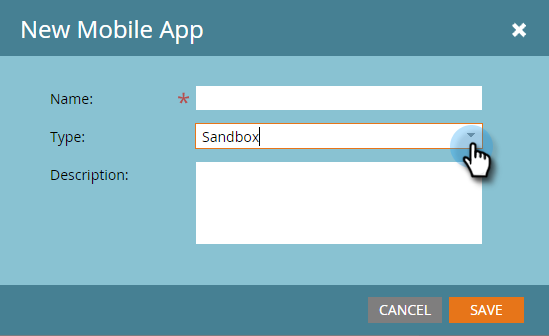
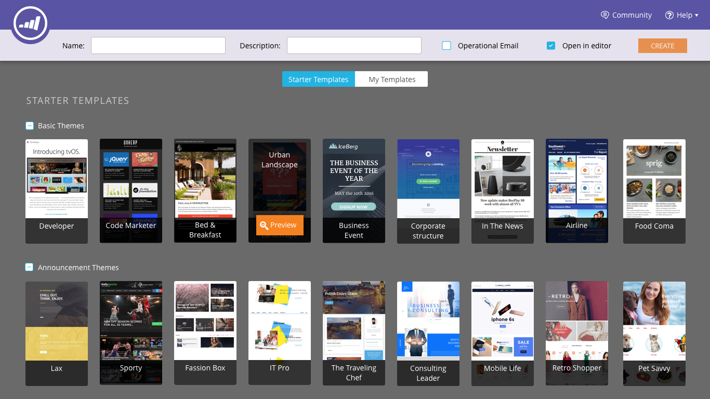
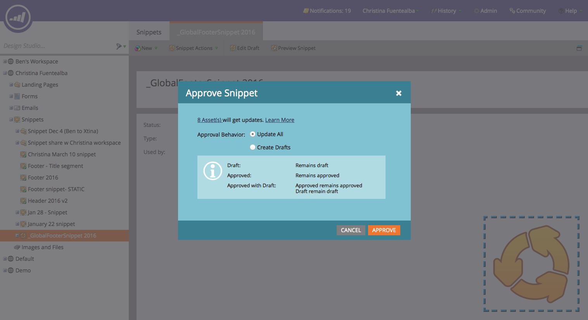
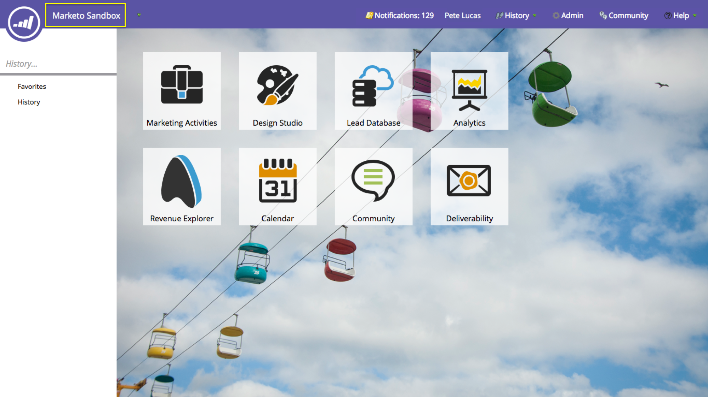
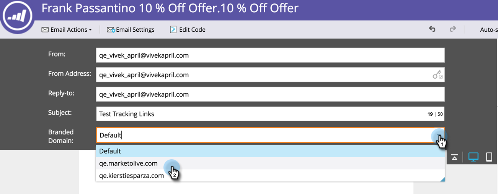
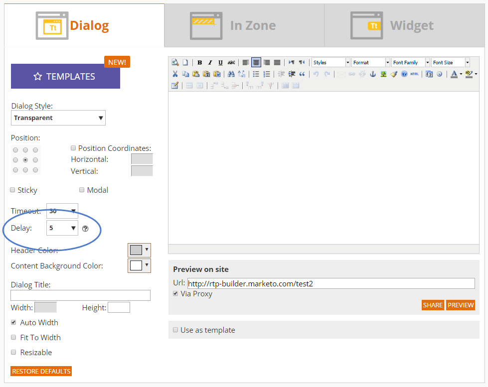
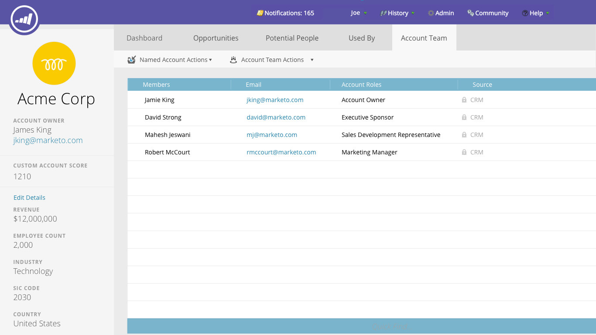

# 2016

## Winter 2016 {#winter}

Die folgenden Funktionen sind in der Version Winter &#39;16 enthalten. Bitte klicken Sie auf die Titel-Links, um detaillierte Artikel für jede Funktion anzuzeigen.

## [Ist anonymer Filter](/help/marketo/product-docs/administration/additional-integrations/add-munchkin-tracking-code-to-your-website/next-generation-munchkin-tracking-faq.md) {#is-anonymous-filter}

Der Filter Ist anonym wurde für Smart-Listen entfernt. Weitere Informationen finden Sie [ Dokument „Häufig gestellte Fragen zum Munchkin](/help/marketo/product-docs/administration/additional-integrations/add-munchkin-tracking-code-to-your-website/next-generation-munchkin-tracking-faq.md)Tracking der nächsten Generation“. Diese Änderung wirkt sich nicht auf Web Personalization (RTP) aus, das anonyme und bekannte Web-Besucher weiterhin identifiziert und Inhalte für diese Besucher in Echtzeit personalisiert.

## [Datenbank-Dashboard](/help/marketo/product-docs/core-marketo-concepts/smart-lists-and-static-lists/managing-people-in-smart-lists/database-dashboard.md)  {#database-dashboard}

Die [!UICONTROL Lead]Datenbank verfügt über ein aktualisiertes Dashboard mit einer Zusammenfassung, die die Gesamtgröße der Personendatenbank, die Anzahl der vermarktbaren Leads und eine Aufschlüsselung der Leads nach den fünf wichtigsten Quellen enthält.

## [Microsoft Edge Browser](/help/marketo/product-docs/administration/setup-administration/supported-browsers.md) {#microsoft-edge-browser}

Wir haben [!DNL Microsoft Edge] zur [Liste der von Marketo ](https://docs.marketo.com/display/public/DOCS/Supported+Browsers) Browser“ hinzugefügt.

## [Microsoft Outlook 2016](/help/marketo/product-docs/marketo-sales-insight/msi-outlook-plugin/install-the-marketo-email-add-in-for-outlook-with-a-registration-code.md) {#microsoft-outlook}

[[!DNL Microsoft Outlook] 2016](/help/marketo/product-docs/marketo-sales-insight/msi-outlook-plugin/install-the-marketo-email-add-in-for-outlook-with-a-registration-code.md) wird jetzt unterstützt.

## [E-Mail-Programm Head Start](/help/marketo/product-docs/email-marketing/email-programs/email-program-actions/head-start-for-email-programs.md) {#email-program-head-start}

Verwenden Sie [!UICONTROL Kopfstart] um anzugeben, dass die Verarbeitung für Ihren Versand im Voraus erfolgen soll. Anstatt Leads zu qualifizieren und E-Mails zum geplanten Zeitpunkt des Programms vorzubereiten, stellt [!UICONTROL Head Start] sicher, dass diese Aufgaben im Voraus erledigt werden. Auf diese Weise erhält Ihre Audience zum geplanten Zeitpunkt E-Mails.

Um diese Funktion verwenden zu können, muss das E-Mail-Programm mindestens 12 Stunden im Voraus geplant werden und die Smart-Liste wird 12 Stunden vor dem Versand gesperrt.

>[!NOTE]
>
>Diese Funktion wird nach der Veröffentlichung der Winterversion 16 schrittweise für eine Woche eingeführt. Sie ist nicht für die Verwendung mit Smart-Kampagnen oder der API verfügbar.

## [Mobile-Marketing-Erweiterungen](/help/marketo/product-docs/mobile-marketing/admin/add-a-mobile-app.md) {#mobile-marketing-enhancements}

**[!DNL PhoneGap]Support:** Wir bieten jetzt [!DNL PhoneGap] Support für Ihre Mobile App. [Weitere Informationen](https://developers.marketo.com/documentation/mobile/phonegap-plugin/).

**Unterstützung für Sandbox-**:

## [Programm-API](https://developers.marketo.com/documentation/programs/) {#program-api}

Erstellen, Aktualisieren und Klonen von Programmen über die REST-API. Dies umfasst nicht die Erstellung oder Aktualisierung von Smart-Listen und Smart-Kampagnen innerhalb eines Programms.

## [Erweiterung von Microsoft Dynamics](/help/marketo/product-docs/crm-sync/microsoft-dynamics-sync/microsoft-dynamics-sync-details/sync-status.md) {#microsoft-dynamics-enhancements}

**[[!UICONTROL Synchronisierungsstatus]](/help/marketo/product-docs/crm-sync/microsoft-dynamics-sync/microsoft-dynamics-sync-details/sync-status.md)**: Überwachen Sie den aktuellen Durchsatz und den Rückstand des Synchronisierungsprozesses. Schlüsseln Sie sie nach der Anzahl der Einfügungen und Aktualisierungen nach Objekt auf.

**[[!UICONTROL Benachrichtigungen]](/help/marketo/product-docs/core-marketo-concepts/miscellaneous/understanding-notifications/notification-types.md)**: Sie erhalten eine Benachrichtigung über häufige Synchronisierungsfehler sowie eine Liste der Leads, die diesen Fehler aufweisen.

## [Erweiterung der benutzerdefinierten Objekte](/help/marketo/product-docs/administration/marketo-custom-objects/create-marketo-custom-objects.md) {#custom-objects-enhancements}

Sie können jetzt Viele-zu-viele-Beziehungen zwischen Leads/Konten und einem benutzerdefinierten Objekt erstellen, indem Sie ein Zwischenobjekt mit mehreren Verknüpfungsfeldern verwenden.

## [Facebook-Lead-Anzeigen](/help/marketo/product-docs/demand-generation/facebook/set-up-facebook-lead-ads.md) {#facebook-lead-ads}

[[!UICONTROL Facebook-Lead]](https://www.facebook.com/business/a/lead-ads)Anzeigen sind eine direktere Möglichkeit für ein Unternehmen, Lead-Generierungskampagnen auf [!DNL Facebook] durchzuführen. Personen füllen ein Formular aus, um ihr Interesse an einem Produkt oder einer Dienstleistung auszudrücken, damit das Unternehmen mit ihnen Kontakt aufnehmen kann. Die Marketo-Integration mit [!UICONTROL Facebook-Lead]Anzeigen erfasst automatisch die Informationen, die ein Lead im Lead-Formular bereitstellt. Folgeaktionen und Benachrichtigungen können dann mithilfe des neuen Triggers [!UICONTROL Ausfüllen von Facebook-Lead-Anzeigen] automatisiert werden.

## [Web-Kampagnenplanung (Echtzeit-Personalization)](/help/marketo/product-docs/web-personalization/working-with-web-campaigns/schedule-a-web-campaign.md) {#web-real-time-personalization-campaign-scheduler}

Planen Sie Ihre Kampagne im Voraus. Richten Sie ein Start- und Enddatum für personalisierte Webinhalte ein und wiederholen Sie Kampagnen an bestimmten Tagen und zu bestimmten Zeiten. Personalisieren Sie den Zeitplan, um die Kampagne entsprechend der Zeit des Web-Besuchers oder einer ausgewählten Zeitzone anzuzeigen.

## Frühjahr 2016 {#spring}

Die folgenden Funktionen sind in der Version vom Frühjahr 1916 enthalten. Bitte klicken Sie auf die Titel-Links, um detaillierte Artikel für jede Funktion anzuzeigen.

## [E-Mail-Insights](/help/marketo/product-docs/reporting/email-insights/email-insights-overview.md) {#email-insights}

E-Mail-Einblicke ist ein brandneues, historisches, aggregiertes Daten-E-Mail-Analyseerlebnis, das von Anfang bis Ende neu gestaltet wurde, um eine blitzschnelle Leistung zu erzielen. Es verfügt über ein völlig neues Design der Benutzeroberfläche, das an die Anforderungen und den Workflow von E-Mail-Marketing-Experten angepasst ist.

>[!NOTE]
>
>Ab dem 3. Juni starten wir Batches-E-Mail-Einblicke für Kunden. Unser Ziel ist es, dies in den nächsten Monaten abzuschließen. Wir benachrichtigen Sie per E-Mail, wenn Sie aktiviert sind.

## [Auswahl der E-Mail-Vorlagen](/help/marketo/product-docs/email-marketing/general/email-editor-2/email-template-picker-overview.md) {#email-template-picker}

Erstellen Sie schöne E-Mails mit unseren neuen Starter-Vorlagen! Suchen Sie Ihre Vorlagen auch schnell anhand der Live-Miniaturansichten.

>[!NOTE]
>
>E-Mail-Editor 2.0 (mit der Vorlagenauswahl) wird ab dem 3. Juni schrittweise eingeführt. Wir werden den Rollout bis zum 30. Juni abschließen. Im Gegensatz zu E-Mail-Einblicken werden Sie nicht benachrichtigt, wenn Sie Zugriff haben. Um dies zu überprüfen, folgen Sie bitte den Schritten in [diesem Artikel](/help/marketo/product-docs/email-marketing/general/email-editor-2/transitioning-to-email-editor-2-0.md).

## [E-Mail-Bearbeitung - neu erfunden](/help/marketo/product-docs/email-marketing/general/email-editor-2/email-editor-v2-0-overview.md) {#email-editing-re-imagined}

Genau, ein brandneuer E-Mail-Editor! Verwenden Sie die einfache Drag-and-Drop-Funktion, um Inhalte hinzuzufügen und neu anzuordnen. Neue Elemente, einschließlich Bilder, Videos, Variablen und Module, verbessern mit Sicherheit das Bearbeitungserlebnis. Sehen Sie sich auch den aktualisierten Code-Editor sowie die Unterstützung für Vorschau und Preheader an.

## [Mobile In-App-Nachrichten](/help/marketo/product-docs/mobile-marketing/in-app-messages/understanding-in-app-messages.md) {#mobile-in-app-messages}

Erstellen Sie beeindruckende In-App-Nachrichten für Ihre App direkt in Marketo. Definieren Sie mit dem In-App-Nachrichtenprogramm genau, wer es wann sehen soll. Überwachen Sie die Leistung einfach mit dem Programm-Dashboard.

## [Keine Entwurfsausschnitte](/help/marketo/product-docs/administration/users-and-roles/enable-no-draft-for-snippets.md) {#no-draft-snippets}

Vorbei sind die Zeiten, in denen Sie jedes Mal, wenn ein Snippet aktualisiert wird, alles erneut genehmigen müssen! Mit „Kein Entwurf“ erhalten alle E-Mails und Landingpages, die einen Ausschnitt verwenden, die Ausschnitt-Aktualisierungen und behalten ihren vorherigen Status bei. Jedes Mal, wenn Sie einen Ausschnitt genehmigen, haben Sie die Wahl, „Kein Entwurf“ auszuführen und alles zu aktualisieren oder Entwürfe zu erstellen. Das liegt an dir! Kein Entwurf steht allen Kunden zur Verfügung und wird von einer neuen Berechtigung in Admin gesteuert.

## [Landingpage, Landingpage-Vorlage und Formular-APIs](https://developers.marketo.com/blog/spring-2016-updates/) {#landing-page-landing-page-template-and-form-apis}

Die Marketo-REST-APIs unterstützen jetzt die Kontrolle über Marketo-Landingpages, Landingpage-Vorlagen und Formulare. Benutzer können jetzt Inhalte direkt über die Marketo-REST-API erstellen, aktualisieren, genehmigen und löschen.

## [IP-Zulassungsauflistung für API-Zugriff](/help/marketo/product-docs/administration/additional-integrations/create-an-allowlist-for-ip-based-api-access.md) {#ip-allowlisting-for-api-access}

Ähnlich wie bei der IP-Zulassungsauflistung für Marketo-Benutzeranmeldungen können Marketo-Administratoren jetzt eine Zulassungsliste von IP-Adressen einrichten, die auf die Marketo SOAP- und REST-APIs zugreifen können, und so den Zugriff von nicht autorisierten IP-Adressen blockieren. Dies bietet eine zusätzliche Sicherheitsebene für Ihre Marketo-Instanz und stellt sicher, dass der API-Zugriff nur innerhalb des Netzwerks Ihres Unternehmens erfolgen kann. Einzelheiten zum Einrichten finden Sie auf der Dokumentations-Site zu Marketo .

## [Neuer Hochgeschwindigkeits-Microsoft Dynamics-Sync-Connector](/help/marketo/product-docs/crm-sync/microsoft-dynamics-sync/microsoft-dynamics-sync-details/sync-status.md) {#new-high-speed-microsoft-dynamics-sync-connector}

Der neue, schnelle Dynamics-Connector bietet Geschwindigkeiten, die bis zu 20-mal höher für die Erstsynchronisierung und bis zu 5-mal höher für die inkrementelle Synchronisierung sind. Alle neuen Kunden werden diesen Connector am Veröffentlichungsdatum integrieren und wir werden ihn im Laufe der Sommerveröffentlichung schrittweise für Bestandskunden bereitstellen.

**Daten für neue Felder aktualisieren**: Jetzt können Sie jederzeit neue Synchronisierungsfelder aktivieren und alle Datenwerte für dieses Feld werden von [!DNL Dynamics] CRM in Marketo aktualisiert. Keine Sorgen mehr, dass bei der Ersteinrichtung alle Felder ausgewählt werden müssen. Wenn Sie ein vorhandenes Synchronisierungsfeld deaktivieren und später erneut aktivieren, werden alle Datenwerte für dieses Feld von [!DNL Dynamics] CRM in Marketo aktualisiert.

**Lead als Kontakt synchronisieren**: Die Flussaktion [!UICONTROL Lead mit Microsoft synchronisieren] bietet eine neue Option zum Synchronisieren als Lead oder Kontakt.

**Registerkarte „Admin“ für Synchronisierungsfehler**: Durchsuchen, Suchen oder Exportieren von Leads (und anderen Objekten), die nicht mit Details wie Vorgang, Richtung, Fehlercode und Fehlermeldung synchronisiert werden konnten.

**[!DNL Microsoft Dynamics]2016**: Connector ist für die [!DNL Online]- und [!DNL On-premise]-Versionen von [!DNL Dynamics] 2016 vollständig zertifiziert.

**Plug-in-Updates sind jetzt dokumentiert:** Siehe den [Artikel zu Plug-in-Updates](/help/marketo/product-docs/crm-sync/microsoft-dynamics-sync/marketo-plugin-releases-for-microsoft-dynamics.md).

## [Anzeigename der Instanz](/help/marketo/product-docs/administration/settings/edit-subscription-settings.md) {#friendly-instance-name}

Heute ist es schwierig, zwischen Marketo-Instanzen wie Sandbox- und Produktionsinstanzen zu unterscheiden. Mit dieser Funktion erfahren Sie, an welchen Instanzen Sie derzeit arbeiten.

## Zeitlich begrenzter Zugriff auf Abonnements {#limited-time-access-for-subscriptions}

Heute werden Benutzende auf unbestimmte Zeit zum Marketo-Abonnement eingeladen. Mit dieser Funktion können Administratoren Benutzer für einen begrenzten Zeitraum zu Abonnements einladen, z. B. für zwei Wochen oder einen Monat.

## [Raster für benutzerdefinierte Objekte](/help/marketo/product-docs/administration/marketo-custom-objects/understanding-marketo-custom-objects.md) {#custom-objects-grid}

Jetzt können Sie die Anzahl der Datensätze und Felder für alle veröffentlichten benutzerdefinierten Objekte anzeigen.

## Eigene Aktivitäten {#custom-activities}

Marketo-Administratoren können jetzt ihre benutzerdefinierten Aktivitätstypen über den Marketo Custom Activity Definition Modeler definieren und verwalten. Ähnlich wie (und in Verbindung mit) dem benutzerdefinierten Objekt Modeler von Marketo können Admins das Datenmodell jetzt entsprechend ihren Geschäftsanforderungen erweitern. Weitere Informationen zur Verwendung dieser Funktion finden Sie auf der Dokumentations-Site zu [Marketo](/help/marketo/product-docs/administration/marketo-custom-activities/understanding-custom-activities.md).

## Sommer 2016 {#summer}

Die folgenden Funktionen sind in der Version vom Sommer 1916 enthalten. Überprüfen Sie Ihre Marketo Edition auf die Verfügbarkeit der Funktionen. Bitte klicken Sie auf die Titel-Links, um detaillierte Artikel für jede Funktion anzuzeigen.

## [Account-based Marketing](https://docs.marketo.com/display/docs/account+based+marketing) {#account-based-marketing}

Account-Based-Marketing von Marketo bietet alle Grundlagen in einer zentralen Plattform:

* **Target** - Kontoerkennung, Lead-Konto-Zuordnung und spezifische Kontolisten
* **Engage** - Account-basierte Personalization, kanalübergreifende Interaktion und Account-spezifische Workflows
* **Kennzahlen** - Einblicke auf Konto- und Listenebene, Kontointeraktionswert und Auswirkungen auf Pipeline und Umsatz

>[!NOTE]
>
>ABM ist als Add-on zu Ihrem Marketo-Abonnement verfügbar. Wenden Sie sich daher zur Implementierung an Ihren Vertriebsmitarbeiter.

## [Audit-Protokoll](/help/marketo/product-docs/administration/audit-trail/audit-trail-overview.md) {#audit-trail}

Das Audit-Protokoll enthält einen umfassenden Verlauf der Änderungen, die in Ihrem Marketo-Abonnement vorgenommen wurden. Sie schafft Rechenschaftspflicht zwischen Benutzern und Administratoren, hilft bei der Identifizierung der Ursache von unerwartetem Verhalten und bietet die Sicherheit zu wissen, wer was und wann tut. Diese Informationen stehen zu jedem Zeitpunkt zur Verfügung und können zur Beantwortung von Fragen verwendet werden, wie z. B.:

* Was ist mit diesem Asset oder dieser Einstellung passiert und wer hat es zuletzt aktualisiert?
* Was hat Benutzer X so gemacht?
* Wer meldet sich bei unserem Konto an?

## Marketo-Vibes SMS LaunchPoint-Integration

Einfaches Erstellen von SMS-Nachrichten direkt in Marketo. Personalisieren und Targeting Ihrer Nachricht mit Ihren umfangreichen Marketo-Daten und einfache Überwachung der Leistung mithilfe des SMS-Nachrichten-Dashboards.

>[!NOTE]
>
>Für diese Funktion müssen Sie über ein vorhandenes [!DNL Vibes SMS] verfügen.

## [Verbesserungen in Email 2.0](/help/marketo/product-docs/email-marketing/general/email-editor-2/email-editor-v2-0-overview.md) {#email-enhancements}

**Variablen auf Modulebene**

Zuvor waren alle in E-Mail 2.0-Vorlagen angegebenen Variablen im Umfang „global“. Bei der Verwendung von Variablen innerhalb von Modulen ist dies nicht immer wünschenswert, wenn Sie mehrere Instanzen des Moduls verwenden möchten. Mit dieser Version können Variablen jetzt als „Modulebene“ angegeben werden, was Ihnen ermöglicht anzugeben, dass der Benutzer in der Lage sein sollte, eindeutige Werte für jedes Modul festzulegen, in dem er verwendet wird.

**Syntaxaktualisierungen**

* Sie können jetzt „mktoAddByDefault“ für Module verwenden, die in E-Mail-2.0-Vorlagen angegeben sind, um anzugeben, welche Module standardmäßig in neuen E-Mails angezeigt werden sollen. Dies ist viel praktischer, wenn Sie eine E-Mail-Vorlage mit einer großen Anzahl von Modulen erstellen.
* Bei Bildelementen können Sie jetzt angeben, ob die Eigenschaften „height“ und „width“ des zugrunde liegenden `` HTML-Elements gesperrt werden sollen oder für den Endbenutzer bzw. die Endbenutzerin bearbeitbar sein sollen. motoLockImgSize=„true“ bewirkt, dass Höhe/Breite gesperrt werden (auch wenn das Bild geändert wird). Ähnlich führt motoLockImgStyle=„true“ dazu, dass die Eigenschaft „style“ gesperrt wird.

**Code-Suche**

Verwenden Sie neue Suchfunktionen, um Inhalte im Code Ihrer E-Mail effizient zu finden und zu ersetzen. Diese Funktion ist auch im E-Mail-Vorlageneditor verfügbar.

**Token-Unterstützung in Bildelementen**

Token können jetzt im Bereich „Externe URL“ des Bilderlebnisses zum Einfügen verwendet werden! Wenn Sie Bilder mit `{{my.tokens}}` angegeben haben, können Sie jetzt diese Token im E-Mail-Editor 2.0 referenzieren. Beachten Sie, dass das Bild auf der Arbeitsfläche des E-Mail-Editors 2.0 weiterhin beschädigt angezeigt wird. Sie sehen sie jedoch in der Vorschau gerendert und Beispiele senden , bevor Sie Ihre E-Mail versenden.

## Mehrmarken-Domainen {#multiple-branding-domains}

Vorbei sind die Zeiten, in denen E-Mail-Tracking-Links nur mit einer Branding-Domain gebrandet werden konnten. Sie können jetzt mehrere Branding-Domains hinzufügen, um das Vertrauen der Verbraucher zu wecken, einen optimierten Look zu erstellen, sich auf die Marke zu konzentrieren, die E-Mail-Zustellbarkeit zu verbessern und für jede E-Mail zu wählen, welche Branding-Domain für die Tracking-Links der einzelnen E-Mails verwendet werden soll.

## [Programm-Token](/help/marketo/product-docs/demand-generation/landing-pages/personalizing-landing-pages/tokens-overview.md) {#program-tokens}

Wir haben einen neuen Token-Typ für Programme erstellt. Sie können jetzt Programmname, Beschreibung und ID in den Schritten Assets und Smart-Campaign-Fluss rendern.

## [Konzernschlüssel](/help/marketo/product-docs/marketo-sales-insight/msi-outlook-plugin/authorize-the-marketo-outlook-plugin.md) {#enterprise-key}

Es kann mühsam sein, von jeder Person in Ihrem Vertriebsteam zu verlangen, unser [!DNL Sales Insight]-Plug-in für [!DNL Outlook] zu installieren. Wir haben eine neue Möglichkeit eingeführt, das Plug-in für [!DNL Outlook] remote mit einem Unternehmensschlüssel zu installieren. Senden Sie Ihrem IT-Team den eindeutigen Schlüssel, der im Abschnitt &quot;Marketo-[!DNL Sales Insight]&quot; von [!UICONTROL Admin] zu finden ist, und überlassen Sie ihm den Rest.

## [Kampagnen zur Web-Personalisierung](/help/marketo/product-docs/web-personalization/working-with-web-campaigns/create-a-new-dialog-web-campaign.md) {#web-personalization-campaigns}

Geben Sie eine Zeitverzögerung an, damit Web-Kampagnen auf Ihrer Website reagieren.

## [Export von Content Analytics und Recommendations](/help/marketo/product-docs/web-personalization/understanding-web-personalization/understanding-content-analytics.md) {#content-analytics-and-recommendations-export}

Anzeigen von Inhaltsanalysen und Recommendations-Daten offline.

## [API-Support für Email Editor 2.0](https://developers.marketo.com/documentation/asset-api/) {#api-support-for-email-editor}

Vorhandene Asset-APIs, die zuvor nur mit E-Mails und Vorlagen der Version 1.0 kompatibel waren, sind jetzt für E-Mail-Assets der Version 2.0 aktiviert.

## [Marketo Developers-Website](https://developers.marketo.com/) {#marketo-developers-site}

Neu und noch besser!

## [Datenschutzeinstellungen](/help/marketo/product-docs/administration/settings/understanding-privacy-settings.md) {#privacy-settings}

Marketing-Experten können anhand von Datenschutzeinstellungen entscheiden, ob Besucher mithilfe von [!DNL Munchkin]- und Web Personalization-Funktionen verfolgt werden sollen oder nicht. Die Tracking-Stufe wird mithilfe der Einstellung „Nicht verfolgen“ des Browsers, eines Opt-out-Cookies oder einer unspezifischen IP-Adresse gesteuert. Diese Methoden können sich auf den Wert und die Funktionalität von Marketo in bestimmten Bereichen auswirken. Wenn der Marketer jedoch nichts ändert, bleibt die Marketo-Funktionalität unverändert.

Diese Funktion wird über einen Zeitraum von sechs Wochen schrittweise für Kunden veröffentlicht. Wenn Sie es sofort benötigen, wenden Sie sich an den Marketo-Support.

## Herbst 2016 {#fall}

Die folgenden Funktionen sind in der Version vom Herbst 16 enthalten. Überprüfen Sie Ihre Marketo Edition auf die Verfügbarkeit der Funktionen. Bitte klicken Sie auf die Titel-Links, um detaillierte Artikel für jede Funktion anzuzeigen.

## [!UICONTROL Prädiktiver Inhalt] in E-Mails {#predictive-content-in-email}

Mit unserem Programm [!UICONTROL Predictive Content] können Sie Ihre Inhalte über maschinelles Lernen und Prognosealgorithmen im Web und in E-Mail-Kanälen verfolgen, verwalten und empfehlen.

>[!NOTE]
>
>Alle Kunden mit dem Predictive-Modul werden bis zum 10. Januar aktiviert.

Sie können Ihrer E-Mail jetzt prädiktive Inhalte hinzufügen. Wenn die E-Mail geöffnet wird, erhält der Empfänger automatisch relevante, empfohlene Inhalte, die dazu beitragen, die Interaktion mit Inhalten und die Konversionen zu steigern.

## [Facebook Offline-Conversions](/help/marketo/product-docs/demand-generation/facebook/understanding-facebook-offline-conversions.md) {#facebook-offline-conversions}

Mit [!DNL Facebook] Integration von Offline-Konversionen werden Konversionsdaten in Marketo (für Lead-Anzeigen-Leads) automatisch an [!DNL Facebook] zurückgesendet, damit Ihr Werbe-Team seine Werbeausgaben besser optimieren kann. In diesem [!DNL Facebook] Ad Manager-Bericht sind die Offline-Konversionen hervorgehoben.

## Universelle ID {#universal-id}

Mit einer universellen ID können Sie mit einer einzigen Anmeldung auf mehrere Marketo-Abonnements zugreifen und schnell zwischen Abonnements wechseln. Sie können für alle Ihre Abonnements ein einzelnes Community-Profil verwenden.

>[!NOTE]
>
>Wenden Sie sich an den Marketo-Support, um diese Funktion zu aktivieren.

## Verbesserungen beim Account-basierten Marketing in Marketo {#marketo-account-based-marketing-enhancements}

Jetzt können Sie Account-Teams benannten Accounts in Account Based Marketing (ABM) zuweisen, z. B. Account Owner, Sales Development Repräsentant, Business Development Repräsentant und Customer Success Manager. Sie können auch Account-Owner-spezifische Account-Listen erstellen und personalisierte wöchentliche ABM-Berichte an das Account-Team senden.

**REST-API**

Mit dieser Version können Sie auch benannte Kontoattribute und Kontobewertungen in ABM mithilfe der Marketo REST-API verwalten. Weitere Informationen zu den API-Vorgängen finden Sie auf der [Marketo Developers-Website](https://developers.marketo.com/rest-api/lead-database/named-accounts).

## [Verbesserungen am Audit-Protokoll](/help/marketo/product-docs/administration/audit-trail/change-details-in-audit-trail.md) {#audit-trail-enhancements}

Das Audit-Protokoll enthält einen umfassenden Verlauf der Änderungen, die in Ihrem Marketo-Abonnement vorgenommen wurden. Wir haben zusätzliche Tracking-Funktionen für Programme hinzugefügt und wichtige Änderungsdetails für intelligente Kampagnen, intelligente Listen und Änderungen an Benutzern und Rollen angezeigt.

## Neuzulassungen

**E-Mail funktionsfähig machen**

Vorbei sind die Zeiten, in denen Sie sich Sorgen darüber machen mussten, dass Benutzer Transaktions-E-Mails an Personen in Ihrer Datenbank senden, die sich abgemeldet haben. Sie können jetzt angeben, welche Benutzer eine E-Mail funktionsfähig machen oder E-Mails bearbeiten können.

**Kampagnenbeschränkungen bearbeiten**

Warum sollte [Kampagnenbeschränkungen](/help/marketo/product-docs/administration/email-setup/enable-person-restrictions-for-smart-campaigns.md) festgelegt werden, wenn sie nicht durchgesetzt werden können? Wenn Sie Einstellungen für Kampagnenbeschränkungen festlegen, um die Anzahl der Personen in Ihrer Datenbank zu begrenzen, die mit einer einzelnen Kampagne angesprochen werden können, können Sie jetzt einschränken, welche Benutzer diese Einstellungen bei der Planung einer Kampagne überschreiben können.

## [Sound für mobile Push-Benachrichtigungen](/help/marketo/product-docs/mobile-marketing/push-notifications/configure-mobile-push-notification.md) {#sound-for-mobile-push-notifications}

Verleihen Sie Ihrer iOS-Push-Benachrichtigung zusätzliche Reichweite, indem Sie Sound aktivieren. Mit dieser neuen Funktion können Sie einen Ton in den Trigger stellen, wenn Ihre Push-Benachrichtigung auf dem Mobilgerät angezeigt wird.

>[!NOTE]
>
>* Gerätebesitzer können verhindern, dass Töne in den Geräteeinstellungen wiedergegeben werden, und App-Entwickler können Gerätebesitzern Optionen in der App geben, um zu verhindern, dass Töne wiedergegeben werden.
>* Töne werden automatisch abgespielt, wenn eine Push-Benachrichtigung auf einem Android-Gerät angezeigt wird.

## [Sales Insight kompatibel mit Salesforce Encryption](/help/marketo/product-docs/marketo-sales-insight/msi-for-salesforce/installation/install-marketo-sales-insight-package-in-salesforce-appexchange.md) {#sales-insight-compatible-with-salesforce-encryption}

Market [!DNL Sales Insight] ist jetzt mit [!DNL Salesforce] Shield Encryption kompatibel. Alle [!DNL Sales Insight]-Kunden sollten ein Upgrade auf dieses neueste verwaltete Paket (Version 1.4359.2) durchführen, das [auf dem verfügbar [!DNL Appexchange]](https://appexchange.salesforce.com/listingDetail?listingId=a0N30000001SVZmEAO).

## [APIs für benannte Konten](https://developers.marketo.com/rest-api/lead-database/named-accounts/) {#named-accounts-apis}

Mit dieser Version können Marketo ABM-Benutzende benannte Konten über die API für benannte Konten verwalten. Benutzer können benannte Konten erstellen, aktualisieren und löschen sowie ABM-spezifische Kontobewertungen lesen und aktualisieren.

## [API-Unterstützung für Email Editor v2.0](https://developers.marketo.com/rest-api/assets/emails/) {#email-editor-v-api-support}

Verwalten von Variablen und Modulen für E-Mails im Format v2.0 mithilfe der Marketo REST-API.

## [Änderungen an Marketo Salesforce Sync](https://nation.marketo.com/docs/DOC-3840) {#changes-to-marketo-salesforce-sync}

Die [!DNL Salesforce] Integration von Marketo entwickelt sich weiter, um die Art und Weise zu verbessern, wie Marketo-Felder mit [!DNL Salesforce] synchronisiert werden. Jetzt können Sie, anstatt eine große Gruppe von Feldern synchronisieren zu müssen, die Sie möglicherweise benötigen oder nicht, auswählen, welche Felder Sie einbeziehen möchten. Weitere Informationen finden Sie in unserer Dokumentation: [https://nation.marketo.com/docs/DOC-3840](https://nation.marketo.com/docs/DOC-3840).

