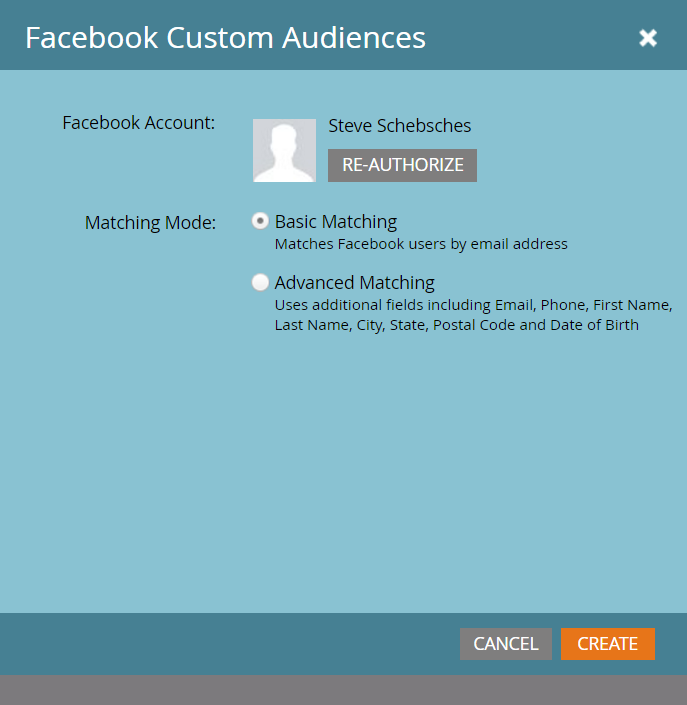
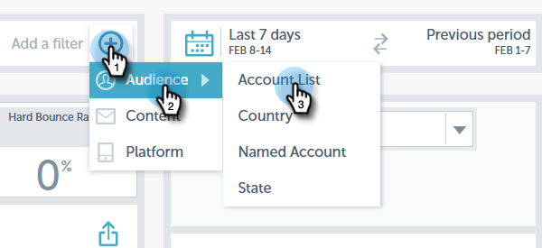
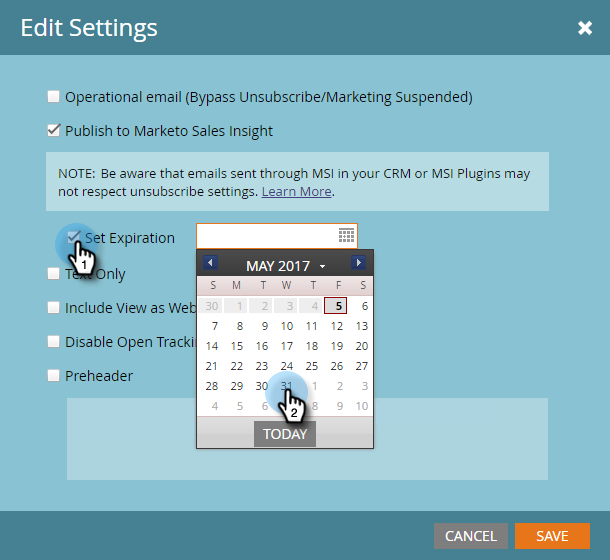
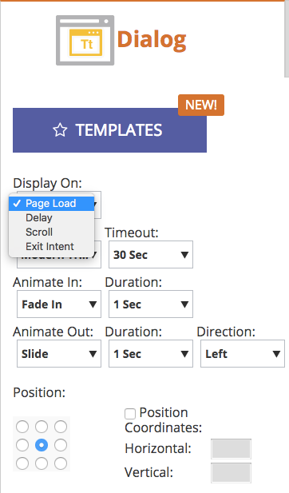
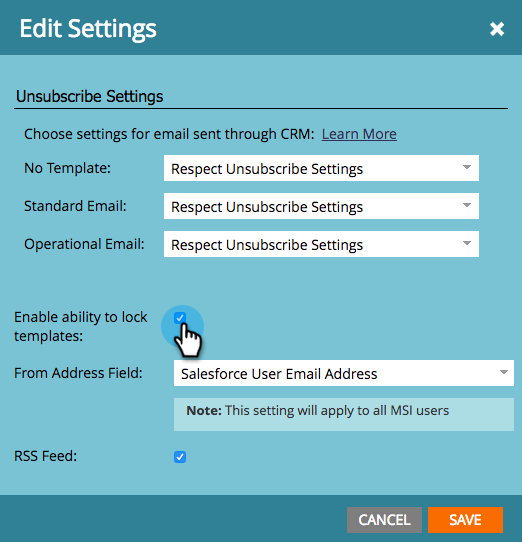

# 2017

## Winter 2017 {#winter}

Die folgenden Funktionen sind in der Version Winter &#39;17 enthalten. Überprüfen Sie Ihre Marketo Edition auf die Verfügbarkeit der Funktionen.

Bitte klicken Sie auf die Titel-Links, um detaillierte Artikel für jede Funktion anzuzeigen.

>[!NOTE]
>
>Wenn ein Thema mehrere Unterüberschriften hat, werden die Links dort platziert.

## [Erweiterte Abgleichung für benutzerdefinierte Facebook-Zielgruppen](/help/marketo/product-docs/demand-generation/ad-network-integrations/add-facebook-custom-audiences-as-a-launchpoint-service.md) {#advanced-matching-for-facebook-custom-audiences}

Bei der einfachen Zuordnung werden nur E-Mail-Adressen verwendet, bei der neuen erweiterten Zuordnung werden jedoch sieben zusätzliche Felder verwendet, was die Übereinstimmungsrate für mehr Konversionen erhöht.

## [API für den Import benutzerdefinierter Objekte](https://developers.marketo.com/rest-api/lead-database/custom-objects/) {#custom-object-import-api}

Diese API bietet eine schnellere Schnittstelle zum Synchronisieren benutzerdefinierter Objekte in Marketo. Sie können CSV-, TSV- oder SSV-Tabellendateien als benutzerdefinierte Objekte in Marketo importieren.

## [Export von Web Personalization-Kampagnen](/help/marketo/product-docs/web-personalization/working-with-web-campaigns/export-web-campaign-data.md) {#web-personalization-campaigns-export}

Exportieren Sie alle Web-Kampagnendetails und Analysen im CSV-Format. Anschließend können Sie Ihre Daten in einem praktischen Layout anzeigen.

## Lokalisierung {#localization}

Die Apps Web Personalization[!UICONTROL Predictive Content] und Email Insights sind jetzt auf Japanisch, Deutsch und Spanisch verfügbar. Sie [&#x200B; Ihre Sprache und Ihr Gebietsschema &#x200B;](/help/marketo/product-docs/administration/settings/change-time-zone.md), um Ihre Inhalte in diesen Sprachen anzuzeigen.

## Verbesserungen beim Account-basierten Marketing {#account-based-marketing-enhancements}

**[Spezifische Konten importieren](/help/marketo/product-docs/target-account-management/target/named-accounts/import-named-accounts.md)**

Mit der Option [!UICONTROL Benanntes Konto] Importieren können Sie mehrere Datensätze gleichzeitig über den CSV-Upload erstellen oder aktualisieren.

**[Email Insights-Unterstützung](/help/marketo/product-docs/reporting/email-insights/filtering-in-email-insights.md)**

Verwenden [!UICONTROL Benanntes Konto] oder [!UICONTROL Kontoliste] als Dimensionen in E-Mail-Einblicken.

## [!UICONTROL Verbesserungen bei prädiktiven &#x200B;]) {#predictive-content-enhancements}

**[Filtern nach [!UICONTROL Source aktiviert]](/help/marketo/product-docs/predictive-content/working-with-predictive-content/understanding-predictive-content.md)**

Filtern Sie [!UICONTROL prädiktiven Inhalt] Teile, die für [!UICONTROL E-Mail], [!UICONTROL Rich-Media] oder die [!UICONTROL Empfehlungsleiste] sind.

**[Filtern [!UICONTROL Analytics nach Source]](/help/marketo/product-docs/predictive-content/working-with-predictive-content/understanding-predictive-content.md)**

Filtern [!UICONTROL prädiktive Inhalte] Analysen nach bestimmten Quellen - [!UICONTROL E-Mail], [!UICONTROL Rich-Media] oder [!UICONTROL Empfehlungsleiste].

**[!UICONTROL Prädiktiver Inhalt] Editor**

Die Inhaltsvorbereitung wird durch ein verbessertes Bearbeitungserlebnis und Layout nach Quelle aufgeteilt - [!UICONTROL E-Mail], [!UICONTROL Rich Media] oder [!UICONTROL Empfehlungsleiste].

**[Automatische Erkennung prädiktiver Inhalte](/help/marketo/product-docs/predictive-content/getting-started/enable-content-discovery.md)**

Bild-URL und Metadaten werden jetzt im Prozess zur automatischen Erkennung von Inhalten verwendet.

## [SDK-Verbesserungen](https://developers.marketo.com/mobile/) {#sdk-enhancements}

Entwickler haben jetzt zusätzliche Kontrolle über den Versand von Push-Benachrichtigungen, indem sie einen neuen SDK-API-Aufruf hinzufügen, mit dem Entwickler Push-Token entfernen können.

## Integration von Vibes SMS LaunchPoint

Verbessern Sie Ihr Targeting mit der neuen Filteroption „Mitglied der Vibes-Liste“.

## [Veralteter Rich-Text-Editor und Formular-Editor 1.0 eingestellt](https://nation.marketo.com/docs/DOC-4315)

Ab dem 1. August 2017 werden Kunden, die noch den alten Rich-Text-Editor und Formular-Editor 1.0 verwenden, automatisch auf das neue Erlebnis umgestellt.

## [Marketo-Aktivitäts-APIs](https://developers.marketo.com/blog/important-change-activity-records-marketo-apis/) {#marketo-activity-apis}

Bei den Aktivitäten-APIs von Marketo gibt es eine wichtige Änderung. Seid ihr vorbereitet?

## Frühjahr 2017 {#spring}

Die folgenden Funktionen sind in der Version vom Frühjahr 1917 enthalten. Überprüfen Sie Ihre Marketo Edition auf die Verfügbarkeit der Funktionen.

Bitte klicken Sie auf die Titel-Links, um detaillierte Artikel für jede Funktion anzuzeigen. **Hinweis**: Wenn ein Thema mehrere Unterüberschriften hat, werden die Links dort platziert.

## [LinkedIn-Lead-Gen-Forms](/help/marketo/product-docs/demand-generation/social/social-functions/set-up-linkedin-lead-gen-forms.md) {#linkedin-lead-gen-forms}

[[!UICONTROL LinkedIn Lead Gen] Forms](https://business.linkedin.com/marketing-solutions/native-advertising/lead-gen-ads) sind eine direktere Möglichkeit für ein Unternehmen, Kampagnen zur Lead-Generierung auf [!DNL LinkedIn] durchzuführen. Personen können Formulare ausfüllen, um ihr Interesse an einem Produkt oder einer Dienstleistung auszudrücken, sodass das Unternehmen die Details der Person erfassen und mit Marketo synchronisieren kann, wo automatisierte Folgeprozesse und Lead-Routing-Aktivitäten stattfinden können.

Die Marketo-Integration mit [!UICONTROL LinkedIn Lead Gen] Forms erfasst automatisch die Informationen, die ein Lead im Lead Gen-Formular bereitstellt. Folgeaktionen und Benachrichtigungen können dann mithilfe des neuen Triggers **Ausfüllen [!DNL LinkedIn Lead Gen] Formulars** und -filters automatisiert werden.

## [MSI-Vorlage abgelaufen](/help/marketo/product-docs/marketo-sales-insight/msi-for-salesforce/features/actions-in-the-msi-panel/send-marketo-email/publish-an-email-to-sales-insight.md) {#expire-msi-template}

Die Zeiten, in denen veraltete Vorlagen in [!DNL Sales Insight] bereinigt wurden, sind vorbei. Legen Sie ein Ablaufdatum fest, wenn Sie Ihre E-Mail veröffentlichen, und wir werden uns darum kümmern, die Veröffentlichung für Sie rückgängig zu machen, wenn das Ablaufdatum sich wiederholt.

>[!NOTE]
>
>Das Festlegen des Ablaufdatums für 5/31/17 bedeutet, dass die Vorlage am Ende des Tages am 5/31/17 aus [!DNL Sales Insight] entfernt wird.

## [Massenextraktions-APIs für Personen und Aktivitäten](https://developers.marketo.com/rest-api/bulk-extract/) {#bulk-extract-apis-for-people-and-activities}

Übertragen Sie auf einfache Weise große Mengen an Personen- und Aktivitätsdaten von Marketo auf Ihre externen Systeme.

## ABM-Verbesserungen

**[Benutzerdefinierte Felder in benannten ABM-Konten](https://docs.marketo.com/x/1wnG)**

Mit Marketo ABM können Sie jetzt bis zu 10 benutzerdefinierte Felder für Ihre spezifischen Konten erstellen. Sie können diese benutzerdefinierten Felder Feldern in Ihrem CRM-Kontoobjekt zuordnen. Marketo ABM synchronisiert die Daten, sodass Sie Ihre ABM-benannten Konten erweitern und Ihr Marketing fördern können.

**[Perzentil-Bewertung für ABM-spezifische Konten](https://docs.marketo.com/display/docs/assets/abmpercentiles.png)**

Die Werte für benannte Konten können stark variieren. Marketo ABM berechnet jetzt automatisch ein Perzentil für jede Ihrer Bewertungen, sodass Sie auf einen Blick sehen können, wo jedes benannte Konto zu Ihren anderen benannten Konten gehört.

**[APIs für die ABM-Kontoliste](https://developers.marketo.com/rest-api/lead-database/named-account-lists/)**

Profitieren Sie von umfangreichen und robusten ABM-Partnerintegrationen mit verbesserter API-Unterstützung für Named Account Lists.

## Verbesserte Web-Personalisierung

**[Web-Kampagne beim Scrollen](/help/marketo/product-docs/web-personalization/working-with-web-campaigns/set-how-your-web-campaign-displays.md)**

Neue Web-Kampagneneffekte bieten Ihren Web-Besuchern ein personalisierteres Erlebnis. Personalisierte (Web[!UICONTROL Kampagnen) so einstellen] dass sie nur angezeigt werden, wenn ein Web-Besucher auf der Web-Seite nach unten scrollt. Sie können festlegen, dass Ihr Dialogfeld [!UICONTROL Web-Kampagnen] beim Scrollen angezeigt wird, basierend auf:

* Prozentsatz der gescrollten Seite
* Pixel erreicht
* Scrollen unter den Seitenfalten

**[Web-Kampagne bei Exit-Absicht](/help/marketo/product-docs/web-personalization/working-with-web-campaigns/set-how-your-web-campaign-displays.md)**

Ermitteln Sie die Aufmerksamkeit Ihres Besuchers, bevor er Ihre Seite schließt. Legen Sie Ihre personalisierten [!UICONTROL Web-Kampagnen] so fest, dass sie nur angezeigt werden, wenn eine Mausgeste anzeigt, dass der Besucher die Seite verlässt.

**[Animationseffekte für [!UICONTROL Web-Kampagnen]](/help/marketo/product-docs/web-personalization/working-with-web-campaigns/create-a-new-dialog-web-campaign.md)**

Legen Sie die Animationseffekte für Ihre Dialog-Web-Kampagne fest, um anzupassen, wie eine Kampagne beim Betreten oder Verlassen Ihrer Web-Seite angezeigt wird. Sie können aus 6 verschiedenen Effekten auswählen und den Zeitpunkt und die Richtung des Dialogfelds steuern.

**[Anpassung des Schließen-Dialogs](/help/marketo/product-docs/web-personalization/working-with-web-campaigns/create-a-new-dialog-web-campaign.md)**

Passen Sie die Schaltfläche Schließen für Dialogfelder an. Wählen Sie aus einer Reihe von Optionen aus, die im Stil des transparenten Dialogfelds ([!UICONTROL ) verwendet &#x200B;]. Wählen Sie das Symbol, die Farbe und die Positionierung für die Schaltfläche „Schließen“ aus. Sie können auch ein eigenes Schaltflächenbild hinzufügen.

**[Web-Kampagnen-Archiv](/help/marketo/product-docs/web-personalization/working-with-web-campaigns/archive-a-web-campaign.md)**

Das Archivieren ist ein neuer Web-Kampagnenstatus, mit dem Sie [!UICONTROL Web-Kampagnen] archivieren und in der standardmäßigen Web-Kampagnenansicht ausblenden können. Auf diese Weise können Sie sich auf Ihre relevantesten, aktiven Kampagnen konzentrieren und ältere archivierte Kampagnen bei Bedarf abrufen.

**[Lokalisierung](/help/marketo/product-docs/administration/settings/change-time-zone.md)**

Web Personalization ist jetzt in allen von Marketo unterstützten Sprachen verfügbar (Englisch, Japanisch, Deutsch, Spanisch, Französisch und Portugiesisch).

## Prädiktive Verbesserungen {#predictive-enhancements}

**[Lokalisierung](/help/marketo/product-docs/administration/settings/change-time-zone.md)**

Predictive Content steht jetzt in allen von Marketo unterstützten Sprachen zur Verfügung (Englisch, Japanisch, Deutsch, Spanisch, Französisch und Portugiesisch).

## [Veralteter Rich-Text-Editor und Formular-Editor 1.0 eingestellt](https://nation.marketo.com/docs/DOC-4315)

Ab dem 1. August 2017 werden Kunden, die noch den alten Rich-Text-Editor und Formular-Editor 1.0 verwenden, automatisch auf das neue Erlebnis umgestellt.

## Sommer 2017 {#summer}

Die folgenden Funktionen sind in der Version vom Sommer 17 enthalten. Überprüfen Sie Ihre Marketo Edition auf die Verfügbarkeit der Funktionen.

Bitte klicken Sie auf die Titel-Links, um detaillierte Artikel für jede Funktion anzuzeigen. Hinweis: Einige der in dieser Version enthaltenen Funktionen verfügen nicht über zugehörige Artikel. Wenn ein Thema mehrere Unterüberschriften hat, werden die Links dort platziert.

## [Zusätzliche Facebook-Offline-Konversionsstadien](/help/marketo/product-docs/demand-generation/facebook/set-up-facebook-offline-conversions.md) {#additional-facebook-offline-conversion-stages}

Wählen Sie bis zu 7 zusätzliche Offline-Konvertierungsphasen aus, die Sie Ihren Marketo-Lebenszyklusphasen zuordnen können (über die derzeit verfügbaren drei hinaus). Optimieren Sie Ihre [!DNL Facebook] Anzeigenausgaben basierend auf Konversionen auf Ihrem Kunden-Journey, um einen besseren ROI zu erzielen.

## [Vorlage für Sales Insight sperren](/help/marketo/product-docs/marketo-sales-insight/msi-for-salesforce/features/actions-in-the-msi-panel/send-marketo-email/lock-sales-template.md) {#lock-sales-insight-template}

Gewährleisten Sie die Konsistenz von Nachricht und Inhalt, indem Sie Änderungen an Ihren Verkaufsvorlagen verhindern. Dies hilft, Vorlagen zu standardisieren und professionelle Kommunikation zu pflegen.

## ABM-Verbesserungen

**Datenquelle für die Suche nach japanischen Unternehmen**

Personen mit den Namen japanischer Unternehmen in der Landessprache in Übereinstimmung bringen.

**[ABM- und LeanData-Integration](https://docs.marketo.com/x/pKmt)**

[!DNL LeanData] Integration ermöglicht jetzt die Lead-Konto-Zuordnung in Marketo. Halten Sie Marketing und Vertrieb aufeinander abgestimmt, indem Sie innerhalb der aufgezeichneten Vertriebs- und Marketing-Systeme dieselben Leads mit Accounts verknüpfen. Flexiblere Optionen geben Marketing- und Vertriebsvorgängen mehr Kontrolle über die Regeln für den Lead-Konto-Abgleich, sodass sie die gewünschte Präzision erreichen können.

## Verbesserte Web-Personalisierung

**[Verbesserte Kampagnenvorschau](/help/marketo/product-docs/web-personalization/working-with-web-campaigns/preview-and-test-a-web-campaign.md)**

Marketing-Experten können jetzt sicherstellen, dass ihre Web-Kampagnen auf jedem Gerät gut aussehen, *sie*. Mit diesen Verbesserungen können Sie sehen, wie Ihre Web-Kampagnen auf Desktop-, Mobilgeräten und Tablets gerendert werden. Das neue Plug-in für [!DNL Chrome] bietet außerdem konsistentere und genauere Vorschauen.

**[Verbesserte Widget-Kampagnen](/help/marketo/product-docs/web-personalization/working-with-web-campaigns/create-a-new-widget-web-campaign.md)**

Neue Optionen für Widget-Kampagnen sind jetzt verfügbar, einschließlich:

* Auslösen von Kampagnen (Verzögerung, Scrollen)
* Anzeigen von Kampagnen (beliebige Position um den Bildschirm herum)
* Ändern des Pfeils zum Erweitern/Minimieren in einen beliebigen CTA-Text

## ContentAI {#contentai}

**[ContentAI-Analysen und -Vorschläge](/help/marketo/product-docs/predictive-content/predictive-content-analytics-overview.md)**

Steigern Sie den Return-on-Investment für Ihr Content-Marketing mit tieferen Analysen und KI-gestützten Inhaltsvorschlägen, um die Interaktion zu steigern. Leistungsstarke Analysen zeigen die Leistung empfohlener Inhalte, einschließlich beliebter, Trend- und zielgruppenbasierter Ansichten. Außerdem werden Vorschläge für zusätzliche einzuschließende Inhalte angezeigt.

## Analytics {#analytics}

**[!UICONTROL E-Mail-Einblicke] Verbesserungen**

Profitieren Sie noch mehr von Ihrem [!UICONTROL E-Mail-Insights]-Erlebnis mit neuen Möglichkeiten zur Vorbereitung und Freigabe von Daten. Sie können jetzt Ihre [!UICONTROL E-Mail-Einblicke]-Ergebnisse in [!DNL Microsoft Excel] und [!DNL PowerPoint] herunterladen, um mit den Daten außerhalb von Marketo zu arbeiten.

## Unterstützung bei der Konfiguration vernetzter Identitäten {#federated-identity-configuration-support}

Halten Sie die Authentifizierung (Active Directory) lokal hinter Ihrer Firewall, während Sie weiterhin [!DNL Microsoft Dynamics] CRM in der Cloud verwenden.

## Herbst 2017 {#fall}

Die folgenden Funktionen sind in der Version vom Herbst 17 enthalten. Überprüfen Sie Ihre Marketo Edition auf die Verfügbarkeit der Funktionen.

Bitte klicken Sie auf die Titel-Links, um detaillierte Artikel für jede Funktion anzuzeigen. Hinweis: Einige der in dieser Version enthaltenen Funktionen verfügen nicht über zugehörige Artikel. Wenn ein Thema mehrere Unterüberschriften hat, werden die Links dort platziert.

## Systemzuverlässigkeit {#system-reliability}

Wir haben weitere Verbesserungen an der Marketo-Kerninfrastruktur vorgenommen, einschließlich einer besseren Sequenzierung, weniger Inkongruenzen und verbesserter [!DNL Munchkin].

## SFDC Sync-Performance {#sfdc-sync-performance}

Nutzen Sie die Vorteile einer umfassenderen und schnelleren Synchronisierung zwischen Marketo und [!DNL Salesforce]. Datenänderungen, die Massenaktualisierungen von Konten oder Leads erfordern, können in parallele Warteschlangen aufgeteilt werden, um Rückstände zu vermeiden. Ereignisse und Aufgaben synchronisieren sich jetzt um bis zu 50 % schneller.

## Verbesserungen der Analyse-Performance {#analytics-performance-improvements}

Jüngste Infrastrukturverbesserungen bieten eine höhere Verfügbarkeit und Stabilität innerhalb der Reporting- und Analyse-Tools von Marketo, sodass Sie Ad-hoc-Berichte schneller erstellen können.

## [Zeitzone des Empfängers](/help/marketo/product-docs/email-marketing/email-programs/email-program-actions/scheduling-with-recipient-time-zone/understanding-recipient-time-zone.md) {#recipient-time-zone}

Mit dieser neuen Funktion können Sie jetzt E-Mails entsprechend den lokalen Zeitzonen speichern und versenden. E-Mail- und Interaktionsprogramme können so konfiguriert werden, dass sie in den Zeitzonen der Empfängerinnen und Empfänger bereitgestellt werden, sodass nicht mehrere Programme erstellt werden müssen - einmal senden und Marketo speichert die E-Mail automatisch bis zur korrekten Ortszeit. Erhöhen Sie E-Mail-Metriken, beachten Sie lokale Best Practices und sparen Sie Zeit, indem Sie global ein einziges Programm verwenden.

>[!NOTE]
>
>Wenn Sie die Zeitzone der Empfänger in Ihren E-Mail- und Interaktionsprogrammen noch nicht aktivieren können, geraten Sie nicht in Panik! Diese Funktion wird für alle Kunden schrittweise aktiviert.

## [Beispiel-E-Mails nach Segment überprüfen](/help/marketo/product-docs/email-marketing/general/creating-an-email/send-a-sample-email.md) {#review-sample-emails-by-segment}

Marketo bietet eine neue Option, beim Senden von Beispiel-E-Mails zur Überprüfung ein Segment auszuwählen. Sie müssen nicht mehr manuell ermitteln, zu welchem Segment ein Lead gehört, was das Senden von E-Mails mit dynamischen Inhalten an verschiedene Segmente erleichtert.

## [Benutzerdefinierte Fragen zu LinkedIn-Lead-Gen](/help/marketo/product-docs/demand-generation/social/social-functions/set-up-linkedin-lead-gen-forms.md) {#linkedin-lead-gen-custom-questions}

Passen Sie Ihre [!UICONTROL LinkedIn Lead Gen]-Formulare an, um benutzerdefinierte Lead-Attribute zu erfassen. Sie können jetzt bis zu drei benutzerdefinierte Fragen pro Formular stellen, aus einzeiligen Texteingaben oder Multiple-Choice-Fragen auswählen und diese wieder den Marketo-Lead-Feldern zuordnen.

## Slack-Integration {#slack-integration}

Im Rahmen unserer neuen Slack-Integration haben wir zwei Funktionen veröffentlicht:

* Systembenachrichtigungen: Erhalten Sie Slack-Benachrichtigungen zu wichtigen Ereignissen in Ihrer Marketo-Instanz, z. B. Warnhinweise zum aktuellen Kampagnenstatus und zu Problemen, die sofortiges Eingreifen erfordern.
* Interessante Momente: Wenn eine Marketo Insight von einer bekannten Person aus einem Kundenkonto ausgelöst wurde, können Lead-Inhaber über Slack benachrichtigt werden. Benachrichtigungen enthalten Lead-Informationen sowie Details zum Verkaufskonto.

## ABM-Verbesserungen

**[Konten ohne Kontakte anzeigen](https://docs.marketo.com/x/fKCt)**

Marketo ABM synchronisiert und zeigt jetzt CRM-Konten ohne Kontakte an. Neue Konten ohne vorherigen Verkaufs- oder Marketing-Verlauf einschließen und den Fortschritt verfolgen, indem nachfolgende Leads mit den Konten abgeglichen werden.

## ContentAI Analyse {#contentai-analytics}

**[Neuer ABM-Kontolistenfilter](https://docs.marketo.com/x/1BPG)**

Anzeigen und Vergleichen der Inhaltsleistung in allen ABM-Kontolisten zur Optimierung vorhandener Inhalte. ContentAI zeigt Ihnen:

* Am häufigsten angezeigte Inhalte
* Am häufigsten konvertierter Inhalt
* KI-gestützte vorgeschlagene Inhalte für Marketing-Aktivitäten

## Verbesserte Web-Personalisierung

**[Token für Webkampagnen](/help/marketo/product-docs/web-personalization/working-with-web-campaigns/using-the-web-personalization-rich-text-editor.md)**

Token sind jetzt zur Verwendung in Web-Kampagnen verfügbar. Nutzen Sie Token zur Bereitstellung personalisierter Nachrichten und Inhalte, um die Interaktion mit Ihren Web-Kampagnen zu steigern.

**[Studio-Bilder im Webkampagnen-Editor designen](/help/marketo/product-docs/web-personalization/working-with-web-campaigns/using-the-web-personalization-rich-text-editor.md)**

Sparen Sie Zeit durch die Wiederverwendung von Kreativ-Assets und -Bildern auf mehreren Kanälen in Marketo.

## Integration  {#integration}

**[Email Preview API](https://experienceleague.adobe.com/en/docs/marketo-developer/marketo/email-scripting)**

Sie können jetzt eine Remote-Vorschau von E-Mails außerhalb von Marketo anzeigen, wodurch der Prozess der Lokalisierung von E-Mail-Inhalten vereinfacht und Fehler reduziert werden.

**[HTML-API ersetzen](https://experienceleague.adobe.com/en/docs/marketo-developer/marketo/email-scripting)**

Entwicklerinnen und Entwickler können HTML-Inhalte von E-Mail-Assets remote aktualisieren, sodass sie in einem einzigen System arbeiten können, um Assets zu verwalten.

## April - ABM-Verbesserungen {#april-abm}

Die folgenden Funktionen sind in der ABM-Erweiterungsversion vom 17. April enthalten. Überprüfen Sie Ihre Marketo Edition auf die Verfügbarkeit der Funktionen.

## Synchronisierung von CRM-zugeordneten Standardfeldern {#synching-of-crm-mapped-standard-fields}

Marketo ABM ändert sein Verhalten im Zusammenhang mit CRMs. Künftig wird Marketo ABM eine 1:1-Beziehung zwischen ABM-Konten und -Konten im CRM herstellen und aufrechterhalten. Dadurch kann Marketo die zugeordneten Kontofelder mit dem CRM synchronisieren.

## Benutzerdefinierte Felder für die CRM-Erkennung {#custom-fields-for-crm-discovery}

Sie können jetzt benutzerdefinierte Felder zu Konten hinzufügen, sie Ihrem CRM zuordnen und sie für die CRM-Kontoerkennung in Marketo verwenden.

## Account-basierte Filter im benannten Account-Raster {#account-based-filters-in-the-named-account-grid}

Jetzt können Sie Ihre benannten Konten einfach anhand einer Kontoliste filtern.

## August ABM-Verbesserungen {#august-abm}

Die folgenden Funktionen sind in der ABM-Erweiterungsversion vom 17. August enthalten. Überprüfen Sie Ihre Marketo Edition auf die Verfügbarkeit der Funktionen.

Bitte klicken Sie auf die Titel-Links, um detaillierte Artikel für jede Funktion anzuzeigen.

## [!DNL Account Insight] {#account-insight}

**[[!DNL Account Insight]](/help/marketo/product-docs/target-account-management/setup-tam/account-insight-plug-in-overview.md)** ist ein [!DNL Google Chrome]-Plug-in, das Ihren Vertriebsteams umsetzbare ABM- und Account-Insights zur Verfügung stellt. So können diese eng mit dem Marketing zusammenarbeiten, um Accounts effektiv anzusprechen. Vertriebsteams erhalten Einblicke in die Daten und Einblicke, die für jedes der benannten Konten generiert wurden, deren Inhaber sie sind. Dazu gehören die Perzentile der Kontobewertung, eine priorisierte Liste ihrer benannten Konten, die mit diesen Konten interagierenden Personen und ein Live-Aktivitäts-Stream der letzten Aktivitäten aus dem Konto.

 

## [Dynamische Kontolisten](/help/marketo/product-docs/target-account-management/target/account-lists.md) {#dynamic-account-lists}

Wir fügen eine neue Möglichkeit hinzu, Kontolisten in ABM zu erstellen. Zusätzlich zu vorhandenen Kontolisten können Sie jetzt dynamische Kontolisten erstellen, die aus öffentlichen CRM-Kontoansichten generiert werden. Eine CRM-Kontoansicht ist ein Regelsatz, der beim Anzeigen von Konten als Filter dient. Sie können damit beispielsweise Konten suchen, bei denen die Branche das Gesundheitswesen ist _und der_ über 100 Millionen US-Dollar beträgt.

